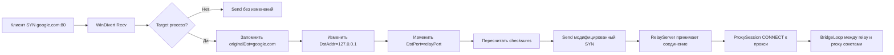
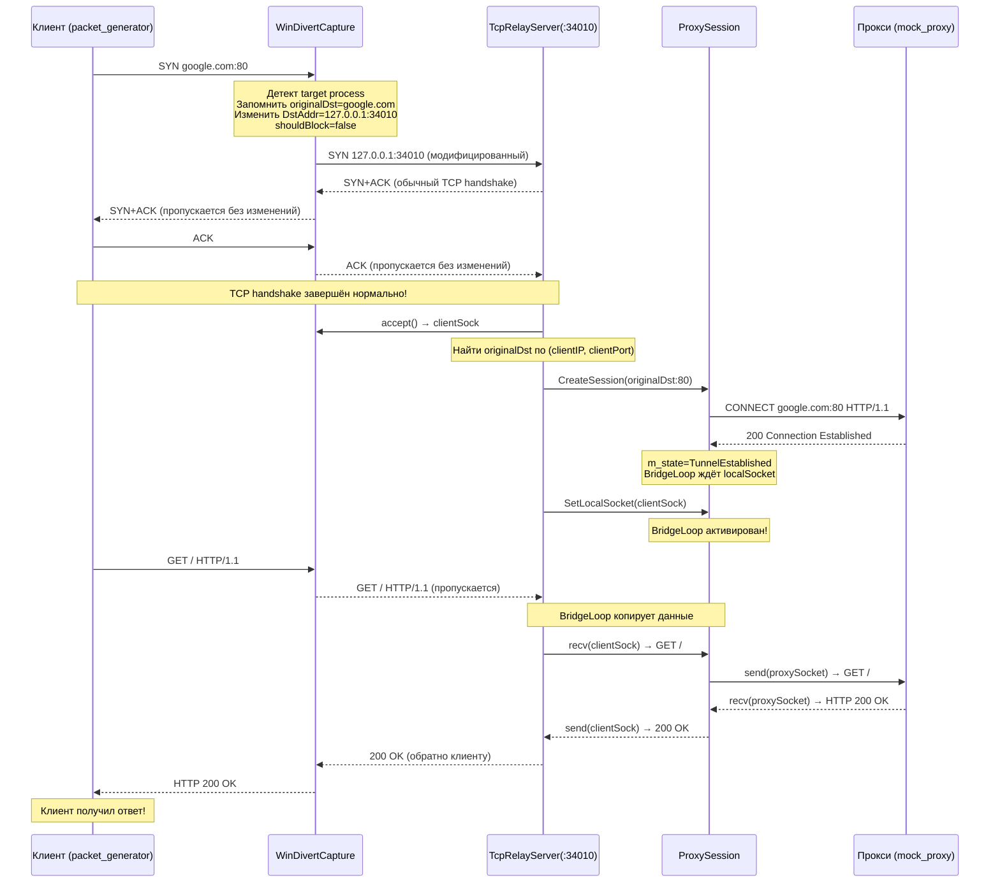

# Задание: Полный редирект с возвратом ответов источнику

## 1. Анализ проблемы

### Текущее состояние (что не работает)

```
Клиент (packet_generator)    WinDivert          ProxySession        mock_proxy
       │                        │                    │                  │
       │  ─── SYN ──►         БЛОК (shouldBlock)     │                  │
       │  (SYN+ACK не получен)                       │                  │
       │                        │                    │  ──CONNECT──►    │
       │                        │                    │  ◄──200 OK───    │
       │                        │                    │  Tunnel OK!      │
       │                        │                    │  m_localSocket=  │
       │                        │                    │  =INVALID_SOCKET  │
       │                        │                    │  BridgeLoop      │
       │                        │                    │  ничего не делает │
       │  ◄── WSAECONNREFUSED   │                    │                  │
```

Ключевая проблема: сейчас SYN **блокируется** (`shouldBlock = true`), клиент не получает SYN+ACK, TCP-рукопожатие не завершается. Локальный сокет не создаётся.

### Референсная реализация: ProxyBridge (GitHub: InterceptSuite/ProxyBridge)

ProxyBridge решает ту же задачу через **модификацию DST в SYN-пакете**, а не через блокировку:

```
Клиент(packet_generator)      WinDivert            Relay(34010)     ProxySession     Прокси
       │                        │                     │                │               │
       │  SYN google.com:80     │                     │                │               │
       │──────────────────────► │                     │                │               │
       │                        │  Модифицировать DST │                │               │
       │                        │  DstAddr=127.0.0.1  │                │               │
       │                        │  DstPort=34010       │                │               │
       │                        │  Запомнить original  │                │               │
       │                        │  shouldBlock=false   │                │               │
       │                        │──────────────────────►               │               │
       │                        │  SYN 127.0.0.1:34010 │                │               │
       │  ◄── SYN+ACK ──────────┤◄──────────────────── │                │               │
       │  ─── ACK ─────────────►├─────────────────────►│                │               │
       │                        │                     │  CONNECT       │               │
       │                        │                     │  google.com:80 │               │
       │                        │                     │ ───────────────►│ ──CONNECT──►  │
       │                        │                     │                 │ ◄──200 OK───  │
       │                        │                     │  Bridge        │               │
       │  ─── GET / ───────────►│─────────────────────►│  ── GET ──────►│ ──GET───────► │
       │  ◄── 200 OK ──────────┤◄─────────────────────│◄── 200 OK ──── │ ◄──200 OK──── │
```

Ключевое отличие:
- **ProxyBridge**: модифицирует SYN → клиент завершает handshake с локальным relay → relay работает через ОБЫЧНЫЕ СОКЕТЫ
- **Мой ошибочный подход (предыдущая версия)**: блокирует SYN → ручной спуфинг SYN+ACK → ручной разбор DATA пакетов → сложно, ненадёжно

### Как работает модификация DST через WinDivert

WinDivert позволяет изменить пакет ВНУТРИ callback'а перед отправкой обратно:

```cpp
// В CaptureLoop:
if (isTargetSyn) {
    // Сохраняем оригинальный DST
    uint32_t originalDst = ipHdr->DstAddr;
    uint16_t originalPort = ntohs(tcpHdr->DstPort);
    
    // Изменяем DST на relay-сервер
    ipHdr->DstAddr = inet_addr("127.0.0.1");
    tcpHdr->DstPort = htons(relayPort);
    
    // Пересчитываем контрольные суммы
    m_api.HelperCalcChecksums(packet, recvLen, &addr, 0);
    
    // Сохраняем original DST (соответствие relayPort ↔ originalDst)
    StoreRedirect(relayPort, originalDst, originalPort, pid);
    
    shouldBlock = false;  // Отправляем модифицированный пакет!
}
```

Клиент получает SYN+ACK от **реального relay-сервера** через обычный TCP-стек — без спуфинга!

## 2. Новая архитектура решения

### Компоненты

```
┌───────────────────────────────────────────────────────────────────┐
│                   TcpRedirectorService                             │
│                                                                   │
│  ┌──────────────────┐    ┌────────────────────┐                   │
│  │ WinDivertCapture │    │  TcpRelayServer     │                   │
│  │                  │    │                     │                   │
│  │ CaptureLoop:     │    │  - listen(port)     │                   │
│  │  - SYN target→   │    │  - accept()         │                   │
│  │    modify DST    │    │  - CreateSession()  │                   │
│  │  - other packets │    │  - BridgeLoop()     │                   │
│  │    pass through  │    │                     │                   │
│  │  - StoreRedirect │    │  Registry:          │                   │
│  │    (relayPort→   │    │  - relayPort →      │                   │
│  │     originalDst) │    │    originalDst       │                   │
│  └──────────────────┘    └────────────────────┘                   │
│           │                         │                              │
│           │                    ┌────▼───────────┐                  │
│           │                    │ ProxyEngine     │                  │
│           │                    │ ProxySession    │                  │
│           │                    │ - CONNECT       │                  │
│           │                    │ - BridgeLoop    │                  │
│           │                    └────────────────┘                  │
└───────────────────────────────────────────────────────────────────┘
```

### Схема модификации SYN-пакета



## 3. Детальный план изменений

### 3.1. Новый класс: `TcpRelayServer`

Создать новый файл: `infrastructure/relay/TcpRelayServer.h`

```cpp
#pragma once

#include <windows.h>
#include <winsock2.h>
#include <ws2tcpip.h>
#include <thread>
#include <atomic>
#include <unordered_map>
#include <mutex>
#include <memory>
#include <functional>
#include "../../domain/entities/ProxyConfig.h"
#include "../../domain/ports/IProxyConnector.h"

namespace tcp_redirector {
namespace infrastructure {

struct RedirectRecord {
    uint32_t originalAddr;   // оригинальный DST (google.com IP)
    uint16_t originalPort;   // оригинальный порт (80)
    uint32_t clientAddr;     // адрес клиента
    uint16_t clientPort;     // порт клиента (для логов)
    uint32_t pid;            // PID процесса
    uint64_t timestamp;      // время создания
};

class TcpRelayServer {
public:
    TcpRelayServer();
    ~TcpRelayServer();

    bool Start(uint16_t port, 
               std::shared_ptr<domain::ports::IProxyConnector> proxyEngine);
    void Stop();
    bool IsRunning() const;

    // Регистрация редиректа (вызывается из CaptureLoop после модификации SYN)
    void RegisterRedirect(uint16_t relayPort, 
                           uint32_t originalAddr, uint16_t originalPort,
                           uint32_t clientAddr, uint16_t clientPort,
                           uint32_t pid);

    // Получение оригинального DST по порту relay
    std::optional<RedirectRecord> GetRedirect(uint16_t relayPort);

    // Удаление записи (после закрытия соединения)
    void RemoveRedirect(uint16_t relayPort);

private:
    void AcceptLoop();

    SOCKET m_listenSocket = INVALID_SOCKET;
    uint16_t m_port = 0;
    std::thread m_acceptThread;
    std::atomic<bool> m_running{false};

    // Реестр редиректов: relayPort → оригинальные данные
    std::unordered_map<uint16_t, RedirectRecord> m_redirects;
    std::mutex m_redirectMutex;

    std::shared_ptr<domain::ports::IProxyConnector> m_proxyEngine;
};

} // namespace infrastructure
} // namespace tcp_redirector
```

### 3.2. Реализация `TcpRelayServer.cpp`

```cpp
bool TcpRelayServer::Start(uint16_t port, 
                            std::shared_ptr<domain::ports::IProxyConnector> proxyEngine)
{
    if (m_running) return true;
    
    m_proxyEngine = proxyEngine;
    m_port = port;
    
    m_listenSocket = socket(AF_INET, SOCK_STREAM, IPPROTO_TCP);
    if (m_listenSocket == INVALID_SOCKET) return false;
    
    // Разрешить быстрый перезапуск порта
    int reuse = 1;
    setsockopt(m_listenSocket, SOL_SOCKET, SO_REUSEADDR, 
               (const char*)&reuse, sizeof(reuse));
    
    sockaddr_in addr;
    addr.sin_family = AF_INET;
    addr.sin_addr.s_addr = htonl(INADDR_LOOPBACK);
    addr.sin_port = htons(m_port);
    
    if (bind(m_listenSocket, (sockaddr*)&addr, sizeof(addr)) != 0 ||
        listen(m_listenSocket, SOMAXCONN) != 0) {
        closesocket(m_listenSocket);
        m_listenSocket = INVALID_SOCKET;
        return false;
    }
    
    m_running = true;
    m_acceptThread = std::thread(&TcpRelayServer::AcceptLoop, this);
    return true;
}

void TcpRelayServer::AcceptLoop() {
    while (m_running) {
        sockaddr_in clientAddr;
        int clientAddrLen = sizeof(clientAddr);
        SOCKET clientSock = accept(m_listenSocket, 
                                    (sockaddr*)&clientAddr, &clientAddrLen);
        
        if (clientSock == INVALID_SOCKET) {
            if (m_running) Sleep(100);
            continue;
        }
        
        // Определить relayPort (локальный порт, на который пришло соединение)
        sockaddr_in localAddr;
        int localAddrLen = sizeof(localAddr);
        getsockname(clientSock, (sockaddr*)&localAddr, &localAddrLen);
        uint16_t relayPort = ntohs(localAddr.sin_port);
        
        // Получить оригинальный DST
        auto redirect = GetRedirect(relayPort);
        if (!redirect) {
            // Если записи нет — закрыть (произошло что-то не то)
            closesocket(clientSock);
            continue;
        }
        
        // Создать RedirectEvent для ProxySession
        domain::RedirectEvent event;
        event.redirect_id = ++m_nextFlowId;
        event.pid = redirect->pid;
        event.original_address_v4 = redirect->originalAddr;
        event.original_port = redirect->originalPort;
        
        // Запустить ProxySession в фоновом потоке
        std::thread([this, clientSock, event, relayPort]() {
            auto session = m_proxyEngine->CreateSession(event,
                [this, clientSock, relayPort](bool success, const std::string& error) {
                    if (!success) {
                        closesocket(clientSock);
                        RemoveRedirect(relayPort);
                    }
                    // BridgeLoop уже запущен внутри сессии
                });
            
            if (session) {
                // Передать клиентский сокет в сессию для бриджа
                auto proxySession = std::dynamic_pointer_cast<ProxySession>(session);
                if (proxySession) {
                    proxySession->SetLocalSocket(clientSock);
                }
            } else {
                closesocket(clientSock);
                RemoveRedirect(relayPort);
            }
        }).detach();
    }
}
```

### 3.3. Изменения в `WinDivertCapture.cpp` — CaptureLoop

Вместо `shouldBlock = true`:

```cpp
if (isTargetSyn) {
    // Вместо блокировки — МОДИФИЦИРУЕМ DST пакета
    pid = FindPidBySourcePort(srcPort);
    if (pid != 0 && IsTargetProcess(pid)) {
        uint32_t originalDst = ipHdr->DstAddr;
        uint16_t originalDstPort = dstPort;
        uint32_t clientAddr = ipHdr->SrcAddr;
        uint16_t clientPort = srcPort;
        
        // Выбрать порт для relay (может быть фиксированным или динамическим)
        uint16_t relayPort = m_relayPort;  // фиксированный порт
        
        // Модифицировать DST на relay-сервер
        ipHdr->DstAddr = htonl(INADDR_LOOPBACK);  // 127.0.0.1
        tcpHdr->DstPort = htons(relayPort);
        
        // Пересчитать контрольные суммы
        m_api.HelperCalcChecksums(packet, recvLen, &addr, 0);
        
        // Зарегистрировать редирект
        if (m_relayServer) {
            m_relayServer->RegisterRedirect(relayPort, 
                originalDst, originalDstPort,
                clientAddr, clientPort, pid);
        }
        
        // НЕ БЛОКИРУЕМ — отправляем модифицированный пакет
        // Клиент получит SYN+ACK от relay-сервера
        shouldBlock = false;
        
        LOG("[WD] PROXIED #%llu: redirect %s:%u -> relay %d (original %s:%u)\n",
            pktCount, srcIP, srcPort, relayPort, dstIP, originalDstPort);
    }
}
```

### 3.4. Изменения в `ProxySession` — восстановление BridgeLoop

`BridgeLoop` в `ProxyEngine.h` уже существует и использует `m_localSocket`. Теперь он будет работать, потому что:

1. RelayServer принимает соединение от клиента → получает `clientSock`
2. RelayServer создаёт `ProxySession`, вызывается `Start()`, который делает CONNECT
3. После получения 200 OK, RelayServer вызывает `SetLocalSocket(clientSock)`
4. BridgeLoop начинает мост между `m_localSocket` (клиент) и `m_proxySocket` (прокси)

Нужно доработать BridgeLoop — добавить ожидание m_localSocket с таймаутом, как в предыдущей версии:

```cpp
void BridgeLoop() {
    // Ждать m_localSocket до 10 секунд
    auto waitStart = std::chrono::steady_clock::now();
    while (m_localSocket == INVALID_SOCKET) {
        if (std::chrono::steady_clock::now() - waitStart > std::chrono::seconds(10)) {
            HandleError("timeout", "Local socket not set within 10s");
            return;
        }
        Sleep(10);
    }
    
    fd_set read_set;
    char buf[65536];
    
    while (m_state == domain::ConnectionState::TunnelEstablished) {
        FD_ZERO(&read_set);
        FD_SET(m_localSocket, &read_set);
        FD_SET(m_proxySocket, &read_set);
        
        timeval tv = {1, 0};
        int ret = select(0, &read_set, NULL, NULL, &tv);
        if (ret <= 0) continue;
        
        if (FD_ISSET(m_localSocket, &read_set)) {
            int n = recv(m_localSocket, buf, sizeof(buf), 0);
            if (n > 0) {
                m_txBytes += n;
                send(m_proxySocket, buf, n, 0);
            } else break;
        }
        
        if (FD_ISSET(m_proxySocket, &read_set)) {
            int n = recv(m_proxySocket, buf, sizeof(buf), 0);
            if (n > 0) {
                m_rxBytes += n;
                send(m_localSocket, buf, n, 0);
            } else break;
        }
    }
    Close();
}
```

### 3.5. Изменения в `ServiceMain.h`

App3.5. Initialize relay server and pass to capture:

```cpp
bool Initialize() {
    // ... существующий код ...

    // Initialize relay server
    m_relayServer = std::make_shared<infrastructure::TcpRelayServer>();
    if (!m_relayServer->Start(RELAY_PORT, m_proxyEngine)) {
        m_logger->Error("service", "Failed to start relay server");
        return false;
    }
    m_logger->Info("service", "Relay server started on port " + 
        std::to_string(RELAY_PORT));

    // Initialize WinDivert capture
    m_capture = std::make_unique<infrastructure::WinDivertCapture>();
    m_capture->SetRelayServer(m_relayServer);
    m_capture->SetRelayPort(RELAY_PORT);
    // ... SetTargetProcess, Open ...
}
```

### 3.6. Выбор порта для relay

Проблема: если несколько соединений одновременно, все они модифицируются на ОДИН И ТОТ ЖЕ порт relay. Это нормально для TCP — relay-сервер listen'ит на одном порту, accept'ит все соединения.

Однако WinDivert модифицирует DstPort на relayPort. Все SYN-пакеты для google.com:80, yandex.ru:443 и т.д. — все получат DstPort = relayPort. RelayServer принимает все эти соединения через accept().

Но есть нюанс: если два разных процесса (или один процесс) одновременно открывают соединения к разным хостам, оба SYN будут модифицированы на relayPort. Когда они дойдут до relayServer, у обоих будет одинаковый relayPort (локальный порт после accept будет разным, но mapped key relayPort одинаков). 

Решение: сохранять маппинг на уровне tuple (clientAddr, clientPort, relayPort → originalDst), а не только relayPort.

ИЛИ проще: выделять динамический порт для каждого SYN:

```cpp
// В CaptureLoop:
if (isTargetSyn) {
    // Найти свободный порт для relay
    uint16_t relayPort = GetNextRelayPort();  // циклический перебор портов
    tcpHdr->DstPort = htons(relayPort);
    
    // Но relayServer listen'ит на ОДНОМ порту!
    // Если мы меняем DstPort на 34011, то relay должен слушать на 34011
}
```

Правильное решение: relayServer listen на диапазоне портов или использовать один порт, но WinDivert модифицирует DstPort на этот один порт для всех.

**Один порт — правильное решение**. RelayServer слушает на порту 34010 (или любом другом). Все SYN модифицируются на 127.0.0.1:34010. RelayServer принимает через accept(), getsockname показывает порт 34010 для всех. Маппинг originalDst хранится по tuple (clientAddr, clientPort) → originalDst.

### 3.7. Уточнение: как relayServer находит originalDst

У нас есть два варианта:

**Вариант A (по tuple)**:
```cpp
// CaptureLoop сохраняет:
m_redirectRegistry[{clientAddr, clientPort}] = {originalDst, originalPort, pid};

// RelayServer при accept получает clientAddr, clientPort из accept()
// и ищет по tuple
auto it = m_redirectRegistry.find({clientAddr, clientPort});
```

**Вариант B (по relayPort + динамический порт)**:
```cpp
// Каждому SYN выделяется уникальный relayPort
// relayServer listen на 10 портах (34010-34019) и accept на всех
```

**Вариант A проще**. Используем один порт relay и маппинг по (clientAddr, clientPort).

```cpp
struct RedirectKey {
    uint32_t clientAddr;
    uint16_t clientPort;
    bool operator==(const RedirectKey& o) const {
        return clientAddr == o.clientAddr && clientPort == o.clientPort;
    }
};

struct RedirectKeyHash {
    size_t operator()(const RedirectKey& k) const {
        return std::hash<uint32_t>()(k.clientAddr) ^ 
               std::hash<uint16_t>()(k.clientPort);
    }
};

std::unordered_map<RedirectKey, RedirectRecord, RedirectKeyHash> m_redirects;
```

## 4. Диаграмма последовательности (полный цикл)



## 5. Список файлов для изменения

| Файл | Изменения |
|------|-----------|
| **НОВЫЙ** `infrastructure/relay/TcpRelayServer.h` | Класс TCP relay-сервера |
| **НОВЫЙ** `infrastructure/relay/TcpRelayServer.cpp` | Реализация relay |
| `infrastructure/capture/WinDivertCapture.h` | Добавить `SetRelayServer()`, `SetRelayPort()` |
| `infrastructure/capture/WinDivertCapture.cpp` | CaptureLoop: модификация DST вместо блокировки SYN |
| `adapters/driven/ProxyEngine.h` | BridgeLoop: ожидание m_localSocket с таймаутом |
| `adapters/driving/ServiceMain.h` | Initialize: создать и запустить RelayServer, передать в Capture |

## 6. Порядок реализации

1. **Создать `TcpRelayServer.h`** — класс с listen/accept, реестром редиректов
2. **Создать `TcpRelayServer.cpp`** — AcceptLoop, RegisterRedirect, GetRedirect
3. **Доработать `WinDivertCapture.h`** — добавить поля relayServer, relayPort
4. **Доработать `WinDivertCapture.cpp`** — изменить CaptureLoop: модификация DST вместо блокировки
5. **Доработать `ProxyEngine.h`** — BridgeLoop с ожиданием m_localSocket
6. **Доработать `ServiceMain.h`** — создать RelayServer, передать в Capture
7. **Сборка и тестирование**

## 7. Сравнение подходов

| Аспект | Старый подход (блокировка + спуфинг) | ProxyBridge подход (модификация DST) |
|--------|--------------------------------------|--------------------------------------|
| SYN обработка | shouldBlock = true | shouldBlock = false (с изменённым DST) |
| SYN+ACK | Ручной спуфинг через WinDivert Send() | Обычный TCP handshake с relay |
| DATA передача | Извлечение payload из пакетов | Обычный recv/send на сокетах |
| Ответы | Ручная сборка TCP/IP пакетов | Обычный recv/send на сокетах |
| Сложность | Очень высокая (ручные заголовки, SEQ/ACK) | Низкая (стандартные сокеты) |
| Надёжность | Низкая (легко ошибиться в SEQ/ACK/checksum) | Высокая (используется TCP-стек Windows) |
| Поддержка | Сложная отладка | Простая (как любой TCP-сервер) |
| Proxifier | Нет, использует NDIS драйвер | Да, именно так и работает |

## 8. Тестирование

После реализации протестировать сценарием:

1. Запустить `mock_proxy.exe 127.0.0.1 3128`
2. Запустить `TcpRedirectorService.exe --console` (конфиг: прокси 127.0.0.1:3128, relayPort: 34010)
3. Запустить `packet_generator.exe google.com 80`
4. Ожидаемый результат:
   - SYN перехвачен, DST модифицирован на 127.0.0.1:34010
   - RelayServer принимает соединение, находит originalDst=google.com:80
   - ProxySession делает CONNECT google.com:80 через прокси
   - BridgeLoop копирует GET от клиента → прокси, 200 OK от прокси → клиент
   - packet_generator выводит полученные данные от google.com
5. Проверить логом, что пакеты google.com:80 не уходят напрямую