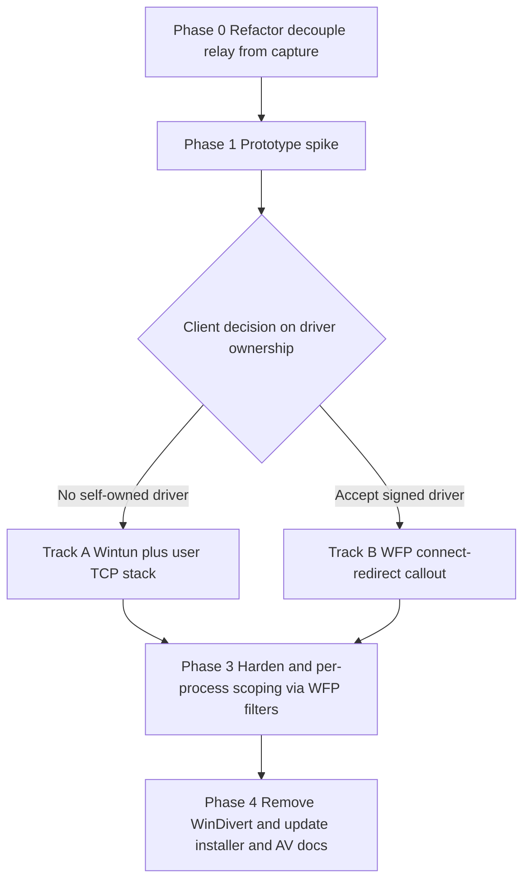

# WinDivert Alternatives — Comparative Technical Evaluation

**Product:** TcpRedirector — transparent outbound-TCP redirection to an HTTP CONNECT proxy on Windows
**Scope:** Read-only research/design report. No source code was modified.
**Date:** 2026-07-13

---

## 1. Executive Summary

TcpRedirector currently relies on **WinDivert 2.2.2** to intercept outbound TCP SYN packets in the kernel, decide per-process whether to redirect, rewrite the destination to a local relay ([`TcpRelayServer`](../src/service/TcpRedirectorService/infrastructure/relay/TcpRelayServer.h:44)), and tunnel through an upstream HTTP proxy. The client's objections to WinDivert are not about correctness — the current implementation works — but about **operational friction**: WinDivert ships a third-party kernel driver ([`WinDivert64.sys`](../KASPERSKY_EXCLUSIONS.md:7)) whose signature and behavior trigger AV/EDR (a whole [`KASPERSKY_EXCLUSIONS.md`](../KASPERSKY_EXCLUSIONS.md:1) exists just to whitelist it), it needs admin, it has driver-deployment/signing overhead, and it carries LGPL/GPL-or-commercial licensing considerations.

The core question is: *what removes the "unsigned/suspicious third-party kernel driver" problem while keeping per-process transparent redirection with original-destination recovery?*

There are only two honest ways to eliminate the third-party kernel driver:

1. **Ship your own kernel driver** — but then *you* own the signing burden (EV cert + Microsoft attestation signing). This is the WFP callout-driver path. It is the *technically cleanest* redirection primitive, and a properly-signed Microsoft-attested driver is far more AV/EDR-friendly than WinDivert, but it moves the signing cost onto you and still means "a kernel driver."
2. **Use no kernel driver at all** — either a user-mode API-hook approach (Detours/MinHook), or route traffic through a **Microsoft-signed** TUN adapter (**Wintun**) into a user-mode network stack. Wintun's driver is signed by WireGuard LLC under a Microsoft-attested signature and is widely trusted by AV/EDR (it ships inside WireGuard, Tailscale, Cloudflare WARP, etc.).

### Ranked recommendation

> **#1 — Wintun (WireGuard's TUN adapter) + a user-mode packet/relay engine (tun2socks-style).**
> This is the best fit for the client's *stated* concerns. Wintun is a small, Microsoft-attested, broadly-whitelisted signed driver — it does **not** behave like WinDivert to an EDR (it presents as a virtual network adapter, an extremely common and trusted pattern). You keep 100% of the redirect/relay logic in user mode, reuse the existing [`TcpRelayServer`](../src/service/TcpRedirectorService/infrastructure/relay/TcpRelayServer.h:44) and proxy/auth code almost verbatim, and get IPv4 **and** IPv6 for free. Cost: you must add a minimal user-mode TCP/IP reassembly layer and drive per-process selection via routing rather than PID-at-capture-time. This removes the "our own unsigned driver" problem entirely without you having to run a WHQL/attestation pipeline.

> **#2 — WFP ALE connect-redirect callout driver (the "correct" version of the existing broken driver in [`src/driver/`](../src/driver/TcpRedirectorDriver/infrastructure/wfp/WfpCallout.c:1)).**
> This is the technically *best* redirection mechanism on Windows: kernel-native, per-process, per-connection, IPv4+IPv6, gives you the original destination for free, near-zero packet overhead, and integrates with OS auth/telemetry. The reason it is #2 and not #1 is the signing reality: a kernel-mode driver on Win10/11 x64 requires an **EV code-signing certificate and Microsoft attestation signing** (or full WHQL), and a home-grown callout driver often draws *more* EDR scrutiny than a well-known signed adapter until it earns reputation. If the client can commit to the signing pipeline and wants the most robust long-term primitive, this is the answer. It also lets you **delete WinDivert and the relay-side IP-swap hacks** entirely.

**Not recommended as primary:** user-mode-only WFP (cannot redirect — see §4.2), Winsock LSP (deprecated/removed-path — §4.4), NDIS LWF (huge effort, no per-process context, worse AV posture — §4.5), and native `netsh portproxy` (no per-process, no transparent original-dest — §4.8). API hooking (§4.3) is viable as a **fallback/complement** but not as the sole mechanism because of static-linked Winsock, non-Winsock traffic, .NET, and protected-process gaps.

---

## 2. Requirements Recap — what any replacement MUST provide

Derived from the current behavior in [`WinDivertCapture.h`](../src/service/TcpRedirectorService/infrastructure/capture/WinDivertCapture.h:41), [`TcpRelayServer.h`](../src/service/TcpRedirectorService/infrastructure/relay/TcpRelayServer.h:44), [`ConnectionTable.h`](../src/service/TcpRedirectorService/infrastructure/relay/ConnectionTable.h:52) and [`RuleEngine.h`](../src/service/TcpRedirectorService/domain/services/RuleEngine.h):

| # | Requirement | How WinDivert does it today |
|---|-------------|-----------------------------|
| R1 | **Per-process selection** — redirect only traffic from processes matching a rule | [`CheckProcessRule()`](../src/service/TcpRedirectorService/infrastructure/capture/WinDivertCapture.h:102) does PID lookup by src port (`GetExtendedTcpTable`) + [`RuleEngine`](../src/service/TcpRedirectorService/domain/services/RuleEngine.h) match, cached in a per-port bitmap |
| R2 | **Original-destination recovery** — the relay must learn the app's *intended* dst IP:port | Stored at capture time in [`ConnectionTable::Add()`](../src/service/TcpRedirectorService/infrastructure/relay/ConnectionTable.h:69), read by [`HandleNewConnection()`](../src/service/TcpRedirectorService/infrastructure/relay/TcpRelayServer.h:209) keyed on src port |
| R3 | **Transparent to the application** — no app config, no SDK, unmodified binary | Packet rewrite is invisible to the app; app thinks it connected to the real dst |
| R4 | **Local relay + HTTP CONNECT + auth** — connect upstream, Basic/Negotiate(Kerberos) | [`ConnectionHandler()`](../src/service/TcpRedirectorService/infrastructure/relay/TcpRelayServer.h:258) — this is the *reusable crown jewel* and is mechanism-agnostic |
| R5 | **Admin footprint acceptable** — service already runs as admin; goal is to reduce *driver* friction, not necessarily to drop admin |
| R6 | **AV/EDR friendliness** — the #1 client pain point; avoid an unsigned/suspicious third-party kernel driver |
| R7 | **IPv4 (mandatory), IPv6 (desirable)** — current code is effectively IPv4-only for capture ([`WinDivertCapture`](../src/service/TcpRedirectorService/infrastructure/capture/WinDivertCapture.h:170) rewrites v4 only); relay already has a v6 listener |
| R8 | **Reasonable performance/scale** — today thread-per-connection relay (~1 MB/conn, see [`07_RISKS_AND_LIMITATIONS.md`](07_RISKS_AND_LIMITATIONS.md:87)) |

**Key architectural insight:** R4 (the relay + HTTP CONNECT + SSPI/Kerberos + bidirectional bridge) is *independent of the interception mechanism*. Every candidate below reuses [`TcpRelayServer`](../src/service/TcpRedirectorService/infrastructure/relay/TcpRelayServer.h:44) and [`ConnectionTable`](../src/service/TcpRedirectorService/infrastructure/relay/ConnectionTable.h:52) largely unchanged. What changes is **how packets/connections arrive at the relay and how the original destination is delivered alongside them.**

---

## 3. Comparison Matrix

| Dimension | WinDivert (current) | WFP callout driver (correct) | WFP user-mode only | API hooking (Detours/MinHook) | Winsock LSP | NDIS LWF | Wintun + user stack | netsh portproxy |
|-----------|---------------------|------------------------------|--------------------|-------------------------------|-------------|----------|---------------------|-----------------|
| **Mechanism** | 3rd-party kernel packet intercept | Kernel WFP `ALE_CONNECT_REDIRECT` | User-mode WFP filters | Inline-hook `connect`/`WSAConnect`/`ConnectEx` | Layered Winsock provider | Kernel miniport-edge filter | Virtual TUN adapter → user stack | OS TCP port forwarder |
| **Mode** | Kernel + user | Kernel + user | User only | User only | User (in every process) | Kernel | Kernel driver (tiny) + user | Kernel (built-in) |
| **Own driver to sign?** | No (theirs, unsigned-feel) | **Yes — EV + attestation/WHQL** | No | No | No (but catalog/reg friction) | **Yes — EV + attestation** | **No — Wintun is MS-attested/signed** | No |
| **AV/EDR friendliness** | Poor (needs exclusions) | Good *once signed*; may draw scrutiny early | Excellent | Poor (injection = classic malware TTP) | Poor (global Winsock tamper) | Poor (network kernel driver) | **Excellent** (adapter pattern, trusted vendors) | Excellent |
| **Admin/privilege** | Admin | Admin (driver load) | Admin (WFP engine) | Admin (inject into other procs) | Admin (install provider) | Admin | Admin (adapter create) | Admin |
| **Per-process filtering** | Yes (PID by src port) | **Yes, native** (PID/AppId in metadata) | Yes (block/permit only) | Yes (only hooked procs) | Weak/global | **No** (no process context) | Indirect (route/split-tunnel by PID via WFP or firewall) | No |
| **Original-dest recovery** | Yes (saved at SYN) | **Yes, native** (in classify values) | N/A (can't redirect) | Yes (in `connect` args) | Yes (in provider) | Hard (raw frames) | **Yes** (dst is in the captured IP packet) | Lost (static map only) |
| **IPv4 / IPv6** | v4 only (as built) | **v4 + v6** | v4 + v6 | v4 + v6 | v4 + v6 | v4 + v6 | **v4 + v6** | v4 + v6 |
| **Transparent to app** | Yes | Yes | Yes | Yes | Yes | Yes | Yes | Partial (fixed ports only) |
| **Performance** | Per-packet copy to user | **Best** (kernel connect-time only) | N/A | Per-connect only (cheap) | Per-call | Per-frame (highest volume) | Per-packet user copy (like WinDivert) | Native fast |
| **Licensing** | LGPL/GPL-or-commercial | MS APIs, no license cost | MS APIs | Detours=MIT; MinHook=BSD | MS SPI | MS DDK | Wintun = **prosperity/commercial**, dual-licensed; MIT-ish wrapper libs exist | OS built-in |
| **Maturity** | Mature, niche | MS-supported, production (used by AV/VPN) | MS-supported | Detours/MinHook mature | Deprecated by MS | Mature but low-level | Very mature (WireGuard/Tailscale) | Mature, limited |
| **Code change to adopt** | — (baseline) | High (finish+fix driver, IPC) | N/A | Medium (injector + robust hooks) | High + risky | Very high | Medium (add user TCP stack; reuse relay) | Low but insufficient |

---

## 4. Per-Candidate Deep Dive

### 4.1 WFP Callout Driver — `FWPM_LAYER_ALE_CONNECT_REDIRECT_V4/V6` (the "correct" driver)

**Mechanism.** At the ALE connect-redirect layer, a kernel callout is invoked *once per outbound connect* (not per packet), before the SYN is emitted. The callout receives the process id / AppId and the original remote address in the classify values, and can atomically rewrite the destination to `127.0.0.1:relayPort` using `FwpsRedirectHandleCreate` + `FwpsAcquireWritableLayerDataPointer` + set `localRedirectTargetPID`/remote address on the `FWPS_CONNECT_REQUEST` + `FwpsApplyModifiedLayerData`. Because you also set the redirect *record*, the relay can later query the original destination via `WSAIoctl(SIO_QUERY_WFP_CONNECTION_REDIRECT_RECORDS/CONTEXT)` — **the OS hands you the original dst**, so you may not even need [`ConnectionTable`](../src/service/TcpRedirectorService/infrastructure/relay/ConnectionTable.h:52).

**What is wrong with the existing driver** ([`WfpCallout.c`](../src/driver/TcpRedirectorDriver/infrastructure/wfp/WfpCallout.c:1)):
- It binds to **`FWPM_LAYER_ALE_AUTH_CONNECT_V4`** ([line 218](../src/driver/TcpRedirectorDriver/infrastructure/wfp/WfpCallout.c:218)/[246](../src/driver/TcpRedirectorDriver/infrastructure/wfp/WfpCallout.c:246)), which can *permit/block* but is **not** the redirect layer. Redirection requires `FWPM_LAYER_ALE_CONNECT_REDIRECT_V4`.
- In [`TcpRedirectClassify`](../src/driver/TcpRedirectorDriver/infrastructure/wfp/WfpCallout.c:36) it acquires the writable layer data and sets `connectRequest->redirectHandle` ([line 109](../src/driver/TcpRedirectorDriver/infrastructure/wfp/WfpCallout.c:109)) but **never rewrites the target address/port** — so nothing is actually redirected. It's effectively a no-op permit.
- It `ExAllocatePool2`'s a `REDIRECT_INFO` and enqueues it ([line 94](../src/driver/TcpRedirectorDriver/infrastructure/wfp/WfpCallout.c:94)) with no drain path shown → **non-paged pool leak** on every connect.
- IPv6 path absent; provider/sublayer/filter add order and `FWP_ACTION_CALLOUT_UNKNOWN` vs terminating semantics need review.

**Pros.** Native per-process + original-dst; IPv4+IPv6; lowest overhead (connect-time, not per-packet); no third-party driver; best transparency; the "textbook" Windows way (this is how commercial split-tunnel VPNs and some AVs do it).
**Cons.** **You must sign a kernel driver**: EV certificate + submit to Microsoft Partner Center for attestation signing (Win10 1607+ x64) or full WHQL. Kernel bugs = BSOD. HVCI/Memory-Integrity compatibility must be validated. A brand-new callout driver has *zero reputation* with EDR initially. Longer dev/test cycle (kernel debugging).
**Migration impact.**
- **Remove:** [`WinDivertCapture`](../src/service/TcpRedirectorService/infrastructure/capture/WinDivertCapture.h:41) entirely; WinDivert DLL/sys; [`KASPERSKY_EXCLUSIONS.md`](../KASPERSKY_EXCLUSIONS.md:7) driver line.
- **Fix/complete:** the whole [`src/driver/TcpRedirectorDriver/`](../src/driver/TcpRedirectorDriver/infrastructure/wfp/WfpCallout.c:1) tree (right layer, actual rewrite, pool lifecycle, v6, IOCTL/query path).
- **Reuse unchanged:** [`TcpRelayServer`](../src/service/TcpRedirectorService/infrastructure/relay/TcpRelayServer.h:44), proxy/CONNECT/SSPI logic, [`RuleEngine`](../src/service/TcpRedirectorService/domain/services/RuleEngine.h) (move matching into kernel or keep in service via IOCTL).
- **Simplify:** relay no longer needs the WinDivert IP-swap workaround noted at [`TcpRelayServer.h:95`](../src/service/TcpRedirectorService/infrastructure/relay/TcpRelayServer.h:95); it can bind `127.0.0.1` and use `SIO_QUERY_WFP_CONNECTION_REDIRECT_RECORDS` instead of [`ConnectionTable`](../src/service/TcpRedirectorService/infrastructure/relay/ConnectionTable.h:52).

### 4.2 WFP User-Mode Only (`FwpmEngineOpen` + filters, no callout driver)

**Mechanism.** From user mode you can open the filter engine and add filters at ALE layers to **PERMIT / BLOCK / (soft) audit** connections, with rich conditions (AppId, user, remote addr/port). This is what personal firewalls use.
**The honest limit:** user-mode WFP **cannot redirect or rewrite** a connection. Redirection at `ALE_CONNECT_REDIRECT` requires a **kernel callout** (`FwpsCalloutRegister` is kernel-only). There is no user-mode API to change a connection's destination. So WFP-user-mode can *enforce* "block everything from process X that isn't going to our relay" but it cannot *transparently divert* X to the relay.
**Pros.** No driver, admin-only, excellent AV posture, trivial to add as a **safety net** (e.g., block direct egress from target apps to force them through the relay / prevent leaks).
**Cons.** Not a redirection mechanism on its own — fails R2/R3 for transparent diversion. Useful only in combination with another candidate.
**Migration impact.** Additive: a small `WfpBlockLeaks` helper in the service. Does not replace [`WinDivertCapture`](../src/service/TcpRedirectorService/infrastructure/capture/WinDivertCapture.h:41).

### 4.3 API Hooking / DLL Injection (Microsoft Detours or MinHook) — the [`HookDLL`](../src/service/HookDLL/hook_connect.cpp:1) done properly

**Mechanism.** Inject a DLL into target processes and inline-hook the Winsock connect path: `connect`, `WSAConnect`, `ConnectEx`, and `WSAConnectByName`/`WSAConnectByList`. On hook, save the original dst (available directly in the call args — no PID lookup needed), then connect the socket to the local relay and do HTTP CONNECT. The current [`hook_connect.cpp`](../src/service/HookDLL/hook_connect.cpp:1) is a hand-rolled 12-byte `mov rax/jmp rax` detour ([`BuildDetour`](../src/service/HookDLL/hook_connect.cpp:44)) that only hooks `connect` ([`MyConnect`](../src/service/HookDLL/hook_connect.cpp:170)), only IPv4, and speaks CONNECT inline ([`SendConnect`](../src/service/HookDLL/hook_connect.cpp:140)) with fragile response parsing.

**Doing it properly.**
- Use **Microsoft Detours** (MIT) or **MinHook** (BSD) instead of the hand-rolled trampoline — they handle instruction-length disassembly, hot-patching, and thread suspension safely.
- Hook the *full* connect family incl. `ConnectEx` (used by IOCP/.NET/`HttpClient`) and IPv6.
- **Injection strategies:**
  - `CreateRemoteThread` + `LoadLibrary` into an already-running matched process (most controllable; pairs well with a service that watches process creation via WMI/ETW or a minifilter).
  - **IFEO** (`Image File Execution Options` "Debugger"/AppInit alternative via `Verifier`/Shim) — launch-time injection for specific images.
  - **AppInit_DLLs** — deprecated, blocked under Secure Boot / requires signing, injects everywhere → **avoid**.
  - `SetWindowsHookEx` — only for GUI apps with message loops → too narrow.
  - Debugger-based / `Detoured` bootstrap for child-process propagation.
- Recover original dst directly from the hooked call (satisfies R2 without [`ConnectionTable`](../src/service/TcpRedirectorService/infrastructure/relay/ConnectionTable.h:52)).

**Pros.** **Zero kernel driver → best possible AV/EDR story on the driver axis**; cheap (per-connect only); trivial original-dst; per-process by construction; Detours/MinHook permissively licensed.
**Cons.**
- **Injection itself is a top malware TTP** — EDR heavily flags `CreateRemoteThread`/remote `LoadLibrary`. So you trade "suspicious driver" for "suspicious injection." (Signed DLL + reputation helps but doesn't eliminate.)
- **Statically-linked Winsock / non-standard stacks** aren't hooked (some Go/Rust/`libcurl`-static apps call `Nt`/`Afd` directly or ship their own resolver).
- **Non-Winsock traffic** (raw `NtDeviceIoControlFile` on `\Device\Afd`, HTTP.sys/`WinHTTP` edge cases, QUIC/UDP) bypasses the hook.
- **.NET / managed** apps: `HttpClient` uses `ConnectEx` so hookable, but JITed thunks and `SocketAsyncEventArgs` need care.
- **Protected processes (PPL)**, anti-cheat, and hardened browsers refuse injection.
- Bitness match (x86 vs x64) and per-process lifecycle management add complexity.
**Migration impact.** Promote [`HookDLL`](../src/service/HookDLL/hook_connect.cpp:1) from prototype to product: add an **injector** in the service (process-watch + inject), swap the hand-rolled detour for Detours/MinHook, add the full connect family + IPv6, and reuse the CONNECT/SSPI logic (ideally by calling back into a shared relay rather than duplicating [`SendConnect`](../src/service/HookDLL/hook_connect.cpp:140)). [`WinDivertCapture`](../src/service/TcpRedirectorService/infrastructure/capture/WinDivertCapture.h:41) removed. Best positioned as **fallback/secondary**, not sole mechanism.

### 4.4 Winsock LSP (Layered Service Provider)

**Mechanism.** Install a transport LSP that layers over the base Winsock provider so your DLL sits in every socket call chain and can redirect connects.
**Status — do not use.** Microsoft has **deprecated LSPs**; they are unsupported for modern scenarios, are disabled in many contexts, do not load in Store/UWP or various hardened processes, and a broken LSP notoriously breaks *all* networking on the machine ("LSP hell"). WFP was Microsoft's explicit replacement for LSP. Modern Windows increasingly ignores or restricts LSPs.
**Pros.** (Historical) transparent, per-process-ish, original-dst available.
**Cons.** Deprecated/removed-path; global blast radius; heavy AV suspicion; no future.
**Migration impact.** N/A — recommend against.

### 4.5 NDIS Lightweight Filter (LWF) / NetAdapterCx filter driver

**Mechanism.** A kernel LWF binds between the protocol stack and the miniport, seeing **every Ethernet frame**. You'd inspect frames, identify TCP SYNs, and rewrite — essentially re-implementing WinDivert's kernel half yourself.
**Pros.** Very powerful, sees all traffic, IPv4+IPv6.
**Cons.** **No process context at the frame layer** (fails R1 cleanly — you'd have to correlate flows to PIDs out-of-band, exactly the fragile part). Highest data volume (per-frame) → worst performance profile. **You must sign a kernel driver** (EV+attestation) *and* it's a network-path driver → strong EDR scrutiny. Highest engineering + test cost of all options. This is strictly worse than the WFP callout for this use case.
**Migration impact.** Would replace [`WinDivertCapture`](../src/service/TcpRedirectorService/infrastructure/capture/WinDivertCapture.h:41) with a large new driver; not justified. Recommend against.

### 4.6 Wintun (WireGuard virtual adapter) + user-mode network stack — **RECOMMENDED #1**

**Mechanism.** Create a **Wintun** virtual TUN adapter (a small, Microsoft-attested, WireGuard-LLC-signed driver that exposes L3 packets to user mode via a ring buffer). Add a route (and/or WFP/firewall split-tunnel rule) so that traffic from target processes is sent to the Wintun adapter. Your service reads raw IP packets from the ring, runs a **lightweight user-mode TCP/IP stack** (the tun2socks pattern — e.g. lwIP, gVisor-netstack, or `wireguard-go`/`sing-box`'s stack) that terminates each TCP flow locally; the original destination is simply the **dst field of the captured IP packet** (satisfies R2 with no lookup). Each accepted flow is then handed to the existing relay → HTTP CONNECT → upstream.

**Why this best matches the client's concerns.** The ONLY kernel component is **Wintun**, which:
- is **signed and Microsoft-attested**, shipped in WireGuard, Tailscale, Cloudflare WARP, ProtonVPN, etc.;
- presents to the OS/EDR as a **virtual network adapter** — one of the most common, trusted patterns — not as a packet-tampering hook. It generally does **not** require AV exclusions the way WinDivert does;
- is tiny and stable; you do **not** run a WHQL/attestation pipeline yourself.

**Per-process selection (R1).** Wintun captures by *routing*, not by process, so you drive selection with one of:
- a **WFP user-mode filter** (from §4.2) that redirects/blocks only matched AppIds' egress onto the tunnel (this is exactly how commercial split-tunnel VPNs scope by app), or
- process-scoped routing / firewall rules, or
- accept-all-on-tunnel + filter by PID in the user stack via `GetExtendedTcpTable` (same technique already in [`FindPidBySourcePort`](../src/service/TcpRedirectorService/infrastructure/capture/WinDivertCapture.h:156)).

**Pros.** No self-signed/self-owned driver; **excellent AV/EDR posture**; IPv4+IPv6 uniformly; original-dst from the packet; catches *all* TCP from selected apps regardless of Winsock vs static-linked vs .NET (unlike hooking); mature, battle-tested ecosystem to borrow from (tun2socks/sing-box). Reuses the entire relay/proxy/auth stack.
**Cons.** You must integrate a **user-mode TCP reassembly stack** (real work, but off-the-shelf libraries exist — lwIP is C and embeddable). Per-packet user-mode copy cost similar to WinDivert (acceptable; see perf note). Wintun licensing is **dual (Prosperity Public License / commercial)** — must be reviewed for a commercial product (the driver is redistributable; commercial use of the *project* has terms). Routing-based process scoping is less precise than kernel PID-at-connect unless paired with WFP.
**Migration impact.**
- **Remove:** WinDivert DLL/sys + [`WinDivertCapture`](../src/service/TcpRedirectorService/infrastructure/capture/WinDivertCapture.h:41) + the driver exclusion in [`KASPERSKY_EXCLUSIONS.md`](../KASPERSKY_EXCLUSIONS.md:7).
- **Add:** `WintunCapture` (adapter mgmt + ring read/write) and a `UserTcpStack` (lwIP-based) that produces accepted `SOCKET`-like flows with original dst.
- **Reuse nearly verbatim:** [`TcpRelayServer::ConnectionHandler`](../src/service/TcpRedirectorService/infrastructure/relay/TcpRelayServer.h:258) / [`StartBridge`](../src/service/TcpRedirectorService/infrastructure/relay/TcpRelayServer.h:475) — feed it the accepted flow + dst instead of a `SOCKET` from `accept()`. [`ConnectionTable`](../src/service/TcpRedirectorService/infrastructure/relay/ConnectionTable.h:52) becomes optional (dst comes from packet).
- **Reuse:** [`RuleEngine`](../src/service/TcpRedirectorService/domain/services/RuleEngine.h) for per-process decision (via WFP AppId or PID lookup).
- **Bonus:** removes the [`TcpRelayServer.h:95`](../src/service/TcpRedirectorService/infrastructure/relay/TcpRelayServer.h:95) INADDR_ANY/IP-swap hack.

### 4.7 Proxifier-style loopback redirect & sing-box/tun2socks-class stacks

**Mechanism.** Two related off-the-shelf-inspired patterns:
- **Loopback redirect:** force apps to `127.0.0.1:port` (via hooking or a local proxy setting) and recover dst from a side channel — this is essentially what §4.3 and §4.6 already do more robustly.
- **TUN + userspace netstack (tun2socks / sing-box / hev-socks5-tunnel / badvpn):** the productized form of §4.6 — a virtual adapter feeds a user TCP/IP stack that emits SOCKS/HTTP-CONNECT upstream connections. **sing-box** and **tun2socks** are mature references for exactly this "capture at TUN, proxy in user space" design over Wintun on Windows.
**Relevance.** These validate the #1 recommendation and provide reference implementations of the user-mode stack you'd embed. You would **not** ship sing-box as-is (Go, GPL/edge licensing, feature bloat), but its architecture (Wintun → netstack → outbound HTTP CONNECT) is the blueprint.
**Migration impact.** Same as §4.6.

### 4.8 Native OS mechanisms (`netsh interface portproxy`, connection-redirect policies)

**Mechanism.** `netsh interface portproxy` forwards a fixed `listenaddress:listenport` to a fixed `connectaddress:connectport` using the in-box `iphlpsvc`/WFP infrastructure — no driver, no admin exclusions.
**Why insufficient.** It is a **static** port-to-port map: it has **no per-process selection (R1 fail)**, and it **destroys the original destination (R2 fail)** because everything hitting the listen port is forwarded to one fixed target. It cannot transparently divert "process X's connection to arbitrary host Y" while preserving Y. There is no supported native Windows API to transparently redirect a chosen process's outbound TCP to a proxy while preserving destination — that gap is precisely why WFP callout / WinDivert / TUN exist.
**Migration impact.** Not viable as a mechanism; could only serve trivial fixed-endpoint cases. Recommend against as primary.

---

## 5. Recommended Migration Path (phased)

The goal is to remove the WinDivert third-party driver while protecting the reusable relay/proxy investment. Two tracks are offered; **Track A (Wintun)** is the primary recommendation, **Track B (WFP driver)** is the alternative if the client accepts owning a signed kernel driver.

**Phase 0 — Decouple (mechanism-agnostic, do first regardless of track).**
Introduce a narrow internal interface `IFlowSource` that yields *(accepted-flow, original-dst-ip, original-dst-port, pid/proc)*. Refactor [`TcpRelayServer::HandleNewConnection`](../src/service/TcpRedirectorService/infrastructure/relay/TcpRelayServer.h:209) to consume `IFlowSource` instead of assuming a `SOCKET` from `accept()` whose dst is looked up in [`ConnectionTable`](../src/service/TcpRedirectorService/infrastructure/relay/ConnectionTable.h:52). This makes WinDivert, Wintun, WFP-driver, and HookDLL all pluggable behind one seam. **Reuses:** all of [`ConnectionHandler`](../src/service/TcpRedirectorService/infrastructure/relay/TcpRelayServer.h:258)/[`StartBridge`](../src/service/TcpRedirectorService/infrastructure/relay/TcpRelayServer.h:475) + SSPI.

**Phase 1 — Prototype spike (both tracks, low commitment).**
- Track A: stand up a Wintun adapter, read packets, run lwIP, hand one TCP flow to the relay. Validate that a target app's connection tunnels through the proxy and that AV (Kaspersky/EDR) stays quiet with **no** exclusions.
- Track B: fix [`WfpCallout.c`](../src/driver/TcpRedirectorDriver/infrastructure/wfp/WfpCallout.c:36) to bind `ALE_CONNECT_REDIRECT_V4`, actually set the redirect target, and query the record from the relay via `SIO_QUERY_WFP_CONNECTION_REDIRECT_RECORDS`. Test-sign for a lab machine.

**Phase 2 — Choose track** based on the spike + client's appetite for signing.

**Phase 3 — Implement chosen track to production.**
- **Track A:** finish `WintunCapture` + `UserTcpStack`; add per-process scoping via a WFP user-mode filter (§4.2) keyed on AppId from [`RuleEngine`](../src/service/TcpRedirectorService/domain/services/RuleEngine.h); add IPv6. Retire [`ConnectionTable`](../src/service/TcpRedirectorService/infrastructure/relay/ConnectionTable.h:52) (dst comes from packet).
- **Track B:** complete the driver (v6, pool lifecycle, IOCTL config of rules), procure EV cert, submit for **Microsoft attestation signing**, validate under HVCI. Relay binds `127.0.0.1` and queries WFP records; retire the [`TcpRelayServer.h:95`](../src/service/TcpRedirectorService/infrastructure/relay/TcpRelayServer.h:95) IP-swap hack.

**Phase 4 — Decommission WinDivert.**
Remove `WinDivert.dll`/`WinDivert64.sys` and [`WinDivertCapture`](../src/service/TcpRedirectorService/infrastructure/capture/WinDivertCapture.h:41); update [`installer/`](../installer/setup.iss), [`README.md`](../README.md:30), and delete the WinDivert lines from [`KASPERSKY_EXCLUSIONS.md`](../KASPERSKY_EXCLUSIONS.md:7). Keep the improved [`HookDLL`](../src/service/HookDLL/hook_connect.cpp:1) as an **optional fallback** engine behind the same `IFlowSource` seam for edge cases where TUN routing is undesirable.

### Component reuse/replace summary

| Component | Track A (Wintun) | Track B (WFP driver) |
|-----------|------------------|----------------------|
| [`TcpRelayServer`](../src/service/TcpRedirectorService/infrastructure/relay/TcpRelayServer.h:44) | **Reuse** (behind `IFlowSource`) | **Reuse** |
| Proxy CONNECT + SSPI/Kerberos ([`ConnectionHandler`](../src/service/TcpRedirectorService/infrastructure/relay/TcpRelayServer.h:258)) | **Reuse verbatim** | **Reuse verbatim** |
| [`ConnectionTable`](../src/service/TcpRedirectorService/infrastructure/relay/ConnectionTable.h:52) | Optional/retire (dst in packet) | Retire (query WFP record) |
| [`RuleEngine`](../src/service/TcpRedirectorService/domain/services/RuleEngine.h) | **Reuse** (WFP AppId or PID) | **Reuse** (in-driver or via IOCTL) |
| [`WinDivertCapture`](../src/service/TcpRedirectorService/infrastructure/capture/WinDivertCapture.h:41) | **Remove** | **Remove** |
| [`src/driver/TcpRedirectorDriver`](../src/driver/TcpRedirectorDriver/infrastructure/wfp/WfpCallout.c:1) | Remove/ignore | **Fix + complete + sign** |
| [`HookDLL`](../src/service/HookDLL/hook_connect.cpp:1) | Optional fallback | Optional fallback |
| WinDivert `.dll`/`.sys` + AV exclusions | **Remove** | **Remove** |

---

## 6. Risks & Open Questions

1. **Wintun licensing (Track A).** Wintun is dual-licensed (Prosperity Public License / commercial). The `.sys`/`.dll` are redistributable, but commercial productization terms must be confirmed with legal before shipping. *Open question: is a commercial Wintun license required for this product?*
2. **Per-process precision on Track A.** Routing-based capture is coarser than kernel connect-time PID. Confirm that a **WFP user-mode AppId filter** gives acceptable precision, or whether some traffic will need PID correlation (`GetExtendedTcpTable`) with the same freshness caveat noted for WinDivert (Risk 2 in [`07_RISKS_AND_LIMITATIONS.md`](07_RISKS_AND_LIMITATIONS.md:13)).
3. **EDR reputation for a new driver (Track B).** Even a correctly attestation-signed callout driver starts with no reputation; some EDRs quarantine unknown network kernel drivers until they age. *Open question: what EDR/AV products must be supported in the field (Kaspersky is confirmed; others?).*
4. **Signing pipeline cost/time (Track B).** EV certificate procurement + Microsoft Partner Center attestation is a recurring operational commitment. Confirm the client can own this.
5. **User-mode TCP stack maturity (Track A).** Embedding lwIP/netstack introduces its own reassembly/edge-case burden (window scaling, MSS, RST handling). Budget for interop testing against the real target app(s).
6. **Performance/scale.** The existing thread-per-connection relay (~1 MB/conn, [`07_RISKS_AND_LIMITATIONS.md`](07_RISKS_AND_LIMITATIONS.md:87)) is orthogonal but should be moved to an IOCP/async model if high connection counts are expected — this benefits every track.
7. **IPv6.** Current capture is IPv4-only; both recommended tracks add v6, so v6 behavior of the target apps must be tested (and possibly forced) rather than silently bypassed.
8. **UDP/QUIC.** None of these transparently proxy QUIC via HTTP CONNECT; if target apps fall back to HTTP/3, connectivity may break unless QUIC is blocked (a WFP block filter can force TCP fallback).
9. **Hooking as fallback (both tracks).** If retained, injection must be reconciled with EDR — a signed DLL and `CreateRemoteThread` may still alert. Decide whether the fallback is worth the added EDR surface.

---

## Appendix — Source references consulted

- Capture / rewrite: [`WinDivertCapture.h`](../src/service/TcpRedirectorService/infrastructure/capture/WinDivertCapture.h:1)
- Relay + CONNECT + SSPI: [`TcpRelayServer.h`](../src/service/TcpRedirectorService/infrastructure/relay/TcpRelayServer.h:1)
- Original-dst store: [`ConnectionTable.h`](../src/service/TcpRedirectorService/infrastructure/relay/ConnectionTable.h:1)
- Broken WFP driver: [`WfpCallout.c`](../src/driver/TcpRedirectorDriver/infrastructure/wfp/WfpCallout.c:1)
- API-hook prototype: [`hook_connect.cpp`](../src/service/HookDLL/hook_connect.cpp:1)
- Client AV concern: [`KASPERSKY_EXCLUSIONS.md`](../KASPERSKY_EXCLUSIONS.md:1)
- Constraints/perf: [`07_RISKS_AND_LIMITATIONS.md`](07_RISKS_AND_LIMITATIONS.md:1)
- Product overview: [`README.md`](../README.md:1)
