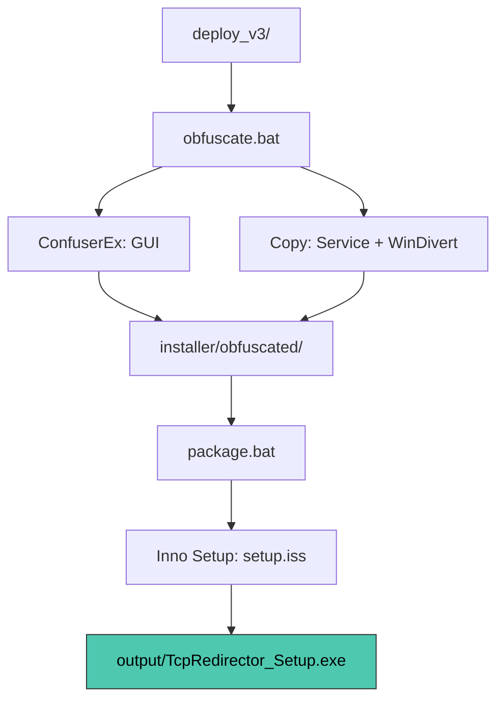

# План: Обфускация + Инсталлятор TcpRedirector

## 🎯 Цель

Из директории [`deploy_v3/`](../deploy_v3/) получить **один файл** `TcpRedirector_Setup.exe`, который:
- Устанавливает приложение (службу + GUI + драйвер)
- Содержит обфусцированные бинарники
- Не требует от пользователя никаких ручных действий

---

## 📦 Что будем использовать

| Инструмент | Назначение | Лицензия | Сайт |
|------------|-----------|----------|------|
| **ConfuserEx 2** | Обфускация .NET GUI | MIT (бесплатно) | https://github.com/mkaring/ConfuserEx |
| **Inno Setup 6** | Создание инсталлятора | Free | https://jrsoftware.org/isinfo.php |
| **MSVC /O2 + /GL** | Обфускация C++ Service | Уже есть | Встроено в Visual Studio |

> **Почему не VMProtect для C++?** VMProtect — коммерческий (~$700). MSVC с `/O2 /GL /LTCG` уже даёт сильную оптимизацию, которая затрудняет reverse engineering. Если бюджет есть — добавим VMProtect позже (см. раздел "Опционально").

---

## 📁 Структура проекта после выполнения плана

```
TcpRedirector/
├── deploy_v3/                    ← чистые бинарники (уже готовы)
├── tools/
│   ├── ConfuserEx/               ← скачанный ConfuserEx
│   └── InnoSetup/                ← скачанный Inno Setup (или установлен)
├── installer/
│   ├── obfuscate.bat             ← скрипт обфускации
│   ├── package.bat               ← скрипт сборки инсталлятора
│   ├── setup.iss                 ← конфиг Inno Setup
│   └── obfuscated/               ← обфусцированные бинарники (создаётся скриптом)
└── output/
    └── TcpRedirector_Setup.exe   ← ГОТОВЫЙ ИНСТАЛЛЯТОР
```

---

## Шаг 1: Скачать и установить инструменты

### 1.1. Inno Setup 6

1. Открой https://jrsoftware.org/isdl.php
2. Скачай `innosetup-6.4.1.exe` (или новее)
3. Запусти, установи с настройками по умолчанию
4. **Запомни путь:** `C:\Program Files (x86)\Inno Setup 6\`

**Проверка:**
```cmd
"C:\Program Files (x86)\Inno Setup 6\ISCC.exe" /?
```
Должен показать справку.

### 1.2. ConfuserEx 2

1. Открой https://github.com/mkaring/ConfuserEx/releases
2. Скачай `ConfuserEx2.zip` (последний релиз)
3. Распакуй в `C:\Users\user\Desktop\TcpRedirector\tools\ConfuserEx\`

**Проверка:**
```cmd
dir C:\Users\user\Desktop\TcpRedirector\tools\ConfuserEx\Confuser.Cli.exe
```
Должен показать файл.

---

## Шаг 2: Создать конфиг обфускации для .NET GUI

Создай файл [`installer/confuser.crproj`](../installer/confuser.crproj):

```xml
<project outputDir="..\installer\obfuscated\gui" baseDir="..\deploy_v3\gui">
  <module path="TcpRedirectorGUI.exe">
    <rule pattern="true" inherit="false">
      <!-- Переименование всего -->
      <protection id="rename" />
      <!-- Шифрование строк -->
      <protection id="resources" />
      <!-- Запутывание потока управления -->
      <protection id="ctrl flow" />
    </rule>
    <!-- НЕ трогать: точка входа -->
    <rule pattern="TcpRedirectorGUI.App" inherit="false">
      <protection id="rename" action="remove" />
    </rule>
    <!-- НЕ трогать: XAML-привязки и MVVM -->
    <rule pattern="TcpRedirectorGUI.Adapters.*" inherit="false">
      <protection id="rename" action="remove" />
    </rule>
    <!-- НЕ трогать: интерфейсы -->
    <rule pattern="TcpRedirectorGUI.Domain.Ports.*" inherit="false">
      <protection id="rename" action="remove" />
    </rule>
  </module>
</project>
```

> **Почему исключаем Adapters и Domain.Ports?** Там лежат ViewModel'ы и интерфейсы, которые привязаны к XAML через `{Binding}`. Если переименовать — GUI сломается.

---

## Шаг 3: Создать скрипт обфускации

Создай файл [`installer/obfuscate.bat`](../installer/obfuscate.bat):

```batch
@echo off
title TcpRedirector — Obfuscation
cd /d "%~dp0"

set CONFUSER=..\tools\ConfuserEx\Confuser.Cli.exe
set INPUT=..\deploy_v3
set OUTPUT=obfuscated

echo ========================================
echo  Obfuscating TcpRedirector
echo ========================================
echo.

:: Clean output
if exist "%OUTPUT%" rmdir /S /Q "%OUTPUT%" >nul 2>&1
mkdir "%OUTPUT%" >nul 2>&1

:: --- .NET GUI (ConfuserEx) ---
echo [1/2] Obfuscating GUI (ConfuserEx)...
%CONFUSER% -n confuser.crproj
if errorlevel 1 (
    echo [FAIL] GUI obfuscation failed!
    pause & exit /b 1
)
echo [OK] GUI obfuscated

:: --- C++ Service (copy as-is, MSVC /O2 /GL already protects) ---
echo [2/2] Copying Service + WinDivert...
copy /Y "%INPUT%\TcpRedirectorService.exe" "%OUTPUT%\" >nul
copy /Y "%INPUT%\WinDivert.dll" "%OUTPUT%\" >nul
copy /Y "%INPUT%\WinDivert64.sys" "%OUTPUT%\" >nul
copy /Y "%INPUT%\config.json" "%OUTPUT%\" >nul
echo [OK] Service copied

echo.
echo ========================================
echo  Obfuscation complete!
echo  Output: %CD%\%OUTPUT%\
echo ========================================
pause
```

---

## Шаг 4: Создать конфиг Inno Setup

Создай файл [`installer/setup.iss`](../installer/setup.iss):

```inno
#define MyAppName "TcpRedirector"
#define MyAppVersion "1.0.0"
#define MyAppPublisher "TcpRedirector"
#define MyAppURL "https://github.com/example/TcpRedirector"
#define MyAppExeName "TcpRedirectorGUI.exe"

[Setup]
AppId={{B8E4F2A1-1234-5678-9ABC-DEF012345678}
AppName={#MyAppName}
AppVersion={#MyAppVersion}
AppPublisher={#MyAppPublisher}
AppPublisherURL={#MyAppURL}
AppSupportURL={#MyAppURL}
AppUpdatesURL={#MyAppURL}

; Куда ставим
DefaultDirName={autopf}\{#MyAppName}

; Где лежат файлы для упаковки (ОТНОСИТЕЛЬНО ЭТОГО .iss ФАЙЛА)
SourceDir=obfuscated

; Один файл на выходе
OutputDir=..\output
OutputBaseFilename=TcpRedirector_Setup

; Настройки
Compression=lzma2/ultra64
SolidCompression=yes
WizardStyle=modern
PrivilegesRequired=admin
ArchitecturesInstallIn64BitMode=x64compatible

; Иконка (опционально — положи setup.ico рядом с .iss)
; SetupIconFile=setup.ico

[Languages]
Name: "english"; MessagesFile: "compiler:Default.isl"
Name: "russian"; MessagesFile: "compiler:Languages\Russian.isl"

[Files]
; GUI (обфусцированный)
Source: "gui\TcpRedirectorGUI.exe";              DestDir: "{app}\gui"; Flags: ignoreversion
Source: "gui\TcpRedirectorGUI.dll";              DestDir: "{app}\gui"; Flags: ignoreversion
Source: "gui\TcpRedirectorGUI.runtimeconfig.json"; DestDir: "{app}\gui"; Flags: ignoreversion
Source: "gui\TcpRedirectorGUI.deps.json";        DestDir: "{app}\gui"; Flags: ignoreversion
Source: "gui\CommunityToolkit.Mvvm.dll";         DestDir: "{app}\gui"; Flags: ignoreversion
Source: "gui\Microsoft.Extensions.*.dll";        DestDir: "{app}\gui"; Flags: ignoreversion
Source: "gui\System.ServiceProcess.ServiceController.dll"; DestDir: "{app}\gui"; Flags: ignoreversion
Source: "gui\runtimes\*";                        DestDir: "{app}\gui\runtimes"; Flags: ignoreversion recursesubdirs

; Service
Source: "TcpRedirectorService.exe";              DestDir: "{app}"; Flags: ignoreversion

; WinDivert
Source: "WinDivert.dll";                         DestDir: "{app}"; Flags: ignoreversion
Source: "WinDivert64.sys";                       DestDir: "{app}"; Flags: ignoreversion

; Config (только если нет существующего — не перезаписывать!)
Source: "config.json";                           DestDir: "{app}"; Flags: ignoreversion onlyifdoesntexist

[Icons]
; Ярлык на GUI в меню Пуск
Name: "{autoprograms}\{#MyAppName}";             Filename: "{app}\gui\{#MyAppExeName}"
; Ярлык на GUI на рабочем столе
Name: "{autodesktop}\{#MyAppName}";              Filename: "{app}\gui\{#MyAppExeName}"; Tasks: desktopicon

[Tasks]
Name: "desktopicon"; Description: "Create a &desktop icon"; GroupDescription: "Additional icons:"

[Run]
; Установка WinDivert драйвера
Filename: "{sys}\sc.exe"; Parameters: "create WinDivert binPath=""{app}\WinDivert64.sys"" type=kernel start=demand"; \
    StatusMsg: "Installing WinDivert driver..."; Flags: runhidden
Filename: "{sys}\sc.exe"; Parameters: "start WinDivert"; \
    StatusMsg: "Starting WinDivert driver..."; Flags: runhidden

; Установка и запуск службы
Filename: "{app}\TcpRedirectorService.exe"; Parameters: "--install"; \
    StatusMsg: "Installing TcpRedirector service..."; Flags: runhidden
Filename: "{sys}\sc.exe"; Parameters: "start TcpRedirectorService"; \
    StatusMsg: "Starting TcpRedirector service..."; Flags: runhidden

; Запуск GUI после установки (галочка в конце инсталлятора)
Filename: "{app}\gui\{#MyAppExeName}"; \
    Description: "Launch TcpRedirector GUI"; \
    Flags: nowait postinstall skipifsilent

[UninstallRun]
; Остановка и удаление службы
Filename: "{sys}\sc.exe"; Parameters: "stop TcpRedirectorService"; Flags: runhidden
Filename: "{app}\TcpRedirectorService.exe"; Parameters: "--uninstall"; Flags: runhidden

; Остановка и удаление WinDivert драйвера
Filename: "{sys}\sc.exe"; Parameters: "stop WinDivert"; Flags: runhidden
Filename: "{sys}\sc.exe"; Parameters: "delete WinDivert"; Flags: runhidden

[Code]
// Проверка .NET Desktop Runtime 9.0
function InitializeSetup: Boolean;
var
  ResultCode: Integer;
begin
  Result := True;
  
  // Проверяем наличие .NET Runtime
  if not RegKeyExists(HKLM, 'SOFTWARE\dotnet\Setup\InstalledVersions\x64\sharedfx\Microsoft.WindowsDesktop.App\9.0') then
  begin
    if MsgBox(
      '.NET Desktop Runtime 9.0 is required but not found.' + #13#10 +
      'Download it from https://dotnet.microsoft.com/en-us/download/dotnet/9.0' + #13#10 +
      'Continue installation anyway?',
      mbConfirmation, MB_YESNO) = IDNO then
    begin
      Result := False;
    end;
  end;
end;
```

---

## Шаг 5: Создать скрипт сборки инсталлятора

Создай файл [`installer/package.bat`](../installer/package.bat):

```batch
@echo off
title TcpRedirector — Package Installer
cd /d "%~dp0"

set INNOSETUP=C:\Program Files (x86)\Inno Setup 6\ISCC.exe

echo ========================================
echo  Building TcpRedirector Installer
echo ========================================
echo.

:: Step 1: Obfuscation
echo [1/2] Running obfuscation...
call obfuscate.bat
if errorlevel 1 (
    echo [FAIL] Obfuscation failed!
    pause & exit /b 1
)

:: Step 2: Build installer
echo [2/2] Building installer (Inno Setup)...
if not exist "%INNOSETUP%" (
    echo [FAIL] Inno Setup not found at: %INNOSETUP%
    echo Install Inno Setup 6 from https://jrsoftware.org/isdl.php
    pause & exit /b 1
)

"%INNOSETUP%" setup.iss
if errorlevel 1 (
    echo [FAIL] Installer build failed!
    pause & exit /b 1
)

echo.
echo ========================================
echo  DONE!
echo  Installer: ..\output\TcpRedirector_Setup.exe
echo ========================================
pause
```

---

## Шаг 6: Запустить сборку

Открой **командную строку** (cmd.exe) и выполни:

```cmd
cd C:\Users\user\Desktop\TcpRedirector\installer
package.bat
```

Результат: `C:\Users\user\Desktop\TcpRedirector\output\TcpRedirector_Setup.exe`

---

## 🔄 Как переиспользовать для следующих сборок

Каждый раз когда выходи новая версия:

1. **Пересобрать бинарники:**
   ```cmd
   cd C:\Users\user\Desktop\TcpRedirector
   build.bat
   ```

2. **Обновить deploy_v3** (если изменился состав файлов):
   ```cmd
   deploy.bat
   ```
   Или вручную скопировать новые файлы в `deploy_v3\`.

3. **Обновить версию в setup.iss:**
   Открой [`installer/setup.iss`](../installer/setup.iss) и поменяй:
   ```inno
   #define MyAppVersion "1.0.1"   ← новая версия
   ```

4. **Пересобрать инсталлятор:**
   ```cmd
   cd C:\Users\user\Desktop\TcpRedirector\installer
   package.bat
   ```

Всё! Новый `TcpRedirector_Setup.exe` готов.

---

## 📋 Проверка инсталлятора (тестирование)

### На чистой машине (или виртуалке):

1. Скопируй `TcpRedirector_Setup.exe` на машину
2. Убедись что **.NET Desktop Runtime 9.0 x64** установлен (или инсталлятор предупредит)
3. Запусти `TcpRedirector_Setup.exe` от имени Администратора
4. Пройди мастер установки (Next → Next → Install)
5. Проверь:
   - [ ] `C:\Program Files\TcpRedirector\` — создана
   - [ ] `C:\Program Files\TcpRedirector\gui\TcpRedirectorGUI.exe` — запускается
   - [ ] Служба `TcpRedirectorService` — запущена (`services.msc`)
   - [ ] Драйвер `WinDivert` — запущен (`sc query WinDivert`)
   - [ ] Ярлык в меню Пуск — работает
6. Проверь удаление:
   - [ ] `Settings → Apps → TcpRedirector → Uninstall`
   - [ ] Служба удалена
   - [ ] Драйвер удалён
   - [ ] Папка `C:\Program Files\TcpRedirector\` удалена

---

## ⚠️ Важные замечания

### 1. .NET Runtime
Инсталлятор **НЕ** включает .NET Runtime. Пользователь должен установить его отдельно. Инсталлятор предупредит, если Runtime не найден.

**Альтернатива:** Встроить .NET Runtime в инсталлятор (добавит ~50 MB):
- Скачать `windowsdesktop-runtime-9.0.0-win-x64.exe`
- Добавить в `[Files]` и `[Run]` секции setup.iss

### 2. WinDivert64.sys
Драйвер должен быть подписан. Оригинальный `WinDivert64.sys` уже подписан разработчиком — **не меняй его**.

### 3. config.json
Инсталлятор кладёт `config.json` в `C:\Program Files\TcpRedirector\`. Но служба читает его из `C:\ProgramData\TcpRedirector\`. Нужно либо:
- **(Проще)** В `[Run]` добавить копирование: `copy "{app}\config.json" "{commonappdata}\TcpRedirector\config.json"`
- **(Правильнее)** Поправить службу чтобы читала из `{app}\` или создать symlink

### 4. Права Администратора
Инсталлятор требует права Администратора (`PrivilegesRequired=admin`). Это обязательно для:
- Установки kernel-драйвера WinDivert
- Регистрации Windows-службы

---

## 💰 Опционально: VMProtect для C++ Service

Если бюджет позволяет (~$700):

1. Купить VMProtect Ultimate на https://vmpsoft.com/
2. Установить, запустить GUI
3. Открыть `TcpRedirectorService.exe`
4. Выбрать функции для виртуализации:
   - `main`
   - `ServiceMain`
   - Все внутренние функции обработки пакетов
5. **НЕ виртуализировать:**
   - `ServiceControlHandlerEx`
   - Функции работы с WinDivert API
6. Сохранить проект как `installer\vmprotect.vmp`
7. Добавить в `obfuscate.bat` перед копированием Service:
   ```batch
   echo [1.5/2] VMProtect Service...
   "C:\Program Files\VMProtect Ultimate\VMProtect_Con.exe" vmprotect.vmp
   ```

---

## 📊 Итоговая схема



---

## ✅ Чек-лист готовности

- [ ] Inno Setup 6 установлен
- [ ] ConfuserEx 2 скачан в `tools/ConfuserEx/`
- [ ] `deploy_v3/` содержит актуальные бинарники
- [ ] Создан `installer/confuser.crproj`
- [ ] Создан `installer/obfuscate.bat`
- [ ] Создан `installer/setup.iss`
- [ ] Создан `installer/package.bat`
- [ ] `package.bat` выполнен без ошибок
- [ ] `output/TcpRedirector_Setup.exe` создан
- [ ] Инсталлятор протестирован на чистой машине