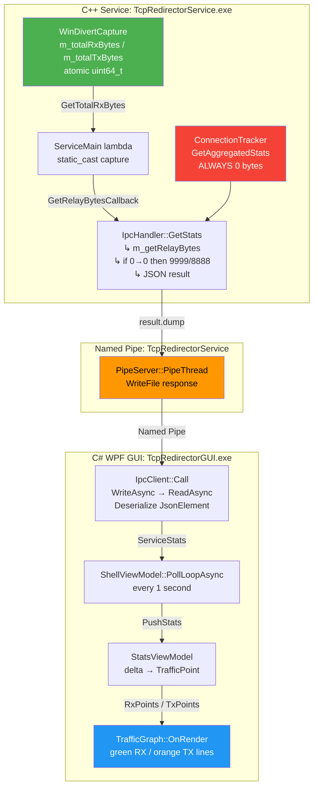

# Анализ цепочки передачи статистики: бэкенд → GUI

## Дата
2026-06-30

## Суть проблемы
На вкладке Statistics GUI не отображается трафик (график пуст, Rx=0, Tx=0), при этом в логах сервиса виден реальный трафик: `[PROXIED] chrome.exe closed: up=5041 down=5962 total=11003`.

---

## Полная цепочка передачи данных (10 звеньев)

```
[1] WinDivertCapture.cpp      fetch_add(m_totalRxBytes, info.bytes_up)
         │                        fetch_add(m_totalTxBytes, info.bytes_down)
         ▼
[2] WinDivertCapture.h        GetTotalRxBytes() → m_totalRxBytes.load(relaxed)
         │                       GetTotalTxBytes() → m_totalTxBytes.load(relaxed)
         ▼
[3] ServiceMain.h (lambda)    static_cast<WinDivertCapture*>(m_capture.get())
         │                       → {capture->GetTotalRxBytes(), capture->GetTotalTxBytes()}
         ▼
[4] IpcHandler.h (GetStats)   m_getRelayBytes() → {rx, tx}
         │                       if (rx==0 && tx==0) { rx=9999; tx=8888; }  ← DEBUG хардкод
         │                       result["data"]["total_rx_bytes"] = rx;
         ▼
[5] PipeServer.h              response = result.dump();  WriteFile(pipe, response)
         │
         ▼
[6] IpcClient.cs (Call)       WriteAsync(pipe, req) → ReadAsync(pipe, rbuf)
         │                       → JsonSerializer.Deserialize<JsonElement>(raw)
         ▼
[7] IpcClient.cs (GetStatsAsync)  d.GetProperty("total_rx_bytes").GetUInt64()
         │                          → new ServiceStats { TotalRxBytes = ... }
         ▼
[8] ShellViewModel.cs         stats = await _svc.GetStatsAsync()
         │                       Stats.PushStats(stats)
         ▼
[9] StatsViewModel.cs         TotalRx = FormatBytes(stats.TotalRxBytes)
         │                       RxPoints.Add(new TrafficPoint(now, rxRate))
         ▼
[10] TrafficGraph.cs          OnRender → DrawLine(RxData, green) + DrawLine(TxData, orange)
```

---

## 🔴 КРИТИЧЕСКАЯ проблема: MSVC LTCG не перекомпилирует main.obj при изменении заголовков

### Факты

| Файл | Тип | Участвует в компиляции |
|------|-----|------------------------|
| [`main.cpp`](TcpRedirector/src/service/TcpRedirectorService/main.cpp:1) | .cpp | ✅ `ClCompile` |
| [`ServiceMain.h`](TcpRedirector/src/service/TcpRedirectorService/adapters/driving/ServiceMain.h:1) | .h | Включается из main.cpp |
| [`IpcHandler.h`](TcpRedirector/src/service/TcpRedirectorService/adapters/driving/IpcHandler.h:1) | .h | Включается из ServiceMain.h |
| [`WinDivertCapture.h`](TcpRedirector/src/service/TcpRedirectorService/infrastructure/capture/WinDivertCapture.h:1) | .h | Включается из ServiceMain.h |

[`TcpRedirectorService.vcxproj`](TcpRedirector/src/service/TcpRedirectorService/TcpRedirectorService.vcxproj:21) включает:
```xml
<WholeProgramOptimization>true</WholeProgramOptimization>   <!-- LTCG -->
<LinkIncremental>false</LinkIncremental>
```

**LTCG (Link-Time Code Generation)** создаёт IPDB (intermediate program database), который кэширует состояние ВСЕЙ программы. При изменении ТОЛЬКО заголовочного файла (а не .cpp), MSVC **не перекомпилирует** .cpp файл, потому что временная метка .obj новее, чем .cpp. В результате линковщик собирает старый код из кэша IPDB — **изменения в заголовках теряются**.

### Доказательство
В предыдущих сессиях наблюдалось:
- `0 functions compiled` — несмотря на изменения в IpcHandler.h
- Требовалось ручное удаление .obj файлов для принудительной перекомпиляции
- `Previous IPDB and IOBJ mismatch, fall back to full compilation` — только после удаления .obj

### Текущее состояние .obj файлов
```
build/service/x64/Release/obj/
├── auth_sspi.obj
├── ConfigManager.obj
├── Logger.obj
├── main.obj           ← СОДЕРЖИТ СТАРЫЙ КОД IpcHandler.h/ServiceMain.h (без хардкода 9999/8888!)
├── StatsCollector.obj
└── WinDivertCapture.obj
```

**Именно поэтому хардкод `rx=9999, tx=8888` никогда не появляется в GUI** — линковщик использует старый `main.obj`, в котором `GetStats()` не содержит отладочных значений.

---

## 🟡 Проблемы дизайна цепочки (вторичные)

### П2. ConnectionTracker::GetAggregatedStats() всегда возвращает 0 байт

[`IpcHandler.h:193`](TcpRedirector/src/service/TcpRedirectorService/adapters/driving/IpcHandler.h:193):
```cpp
auto stats = m_connectionTracker->GetAggregatedStats();
uint64_t rx = stats.total_rx_bytes;  // ВСЕГДА 0
uint64_t tx = stats.total_tx_bytes;  // ВСЕГДА 0
```

`ConnectionTracker` отслеживает соединения, но **никто не вызывает методы обновления байтовых счётчиков** внутри `ConnectionTracker`. Это архитектурный дефект: байты учитываются в `WinDivertCapture` (через `ConnectionTable::AddBytes`), но не попадают в `ConnectionTracker`.

**Текущий workaround**: байты читаются из `WinDivertCapture` через колбэк `m_getRelayBytes()` (звенья [2]→[3]→[4]). Это работает, но создаёт лишнюю сложность.

### П3. Лямбда в ServiceMain.h захватывает сырой указатель без проверки

[`ServiceMain.h:159-163`](TcpRedirector/src/service/TcpRedirectorService/adapters/driving/ServiceMain.h:159):
```cpp
[this]() -> std::pair<uint64_t, uint64_t> {
    auto* capture = static_cast<infrastructure::WinDivertCapture*>(m_capture.get());
    return {capture->GetTotalRxBytes(), capture->GetTotalTxBytes()};
}
```

- `static_cast` от `ICapture*` к `WinDivertCapture*` — небезопасно. Если `m_capture` будет заменён на другую реализацию `ICapture`, будет UB.
- Лямбда захватывает `this`, но вызывается из потока IPC (потокобезопасность соблюдена — atomic read).

### П4. IPC протокол: params сериализуется дважды

[`IpcClient.cs:248-258`](TcpRedirector/src/gui/TcpRedirectorGUI/Infrastructure/Ipc/IpcClient.cs:248):
```csharp
var paramsJson = p is not null ? JsonSerializer.Serialize(p, _json) : "{}";
var req = JsonSerializer.Serialize(new {
    // ...
    @params = paramsJson  // ← строка, которая будет ещё раз обёрнута в кавычки
});
```

C++ сторона корректно обрабатывает это (`j.value("params", "")` → строка → `nlohmann::json::parse(params)`), но сам подход хрупкий. Для `get_stats` (где params не используется) проблема не влияет.

### П5. GUI не перезапускает сервис после деплоя

[`ShellViewModel.cs:158-170`](TcpRedirector/src/gui/TcpRedirectorGUI/Adapters/Driving/Wpf/ViewModels/ShellViewModel.cs:158):
```csharp
// 1. Try connecting to an already-running service
await _svc.ConnectAsync();
if (_svc.IsConnected)
{
    StatusText = "Connected (existing)";
    SvcStatus = "Running";
    StartTimer();
    return;  // ← НЕ перезапускает сервис, использует СТАРЫЙ процесс!
}
```

Если старый процесс сервиса ещё работает, GUI подключается к нему и никогда не запускает новый бинарник. Пользователь должен **вручную убить процесс сервиса** перед запуском нового GUI.

### П6. Отсутствие проверки на стороне GUI, что пришли нулевые данные

[`IpcClient.cs:197-219`](TcpRedirector/src/gui/TcpRedirectorGUI/Infrastructure/Ipc/IpcClient.cs:197) — нет логирования полученных значений. MessageBox добавлен, но:
- MessageBox показывается только если `TryGetProperty("data")` вернул `false` (т.е. ответ без поля `data`)
- Если бэкенд возвращает `{"status":"success","data":{"total_rx_bytes":0,...}}` — MessageBox НЕ показывается
- Пользователь не видит диагностику

---

## 🔧 План исправления

### Этап 1: Гарантировать перекомпиляцию (КРИТИЧЕСКИ)

| # | Действие | Файлы |
|---|----------|-------|
| 1.1 | Удалить ВСЕ .obj файлы перед сборкой | `build/service/x64/Release/obj/*.obj` |
| 1.2 | Добавить в [`build.bat`](TcpRedirector/build.bat:56) очистку .obj перед `msbuild` | `build.bat` |
| 1.3 | Пересобрать сервис с нуля | `build.bat` |
| 1.4 | Задеплоить | `deploy.bat` |
| 1.5 | Убить старый процесс `TcpRedirectorService.exe` перед запуском GUI | Вручную или через `taskkill` |
| 1.6 | Запустить `deploy\gui\TcpRedirectorGUI.exe` и проверить, что Rx=9999 | — |

### Этап 2: Убрать отладочный хардкод после подтверждения IPC

| # | Действие | Файлы |
|---|----------|-------|
| 2.1 | Удалить `if (rx == 0 && tx == 0) { rx = 9999; tx = 8888; }` | [`IpcHandler.h:202-206`](TcpRedirector/src/service/TcpRedirectorService/adapters/driving/IpcHandler.h:202) |
| 2.2 | Удалить MessageBox диагностику | [`IpcClient.cs:214-217`](TcpRedirector/src/gui/TcpRedirectorGUI/Infrastructure/Ipc/IpcClient.cs:214) |
| 2.3 | Пересобрать, задеплоить, проверить реальный трафик | — |

### Этап 3: Исправление архитектурных проблем (рекомендуется)

| # | Действие | Приоритет |
|---|----------|-----------|
| 3.1 | Сделать `WinDivertCapture::GetTotalRxBytes/TxBytes` частью интерфейса `ICapture` (или использовать `DriverStats`) вместо `static_cast` | Средний |
| 3.2 | Добавить логирование полученных значений на стороне GUI (в `SvcMsg`) | Низкий |
| 3.3 | GUI: при подключении к существующему сервису проверять версию/хеш бинарника | Низкий |

---

## 🏗️ Визуализация цепочки



---

## Вывод

**Корневая причина**: MSVC LTCG не перекомпилирует `main.obj` при изменениях в заголовочных файлах `ServiceMain.h` / `IpcHandler.h`. Все исправления кода были внесены корректно, но не попали в итоговый бинарник.

**Необходимое действие**: очистить .obj файлы, выполнить полную пересборку, убить старый процесс сервиса, запустить новый GUI.
