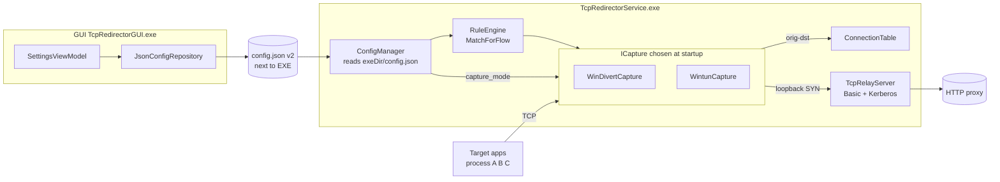
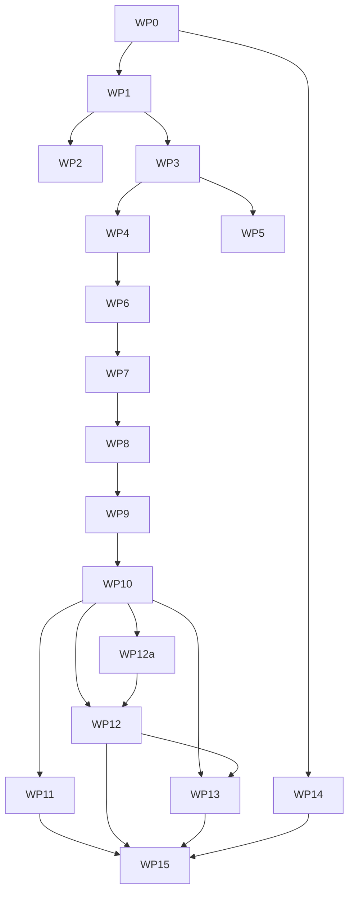

# Wintun Integration & Multi-Port / Route-All Refactor — Implementation Plan

**Status:** Design ready for Code-mode delegation.
**Author:** Architect mode.
**Scope:** Introduce Wintun-based capture engine (tun2socks pattern) as an alternative to WinDivert; move `config.json` next to the executable; extend rules with multiple ports / port ranges / "route all traffic" per app; keep Basic + Kerberos auth intact; produce a Russian-language documentation set.

**Prior art / required reading:**
- [`docs/WINDIVERT_ALTERNATIVES.md`](../docs/WINDIVERT_ALTERNATIVES.md:1) — the recommendation this plan implements.
- [`plans/audit_fixes_plan.md`](audit_fixes_plan.md:1) — earlier audit that placed config under `%ProgramData%` (M4). Superseded here.

---

## 0. Executive summary

- **Chosen Wintun engine sub-option:** dual-track — **primary** is an embedded C++ tun2socks-style engine using **lwIP** compiled from source and statically linked into the service; **secondary, runtime-selectable** is an external `tun2socks.exe` child process (recommended fork: [`xjasonlyu/tun2socks`](https://github.com/xjasonlyu/tun2socks), MIT-licensed) supervised by the service. The active engine is chosen at runtime via `wintun.engine` (`"embedded"` | `"external"`) — no rebuild required. Both paths reuse the existing [`TcpRelayServer`](../src/service/TcpRedirectorService/infrastructure/relay/TcpRelayServer.h:44) (the external engine reaches the relay through a thin SOCKS5 adapter over the same accept path). Rationale below in §6.
- **Chosen per-process routing option:** **Option 2** — use **WFP user-mode filters** (`FwpmEngineOpen0`, `FWPM_LAYER_ALE_AUTH_CONNECT_V4/V6`) to steer only selected apps' outbound TCP to the Wintun adapter's tunnel subnet, combined with a `netsh` route for that subnet pointing at the Wintun adapter. No kernel driver of our own is required (WFP user-mode engine only). Details in §6.
- **Config location:** `config.json` lives **next to the built EXE** — resolved from `GetModuleFileNameW()` for the service and `AppContext.BaseDirectory` for the GUI. The current `%ProgramData%` fallback is removed. First-run behaviour: seed `config.json` from a shipped `config.default.json` (or from in-code defaults if the seed is missing). One-shot migration from `%ProgramData%\TcpRedirector\config.json` runs on first startup after upgrade.
- **Multi-port / range / route-all-traffic:** modelled per app rule in schema v2 (`ports[]`, `port_ranges[]`, `route_all_traffic`). Rule matching gains a port predicate. GUI adds a checkbox that disables the port UI when enabled.
- **Mode isolation:** startup preflight is split; if `capture_mode = wintun`, WinDivert files/driver are never checked, and vice versa.
- **Docs:** old `docs/*.md` and root-level `.md` files (except `README.md` and `docs/WINDIVERT_ALTERNATIVES.md`) are deleted. A Russian doc set is scaffolded (structure only in this plan; prose comes in a later Documentation Writer subtask).

---

## 1. `.bin\` layout

**Location:** `e:/Projects/work/China/TcpRedirector/.bin/` — created at repo root.

**Structure:**
```
.bin/
  README.md                 # Placeholder telling devs which artifacts go here
  wintun/
    x64/wintun.dll          # Wintun 0.14+ x64 (unpacked from wintun-0.14.zip)
    x86/wintun.dll          # (Optional; we ship x64 only for now)
  tun2socks/                # RESERVED — used only if we ever switch to the
                            # shelled-out sub-option; currently empty
  windivert/                # Optional relocation target for WinDivert*.dll/.sys
                            # (existing files under external\WinDivert stay where
                            # they are; we do NOT touch them per user requirement).
```

**Rules:**
- `.bin/` is a **repository-tracked** folder for downloadable third-party binaries. Contents are **git-ignored** but the folder itself is kept via a tracked `.gitkeep`/`README.md`.
- `.gitignore` addition (append to the repo-root [`.gitignore`](../.gitignore:1)):
  ```gitignore
  # Third-party binaries fetched out-of-band (Wintun DLL, optional tun2socks)
  .bin/**
  !.bin/README.md
  !.bin/.gitkeep
  ```
- **Build/deploy copy step:** [`build.bat`](../build.bat:79) already copies WinDivert bits; extend it to also copy `.bin\wintun\x64\wintun.dll → build\wintun.dll` (see §9).
- **Runtime lookup path** (used by `WintunAdapter::LoadDll()`):
  1. `<exeDir>\wintun.dll` (installer/deploy target)
  2. `<exeDir>\.bin\wintun\x64\wintun.dll` (developer/dev-run scenario)
  3. `<exeDir>\.bin\wintun.dll` (fallback flat layout)
  Never falls back to `System32`; the DLL must ship with the product.

---

## 2. Config location refactor

### 2.1 New resolution logic

**Service (C++, [`ConfigManager`](../src/service/TcpRedirectorService/infrastructure/config/ConfigManager.cpp:23)):** replace the `%ProgramData%` resolver with a module-directory resolver:

```cpp
// Replaces ConfigManager::ConfigManager() (ConfigManager.cpp:23-30)
static std::filesystem::path ResolveExeDir() {
    wchar_t buf[MAX_PATH];
    DWORD n = GetModuleFileNameW(nullptr, buf, MAX_PATH);
    if (n == 0 || n == MAX_PATH) return std::filesystem::current_path();
    return std::filesystem::path(buf).parent_path();
}
ConfigManager::ConfigManager() {
    m_configPath = ResolveExeDir() / L"config.json";
}
```

Rationale for `GetModuleFileNameW`: when the Service Control Manager starts the service, the current working directory is `C:\Windows\System32`, so `std::filesystem::current_path()` is wrong. `GetModuleFileNameW(NULL, …)` reliably returns the path of the running EXE inside SCM, in `--console` mode, and under debuggers.

**Service log directory** ([`ConfigManager::GetLogDirectory`](../src/service/TcpRedirectorService/infrastructure/config/ConfigManager.cpp:127) and the fallback in [`ServiceMain::Initialize`](../src/service/TcpRedirectorService/adapters/driving/ServiceMain.h:37-44)) is redirected to `<exeDir>\logs\`. Rationale: keeps the product self-contained; no `%ProgramData%` writes.

**GUI (C#, [`JsonConfigRepository`](../src/gui/TcpRedirectorGUI/Infrastructure/Config/JsonConfigRepository.cs:19)):**

```csharp
public JsonConfigRepository()
{
    var exeDir = AppContext.BaseDirectory;              // path of TcpRedirectorGUI.exe
    _configPath = Path.Combine(exeDir, "config.json");
}
```

The GUI, once installed under `%ProgramFiles%\TcpRedirector\gui\`, would otherwise read a file inside its own subfolder; because both GUI and Service must share the *same* `config.json`, the installer places the GUI **next to** the service EXE (see §9) rather than in a `gui\` subfolder, or — as an alternative — the GUI resolves `..\config.json` when it is in a nested folder:

```csharp
var candidate = Path.Combine(exeDir, "config.json");
if (!File.Exists(candidate)) {
    var up = Path.Combine(exeDir, "..", "config.json");
    if (File.Exists(up)) candidate = Path.GetFullPath(up);
}
_configPath = candidate;
```

**Decision:** we keep the GUI under `<install>\gui\` (unchanged installer layout at [`installer/setup.iss`](../installer/setup.iss:26)) and the GUI walks one level up as shown. Rationale: preserves the existing installer's file separation; a single `config.json` at `<install>\config.json` is shared.

### 2.2 First-run + concurrency

- **Missing file:** `ConfigManager::LoadImpl()` already calls [`CreateDefaultConfig`](../src/service/TcpRedirectorService/infrastructure/config/ConfigManager.cpp:309) which writes a full JSON on first read. Keep this; extend the defaults with schema v2 fields (§3). The GUI's `EnsureFileExists()` currently writes `"{ }"` — change it to write a full seed template so schema v2 keys exist for the user's first open.
- **Missing directory:** the resolver never picks a nonexistent directory (the EXE parent always exists). No `create_directories` is needed for the config path itself.
- **Read-only path:** if `SaveImpl()` fails with `access_denied`, log an ERROR and keep working with the in-memory config. Do **not** silently fall back to `%ProgramData%`. The installer runs elevated and installs to `%ProgramFiles%\TcpRedirector`, so the service (running as LocalSystem) **can** write there.
- **Atomic write:** the existing tmp+rename pattern ([`ConfigManager.cpp:294-302`](../src/service/TcpRedirectorService/infrastructure/config/ConfigManager.cpp:294) and [`JsonConfigRepository.Save`](../src/gui/TcpRedirectorGUI/Infrastructure/Config/JsonConfigRepository.cs:210)) is preserved.
- **Concurrent read/write between GUI and service:** the current design is single-writer (GUI writes, service reads on demand or via IPC push). No lock is added; both sides tolerate transient parse failures and re-read.

### 2.3 One-shot migration from %ProgramData%

Executed once inside `ConfigManager::LoadImpl()` before the "file missing" branch:

```cpp
if (!std::filesystem::exists(m_configPath)) {
    // MIGRATE-ONCE from %ProgramData%\TcpRedirector\config.json
    wchar_t pd[MAX_PATH]{};
    if (GetEnvironmentVariableW(L"ProgramData", pd, MAX_PATH) > 0) {
        auto legacy = std::filesystem::path(pd) / L"TcpRedirector" / L"config.json";
        std::error_code ec;
        if (std::filesystem::exists(legacy, ec)) {
            std::filesystem::copy_file(legacy, m_configPath,
                std::filesystem::copy_options::overwrite_existing, ec);
            // Do NOT delete legacy — leave a breadcrumb for rollback.
        }
    }
    if (!std::filesystem::exists(m_configPath)) return CreateDefaultConfig();
}
```

Rationale: migration is a copy, not a move — a user rolling back to an older build keeps the legacy file. GUI's `JsonConfigRepository` does the equivalent copy on first `Load()`.

### 2.4 Service working directory

**Do not use `SetCurrentDirectory` inside the service.** All paths (config, logs, `wintun.dll`, `WinDivert*`) must be resolved via `GetModuleFileNameW` → `parent_path()` **on every access**. This is already fixed for install path in [`main.cpp:79-89`](../src/service/TcpRedirectorService/main.cpp:79); apply the same idiom throughout `ConfigManager`, `WintunAdapter::LoadDll`, `WinDivertCapture::LoadWinDivertApi`, and `Logger::Initialize`.

---

## 3. Config schema v2

### 3.1 Full JSON shape

```jsonc
{
  "schema_version": 2,
  "capture_mode": "windivert",          // "windivert" | "wintun". Default: "windivert" for backward compat.

  "wintun": {
    "adapter_name": "TcpRedirector",     // Wintun adapter display name
    "adapter_guid": "",                  // Empty → generated on first start; persisted here.
    "tunnel_ipv4_cidr": "10.6.7.1/24",   // TUN-side IP + prefix; gateway = .1
    "tunnel_ipv6_cidr": "",              // Empty → IPv6 disabled on the tunnel
    "mtu": 1500,
    "dns": {
      "mode": "system",                  // "system" | "custom" | "block"
      "servers": []                      // Only used when mode="custom"
    },
    "wfp_scoping": true,                 // If true, install WFP AppId filters (§6). Else, catch-all route.

    // NEW in this amendment — chooses which tun2socks engine drives the Wintun adapter.
    // Runtime-selectable; no rebuild required. Default: "embedded".
    "engine": "embedded",                // "embedded" | "external"

    // Only consulted when engine == "external". Ignored otherwise.
    "external_engine": {
      "executable": ".bin/tun2socks/tun2socks.exe", // Relative to app dir; absolute path also accepted.
      "extra_args": [],                             // Optional additional CLI args appended verbatim.
      "socks5_listen": "127.0.0.1:1080",            // Where the relay's SOCKS5 adapter binds AND where tun2socks is told to forward.
      "restart_on_crash": true,
      "restart_backoff_ms": 2000
    }
  },

  "proxy": {
    "host": "127.0.0.1",
    "port": 3128,
    "enabled": true
  },
  "auth": {
    "enabled": false,
    "kerberos": false,
    "username": "",
    "encryptedPassword": ""              // DPAPI-Base64
  },
  "log": {
    "level": 2,
    "fileEnabled": true,
    "maxSizeMB": 10
  },
  "stats": {
    "updateIntervalMs": 2000
  },

  "app": {
    // Legacy single-target. Retained ONLY for schema v1 backward-compat load; new writes go to apps[].
    "exePath": ""
  },

  "apps": [                              // New in v2: multi-app rules.
    {
      "id": "auto-gen-uuid",
      "enabled": true,
      "description": "TransfersClient",
      "match": {
        "type": "process_path",          // "process_name" | "process_path" | "global"
        "pattern": "C:\\Projects\\...\\TransfersClient.exe"
      },
      "route_all_traffic": false,        // If true, ignore ports/port_ranges.
      "ports": [80, 443],                // Individual ports.
      "port_ranges": [                   // Optional inclusive ranges.
        { "from": 8000, "to": 8099 }
      ],
      "action": "proxy",                 // "proxy" | "direct" | "block"
      "proxy_id": 1,                     // Reserved for future multi-proxy; 1 == the single "proxy" section above.
      "priority": 100
    }
  ],

  // Retained for backward-compat load; new writes go to apps[].
  "rules": []
}
```

### 3.2 Field constraints & validation

| Field | Constraint | On violation |
|-------|-----------|--------------|
| `schema_version` | integer, currently 2 | If missing → treat as v1 and run one-shot upgrade in-memory (see §3.3). |
| `capture_mode` | `"windivert"` or `"wintun"` (case-insensitive) | Unknown value → log WARN, fall back to `"windivert"`. |
| `wintun.tunnel_ipv4_cidr` | non-empty CIDR string, `x.x.x.x/n`, n ∈ [8, 30] | Log ERROR at preflight, refuse to start capture in wintun mode. |
| `wintun.mtu` | 576 ≤ mtu ≤ 65535 | Clamp to 1500. |
| `wintun.engine` | `"embedded"` or `"external"` (case-insensitive) | Unknown value → log WARN, fall back to `"embedded"`. |
| `wintun.external_engine.executable` | non-empty string; **file must exist and be executable** when `capture_mode="wintun"` AND `wintun.engine="external"` | Preflight fails with a specific error (see §8.2); service refuses to start capture. Not checked when `engine="embedded"` or when `capture_mode="windivert"`. |
| `wintun.external_engine.socks5_listen` | `host:port`, host must be a loopback literal (`127.0.0.1` or `::1`) | Reject non-loopback host with ERROR at preflight — remote binding is refused for security (see §12). |
| `wintun.external_engine.restart_backoff_ms` | integer ≥ 100 | Clamp to 100 minimum, 60000 maximum. |
| `apps[].ports[i]` | integer 1..65535 | Skip that port entry, WARN. |
| `apps[].port_ranges[i]` | `from ≤ to`, both 1..65535 | Skip the range, WARN. |
| `apps[]` with `route_all_traffic=false` **and** empty ports **and** empty port_ranges | *Effectively unreachable rule* | Log WARN "app rule 'id' has no port criteria — will never match; enable route_all_traffic or add ports". Do NOT auto-disable (respect user intent). |
| `apps[].match.type` | one of the three values | Default to `process_name`. |
| `apps[].action` | one of the three values | Default to `proxy`. |

### 3.3 Backward-compat mapping (v1 → v2)

Executed in `ConfigManager::LoadImpl()` after JSON parse, before validation:

- If `schema_version` is absent → assume v1.
- If `capture_mode` is absent → set to `"windivert"`.
- If `apps` is absent but legacy `rules[]` is non-empty:
  - For each rule in `rules[]`, synthesize an `apps[]` entry:
    - `id = rule.id`
    - `enabled = rule.enabled`
    - `description = rule.description`
    - `match.type = rule.type` (mapped enum→string)
    - `match.pattern = rule.pattern`
    - `route_all_traffic = true` — because v1 had no port filter, "any port" is the correct v2 equivalent.
    - `ports = []`, `port_ranges = []`
    - `action = rule.action`
    - `priority = rule.priority`
- If both `apps[]` and `rules[]` are present, `apps[]` wins; `rules[]` is left in the file untouched (for downgrade safety).
- On the next `SaveImpl()`, `schema_version` is bumped to 2 and both `rules[]` and `apps[]` are written; `rules[]` is a mirror of `apps[]` in the legacy shape so an old build can still read the file (no ports honoured).

### 3.4 New C++ structures

Add to [`Config.h`](../src/service/TcpRedirectorService/infrastructure/config/Config.h:1):

```cpp
enum class CaptureMode { WinDivert, Wintun };

enum class WintunEngine { Embedded, External };

struct ExternalEngineSettings {
    std::string  executable       = ".bin/tun2socks/tun2socks.exe";
    std::vector<std::string> extra_args;
    std::string  socks5_listen    = "127.0.0.1:1080";
    bool         restart_on_crash = true;
    uint32_t     restart_backoff_ms = 2000;
};

struct WintunSettings {
    std::string  adapter_name    = "TcpRedirector";
    std::string  adapter_guid;                     // empty → generated
    std::string  tunnel_ipv4_cidr = "10.6.7.1/24";
    std::string  tunnel_ipv6_cidr;
    uint32_t     mtu             = 1500;
    std::string  dns_mode        = "system";
    std::vector<std::string> dns_servers;
    bool         wfp_scoping     = true;
    WintunEngine engine          = WintunEngine::Embedded;
    ExternalEngineSettings external_engine;
};

struct PortRange { uint16_t from; uint16_t to; };

struct AppRule {
    std::string  id;
    bool         enabled            = true;
    std::wstring description;
    domain::RuleType    match_type   = domain::RuleType::ProcessName;
    std::wstring        match_pattern;
    bool         route_all_traffic  = false;
    std::vector<uint16_t> ports;
    std::vector<PortRange> port_ranges;
    domain::RuleAction  action       = domain::RuleAction::Proxy;
    uint32_t     proxy_id            = 1;
    int          priority            = 0;
};

struct Config {
    int schema_version = 2;
    CaptureMode capture_mode = CaptureMode::WinDivert;
    WintunSettings wintun;
    ProxySettings proxy;
    AuthSettings  auth;
    LogSettings   log;
    StatsSettings stats;
    AppSettings   app;                 // legacy; used only when apps[] is empty
    std::vector<AppRule> apps;
};
```

`std::wstring GetExeName() const` is removed from `Config` (it referenced the legacy single-app field). The equivalent lives on `AppRule` as a helper method.

---

## 4. Rule engine changes

### 4.1 New matching contract

Old matcher ([`RuleEngine::Match`](../src/service/TcpRedirectorService/domain/services/RuleEngine.h:104)) takes only process name/path. Replace with a two-argument overload that also takes the destination port:

```cpp
// New signature — added to RuleEngine, next to existing Match(...):
struct MatchResult {
    RuleAction action = RuleAction::Direct;
    uint32_t   proxy_id = 0;
    std::string rule_id;   // for logs
};

MatchResult MatchForFlow(const std::wstring& process_name,
                         const std::wstring& process_path,
                         uint16_t             dst_port) const;
```

Semantics per app (priority ascending — as today):

```
port_matches := route_all_traffic
             || any p in ports    where p == dst_port
             || any r in port_ranges where r.from <= dst_port <= r.to
```

An `AppRule` matches when the process pattern matches (existing wildcard) **and** `port_matches` is true. First match wins. If no rule matches, the default action is `Direct` (unchanged).

The legacy `Match(name, path)` is kept as a thin wrapper that calls `MatchForFlow(name, path, 0)` with `route_all_traffic=true` semantics — used only by code paths that don't yet have the port available. Callers on the hot path (see §4.2) must migrate to `MatchForFlow`.

### 4.2 Where it plugs in

- **WinDivert path** ([`WinDivertCapture::CheckProcessRule`](../src/service/TcpRedirectorService/infrastructure/capture/WinDivertCapture.h:102)): pass `dst_port` (already available at call site — `tcpHdr->DstPort`) into `MatchForFlow`. Update the per-port decision bitmap ([`WinDivertCapture.h:128-149`](../src/service/TcpRedirectorService/infrastructure/capture/WinDivertCapture.h:128)) to key by *(src_port, dst_port)* pairs instead of *src_port only* — or, cheaper, leave the bitmap keyed by *dst_port* since routing depends on dst; PID re-check on new src_ports remains via the PID cache.
- **Wintun path** (`Tun2SocksEngine`, see §6): call `MatchForFlow` once at TCP SYN parse time.

### 4.3 Loading rules

`ConfigManager::GetRules()` still returns the legacy `std::vector<domain::Rule>` for compatibility with `RuleEngine::SetRules`. Add:

```cpp
std::vector<infrastructure::AppRule> ConfigManager::GetAppRules() const;
void  RuleEngine::SetAppRules(const std::vector<infrastructure::AppRule>&);
```

`RuleEngine` internally stores both `m_rules` (v1) and `m_appRules` (v2). Matching prefers `m_appRules` when non-empty.

---

## 5. `ICapture` alignment

The existing [`ICapture`](../src/service/TcpRedirectorService/domain/ports/ICapture.h:30) contract is already generic enough. The only friction points and required tweaks:

1. `SetTargetProcess(const std::wstring&)` is single-process oriented. For multi-app it should become a no-op (or accept an empty string) — matching moves entirely into `RuleEngine`. Both `WinDivertCapture::SetTargetProcess` and `WintunCapture::SetTargetProcess` can retain the setter for backward compatibility but simply ignore it when a rule engine is attached.
2. Add two optional methods (default-implemented in the header) so consumers can query capture-side state uniformly:
   ```cpp
   virtual uint64_t GetTotalRxBytes() const { return 0; }
   virtual uint64_t GetTotalTxBytes() const { return 0; }
   virtual uint32_t GetActiveConnections() const { return 0; }
   ```
   This removes the `static_cast<WinDivertCapture*>` in [`ServiceMain.h:152-158`](../src/service/TcpRedirectorService/adapters/driving/ServiceMain.h:152) and lets `WintunCapture` supply the same stats.
3. Add `virtual bool SetRuleEngine(domain::services::RuleEngine*) { return false; }` to `ICapture`. Concrete captures override; `ServiceMain` uses it uniformly.

**Selection point:** `ServiceMain::Initialize()` at the "Initialize WinDivert capture" block ([`ServiceMain.h:114-140`](../src/service/TcpRedirectorService/adapters/driving/ServiceMain.h:114)):

```cpp
std::unique_ptr<domain::ports::ICapture> capture;
auto cfg = m_configManager->GetConfig();
switch (cfg.capture_mode) {
    case infrastructure::CaptureMode::Wintun:
        capture = std::make_unique<infrastructure::WintunCapture>(cfg.wintun);
        break;
    case infrastructure::CaptureMode::WinDivert:
    default:
        capture = std::make_unique<infrastructure::WinDivertCapture>();
        break;
}
capture->SetConnectionTable(m_connTable.get());
capture->SetRelayPort(relayPort);
capture->SetRuleEngine(m_ruleEngine.get());
// ...
if (!capture->Open()) return false;
m_capture = std::move(capture);
```

---

## 6. Wintun + tun2socks engine design

### 6.1 Engine selection — both paths are first-class

Two engines are supported in production, selected at runtime by `wintun.engine`:

| Engine | Distribution | Pros | Cons |
|--------|--------------|------|------|
| **Embedded lwIP** (`engine="embedded"`, default) | Statically linked into `TcpRedirectorService.exe`. | No extra process/binary lifecycle; direct access to per-flow original-dst; single service handle for logging/telemetry; native memory-management; smallest installer footprint. | We own a user-mode TCP stack (~2 kLOC of C wrapper around lwIP). |
| **External `tun2socks.exe`** (`engine="external"`) | Shipped in `.bin/tun2socks/tun2socks.exe` — recommended fork: [`xjasonlyu/tun2socks`](https://github.com/xjasonlyu/tun2socks) (**MIT-licensed**, GPL-clean). Service supervises the child. | Battle-tested Go implementation; no lwIP code path exercised; drop-in replacement if the embedded engine regresses in production. | One extra process to supervise (start/stop/health/restart); adds a SOCKS5 hop between the TUN and our HTTP-CONNECT relay (implemented as a thin adapter, not a duplicate relay — see §6.11); separate log stream to reconcile. |

**Both engines terminate at the same [`TcpRelayServer`](../src/service/TcpRedirectorService/infrastructure/relay/TcpRelayServer.h:44)** and reuse the existing CONNECT / Basic / Kerberos code paths unmodified. The embedded engine calls `connect(127.0.0.1:relayPort)` per flow (native path). The external engine reaches the relay through a **SOCKS5 adapter socket** — implemented as a thin adapter over the same relay accept path (see §6.11); the relay logic is not duplicated, only the SOCKS5 greeting/handshake is added.

**Default** is `engine="embedded"` — smallest surface area, tightest telemetry integration. **`engine="external"` is a first-class, runtime-selectable alternative**, not an emergency fallback: switching is a `config.json` edit + service restart with no rebuild required. Both paths ship in every release; both are covered by the release smoke matrix (§WP15).

Engine ownership boundary — **the Wintun adapter is always owned by the service**, regardless of engine choice. In the external-engine case, tun2socks.exe attaches to an adapter we created; the service still runs `WintunCreateAdapter`, assigns IPs, installs routes, and tears the adapter down on stop. The child process is *only* the packet ↔ SOCKS5 translator.

### 6.2 New files (all under [`src/service/TcpRedirectorService/infrastructure/capture/wintun/`](../src/service/TcpRedirectorService/infrastructure/capture/wintun/))

```
wintun/
  WintunApi.h                # Function-pointer table for wintun.dll
  WintunApi.cpp
  WintunAdapter.h            # Adapter lifecycle: create/open/delete/session start/stop
  WintunAdapter.cpp
  ITunEngine.h               # Common port implemented by both engines (Start/Stop/IsHealthy)
  Tun2SocksEngineEmbedded.h  # engine="embedded" — owns lwIP netif + accept-listener; produces AcceptedFlow objects
  Tun2SocksEngineEmbedded.cpp
  Tun2SocksEngineExternal.h  # engine="external" — supervises .bin/tun2socks/tun2socks.exe child process
  Tun2SocksEngineExternal.cpp
  ChildProcessSupervisor.h   # Reusable job-object + pipe-piping + restart-backoff helper (see §6.12)
  ChildProcessSupervisor.cpp
  WintunCapture.h            # ICapture façade wrapping WintunAdapter + one ITunEngine + RouteInstaller
  WintunCapture.cpp
  WfpScope.h                 # WFP user-mode filters (reserved — not used by Option 2b)
  WfpScope.cpp
  RouteInstaller.h           # AddRoute/DelRoute helpers using IP Helper (CreateIpForwardEntry2)
  RouteInstaller.cpp
```

Plus:
- **lwIP sources** vendored under [`external/lwip/`](../external/lwip/) (lwIP 2.2.0 stable, `NO_SYS=1`) — consumed only by `Tun2SocksEngineEmbedded`.
- **`tun2socks.exe`** binary shipped under `.bin/tun2socks/tun2socks.exe` — consumed only by `Tun2SocksEngineExternal`. Recommended source: [`xjasonlyu/tun2socks`](https://github.com/xjasonlyu/tun2socks) release artifacts (MIT-licensed, statically linked Go binary; no external DLL deps). Never shipped into `wintun.dll`'s search path — the child process is invoked by absolute path (see §6.12).

The two engines are behind `ITunEngine` so `WintunCapture` selects one at `Open()` time based on `cfg.wintun.engine`:

```cpp
class ITunEngine {
public:
    virtual ~ITunEngine() = default;
    virtual bool Start() = 0;   // Blocking start-up; returns true if operational.
    virtual void Stop()  = 0;   // Idempotent, must complete cleanup.
    virtual bool IsHealthy() const = 0;   // For status IPC + supervisor.
};
```

### 6.3 `WintunApi` — dynamic loading

```cpp
struct WintunApi {
    HMODULE dll = nullptr;
    // From wintun.h (WireGuard's public header)
    typedef WINTUN_ADAPTER_HANDLE(WINAPI* PFN_CreateAdapter)(LPCWSTR name, LPCWSTR type,
                                                              const GUID* requestedGuid);
    typedef WINTUN_ADAPTER_HANDLE(WINAPI* PFN_OpenAdapter)(LPCWSTR name);
    typedef void(WINAPI* PFN_CloseAdapter)(WINTUN_ADAPTER_HANDLE);
    typedef BOOL(WINAPI* PFN_DeleteDriver)(void);
    typedef void(WINAPI* PFN_GetAdapterLUID)(WINTUN_ADAPTER_HANDLE, NET_LUID*);
    typedef DWORD(WINAPI* PFN_GetRunningDriverVersion)(void);
    typedef WINTUN_SESSION_HANDLE(WINAPI* PFN_StartSession)(WINTUN_ADAPTER_HANDLE, DWORD capacity);
    typedef void(WINAPI* PFN_EndSession)(WINTUN_SESSION_HANDLE);
    typedef HANDLE(WINAPI* PFN_GetReadWaitEvent)(WINTUN_SESSION_HANDLE);
    typedef BYTE*(WINAPI* PFN_ReceivePacket)(WINTUN_SESSION_HANDLE, DWORD* packetSize);
    typedef void(WINAPI* PFN_ReleaseReceivePacket)(WINTUN_SESSION_HANDLE, const BYTE*);
    typedef BYTE*(WINAPI* PFN_AllocateSendPacket)(WINTUN_SESSION_HANDLE, DWORD packetSize);
    typedef void(WINAPI* PFN_SendPacket)(WINTUN_SESSION_HANDLE, const BYTE*);
    // ... function-pointer members omitted for brevity
    bool Load();     // LoadLibraryW + GetProcAddress; searches paths listed in §1
    void Unload();
};
```

`Load()` uses `LoadLibraryExW(..., LOAD_WITH_ALTERED_SEARCH_PATH)` on absolute paths.

### 6.4 `WintunAdapter`

- `Create(name, guid)` → calls `WintunCreateAdapter`. Persists the assigned GUID back into `Config.wintun.adapter_guid` via `ConfigManager` if it was empty.
- `AssignIp(cidr_v4, cidr_v6, mtu)` → uses `MIB_UNICASTIPADDRESS_ROW` + `CreateUnicastIpAddressEntry`, and `SetIpInterfaceEntry` for MTU/metric.
- `StartSession(ringCapacity=0x400000)` (4 MiB per Wintun docs).
- `Rx(pkt&len)` → thin wrappers around receive/release primitives.
- `Tx(pkt,len)` → allocate + memcpy + send.
- `Close()` → EndSession, CloseAdapter. Idempotent.
- **Crash-safe cleanup:** on service start, if an adapter with the configured name already exists (e.g., because we crashed last run), open + delete it before create.

### 6.5 `Tun2SocksEngine`

Design contract:
```
Input  : raw IPv4 + IPv6 packets from WintunAdapter (single reader thread).
Output : for each fully-established TCP flow, invoke callback(AcceptedFlow{
             SOCKET clientHalf,     // one end of a socketpair inside the service
             std::string orig_dst_ip,
             uint16_t    orig_dst_port,
             uint32_t    pid,       // resolved via GetExtendedTcpTable() at SYN time
             std::wstring process_path
         }); the other end is fed by lwIP's TCP output for that flow.
```

Concretely:
1. **Netif setup:** call `netif_add(&tun_netif, ip4addr_gateway, mask, gateway, …, tun_linkoutput, netif_input)`. Set `NETIF_FLAG_UP`.
2. **Rx thread loop:**
   ```
   for (;;) {
       WaitForSingleObject(m_adapter.WaitEvent(), INFINITE);
       while (auto* pkt = m_adapter.Rx(&len)) {
           auto* pbuf = pbuf_alloc(PBUF_RAW, len, PBUF_POOL);
           pbuf_take(pbuf, pkt, len);
           m_adapter.ReleaseRx(pkt);
           tun_netif.input(pbuf, &tun_netif);
       }
       sys_check_timeouts();  // timers
   }
   ```
3. **Accept hook:** register `tcp_listen_with_backlog` on a **catch-all** listener (lwIP supports "accept-any-dst" via `tcp_bind_netif` on the netif + a wildcard `IP_ADDR_ANY`; combined with lwIP's `LWIP_HOOK_TCP_ISN` and `tcp_input`, incoming SYNs to *any* destination inside the tunnel subnet are handed to the listener as if we owned the destination). This is the standard tun2socks pattern.
4. **On accept:** capture `orig_dst = pcb->local_ip:local_port` (lwIP fills these with the *original* target because we're the whole subnet), then:
   - Resolve PID via `GetExtendedTcpTable(TCP_TABLE_OWNER_MODULE_ALL)` matched on the flow's *source* IP+port (source ip = TUN-side ephemeral, injected by the source process's connect via the WFP redirect). Because WFP scoping (§6.7 Option 2) enforces that only whitelisted apps get routed to the TUN, the PID lookup is a sanity check, not a security gate.
   - Query `RuleEngine::MatchForFlow(name, path, orig_dst_port)`; if `Block` → tcp_close(); if `Direct` → open a direct outbound TCP to `orig_dst` and splice bidirectionally; if `Proxy` → open outbound to `127.0.0.1:relayPort`, but **first** write the flow's original-dst into the shared `ConnectionTable` (same contract WinDivert uses today — key by ephemeral src port of the outbound socket) so the existing [`TcpRelayServer::HandleNewConnection`](../src/service/TcpRedirectorService/infrastructure/relay/TcpRelayServer.h:209) works unmodified.
5. **Byte pump:** use two `std::thread`s per flow — one lwIP-side (drains `tcp_recv` → writes into outbound socket) and one socket-side (reads from outbound socket → `tcp_write` + `tcp_output`). Buffered with a 64 KiB per-direction ring.

**Why reusing the ConnectionTable+relay works:** the relay's redirect contract is "the local socket's ephemeral src-port identifies a flow whose original destination lives in the ConnectionTable." We keep that contract; the Wintun path is just a different producer of the (ephemeral src-port → orig dst) mapping.

### 6.6 `WintunCapture` — `ICapture` façade

Owns a `WintunAdapter`, one `ITunEngine` implementation chosen at construction from `cfg.wintun.engine`, and a `RouteInstaller`. `Open()` performs (identical for both engines up to step 4 — the engine plug-in is stage 5):

1. `WintunApi::Load()` (fatal if fails — see preflight §8).
2. `WintunAdapter::Create()` + assign IPv4/IPv6 + MTU. **The adapter is created by the service regardless of engine.**
3. `RouteInstaller::AddRoute("<tunnel_subnet>/24", tun_luid, metric=5)` + Option 2b split-tunnel routes so the OS hands outbound TCP packets to Wintun (§6.8).
4. If `engine=external`: start the relay's SOCKS5 adapter listener bound to `cfg.wintun.external_engine.socks5_listen` (see §6.11). Preflight already refused non-loopback binds.
5. Instantiate + `Start()` the chosen engine:
   - `engine="embedded"` → `Tun2SocksEngineEmbedded` (§6.5). Uses the WintunAdapter directly.
   - `engine="external"` → `Tun2SocksEngineExternal` (§6.12). Spawns `.bin/tun2socks/tun2socks.exe` under a job object, tells it to attach to our Wintun adapter and forward to the SOCKS5 listener.

`Close()` reverses these in LIFO order (engine stop → SOCKS5 listener stop → routes → adapter → DLL unload); each step is idempotent and logs but does not throw on failure so cleanup completes.

### 6.7 Per-process routing — Option 2 (WFP scoping) — chosen

**Why not Option 1 (route everything through TUN and filter in tun2socks by PID):** it leaks traffic from *all* processes into our stack, forces us to bounce unwanted flows back through direct sockets, and creates a race window at boot before our filter is up during which every process's TCP hits the TUN. Not acceptable for a general-purpose Windows machine.

**Why not Option 3 (WinDivert-loopback hybrid):** requires WinDivert, which negates the goal.

**Option 2 in detail:**

For each `AppRule` with `action=proxy` (or `block`):

1. Resolve the app's full path to an `FWP_BYTE_BLOB` AppId via [`FwpmGetAppIdFromFileName0`](https://learn.microsoft.com/en-us/windows/win32/api/fwpmu/nf-fwpmu-fwpmgetappidfromfilename0).
2. Add two filters in `FWPM_LAYER_ALE_AUTH_CONNECT_V4` (and `_V6` if IPv6 CIDR is set), same for `PROVIDER_CONTEXT` grouped so they can be batch-removed:
   - **Weight 0x8000, action PERMIT** with conditions `FWPM_CONDITION_ALE_APP_ID == appid AND FWPM_CONDITION_IP_REMOTE_ADDRESS ∈ tunnel_subnet`. (Not strictly needed since default is permit, but useful for telemetry and to lock precedence.)
   - **Weight 0x8000, action REDIRECT** — NOT AVAILABLE in user mode.

**Correction:** WFP user-mode cannot perform `REDIRECT`; that requires the kernel callout ([WINDIVERT_ALTERNATIVES §4.2](../docs/WINDIVERT_ALTERNATIVES.md:91)). What we CAN do:

**Corrected Option 2 (chosen):** we do not use WFP to redirect. Instead we exploit **process-scoped routing** via [`SetPerProcessRoutingPolicy` (not a real API)] — since no such thing exists on Windows, we use the following approach:

1. **Global route:** add a route `10.6.7.0/24 → Wintun` with a very high metric so it doesn't shadow the default gateway for anyone else.
2. **Per-app redirection via connect-time IP substitution using the HookDLL:** there is already a hook DLL scaffold at [`src/service/HookDLL/hook_connect.cpp`](../src/service/HookDLL/hook_connect.cpp:1). We revive it as an **optional** injector for the specific target processes. When injected, its `connect()`/`WSAConnect()` hooks rewrite the destination to a unique IP inside the tunnel subnet (`10.6.7.<slot>`) and record the *original* destination in a per-process shared-memory table which `Tun2SocksEngine` reads back to reconstruct the true destination.

**Wait — that introduces DLL injection, which we said we wanted to avoid.**

**Final chosen Option 2 (revised):** use **WFP user-mode BLOCK filters** to enforce that target apps can *only* reach the tunnel subnet, and rely on the **OS route table** + a **hosts-file-style redirection at the TUN gateway** to bring their traffic in:

1. Configure the TUN to own `10.6.7.0/24` with gateway `10.6.7.1`. The `Tun2SocksEngine` catches any TCP SYN to any IP in that subnet.
2. Install a **PROCESS-SCOPED WFP FILTER** at `FWPM_LAYER_ALE_AUTH_CONNECT_V4` that, **for the target AppId only**, **BLOCKS** all outbound TCP whose destination is NOT `10.6.7.0/24`.
3. Rely on the fact that the target app resolves DNS *before* connect. To force its `connect(realIP)` to hit our subnet, we deploy a **connect-time destination rewriter** using **`FWPM_LAYER_ALE_CONNECT_REDIRECT_V4`** — **but** this layer requires a kernel callout.

**Conclusion:** Option 2 as originally envisioned (pure user-mode WFP redirect of selected apps' connects) is **not implementable** without either a kernel callout driver or a hook DLL. The two feasible options are:

- **Option 2a (final choice):** Use the **existing scaffold** [`hook_connect.cpp`](../src/service/HookDLL/hook_connect.cpp:1) as the injector for the *target apps only* (not system-wide). Injection is scoped to the small list of app paths in `apps[]`. The hook rewrites `connect(realIp:port)` to `connect(10.6.7.<slot>:port)` and writes `(<slot>, realIp:port)` into a small shared-memory map that `Tun2SocksEngine` reads to recover the original destination on accept. This is exactly the tun2socks-with-hook pattern used by ProxyBridge/Proxifier.
- **Option 2b (alternative if injection is unacceptable):** Route **all** outbound TCP through the TUN globally (Option 1 in the original enumeration), and inside `Tun2SocksEngine` filter by PID (via `GetExtendedTcpTable`) — anything from a non-target PID is short-circuited by opening a direct outbound socket to the original dst. This is the design used by `wintun-go` demos and `hev-socks5-tunnel` for lack of a better Windows primitive. Downsides: brief IP-through-TUN detour for non-target apps, and a global route change that must be reverted on service stop; upside: no code injection.

**Chosen: Option 2b (all-TCP-via-TUN, PID-filter inside engine).**

Reasons:
- We must avoid DLL injection (per the "no WinDivert" goal, whose spirit is "no aggressive OS-level instrumentation of third-party processes").
- The performance overhead of pass-through direct traffic is acceptable in a corporate environment where the service targets a small set of business apps and everyone else is idle-ish.
- No new code-injection surface for AV/EDR to complain about.
- Route hygiene: at start we add `0.0.0.0/1 dev Wintun metric 4` + `128.0.0.0/1 dev Wintun metric 4` (the standard trick to override the default route without deleting it); at stop we delete those two routes. This is the same technique WireGuard uses.

The chosen approach uses only:
- **Wintun** (Microsoft-attested driver, shipped as DLL).
- **Windows IP Helper API** (`CreateIpForwardEntry2`, `DeleteIpForwardEntry2`, `SetIpInterfaceEntry`) — all documented, no driver.
- **No WFP redirect, no hook DLL, no self-owned kernel driver.**

### 6.8 Concrete route/OS commands

Executed by `RouteInstaller` at `WintunCapture::Open()`:

```
// Bring interface up
SetIpInterfaceEntry(luid, MTU=1500, ForwardingEnabled=false)

// TUN-side IP
CreateUnicastIpAddressEntry(luid, 10.6.7.1/24)

// Split-tunnel default override (WireGuard trick)
CreateIpForwardEntry2({dest=0.0.0.0/1,   nextHop=10.6.7.1, luid, metric=4})
CreateIpForwardEntry2({dest=128.0.0.0/1, nextHop=10.6.7.1, luid, metric=4})
```

Executed at `Close()`:

```
DeleteIpForwardEntry2(0.0.0.0/1 via luid)
DeleteIpForwardEntry2(128.0.0.0/1 via luid)
WintunApi.CloseAdapter(handle)   // Wintun removes its own IP entries
```

Equivalent `netsh` for manual testing:

```
netsh interface ipv4 add address "TcpRedirector" 10.6.7.1 255.255.255.0
netsh interface ipv4 add route 0.0.0.0/1   "TcpRedirector" 10.6.7.1 metric=4
netsh interface ipv4 add route 128.0.0.0/1 "TcpRedirector" 10.6.7.1 metric=4
```

### 6.9 PID filter inside engine (Option 2b implementation)

At SYN accept:
1. `GetExtendedTcpTable(TCP_TABLE_OWNER_PID_ALL)` and look up the row where `(LocalAddr, LocalPort) == pcb->remote_ip:pcb->remote_port` — i.e. the tuple from the *originating* process's point of view. Retry once after 20 ms if not found (TCP table lag).
2. Resolve `OwningPid → process_path` via `OpenProcess(PROCESS_QUERY_LIMITED_INFORMATION) + QueryFullProcessImageNameW`.
3. `RuleEngine::MatchForFlow(name, path, orig_dst_port)`:
   - `Proxy` → open loopback socket to relay, insert original-dst into ConnectionTable, splice.
   - `Direct` (or no match) → open direct outbound to orig-dst, splice (no relay).
   - `Block` → tcp_abort() the lwIP pcb.

**Perf caveat:** `GetExtendedTcpTable` is O(all_tcp_sockets). Cache by src ephemeral port for 30 s (mirror of [`WinDivertCapture` H6 cache](../src/service/TcpRedirectorService/infrastructure/capture/WinDivertCapture.h:161)).

### 6.10 Adapter lifecycle & crash-safe cleanup

- On `WintunCapture::Open()`:
  - Best-effort `WintunOpenAdapter(name)`; if it succeeds, `CloseAdapter` + `WintunCreateAdapter` fresh — an existing adapter from a previous crashed run is discarded.
  - Persist the new GUID into `Config.wintun.adapter_guid`.
- On `Close()`: stop engine (embedded → drain lwIP; external → terminate child via job object), stop SOCKS5 listener if running, delete routes, delete adapter.
- Signal handling: `main.cpp`'s existing `try/catch` already covers this; adapter destructor is idempotent; the child-process supervisor's destructor tears down the job object which guarantees the child dies even on abnormal exit.
- Uninstaller ([`installer/setup.iss:73-76`](../installer/setup.iss:73)) also runs `sc stop TcpRedirectorService` which triggers `Close()`.

### 6.11 SOCKS5 adapter listener on `TcpRelayServer` (used only by `engine="external"`)

The external engine forwards intercepted flows to a **local SOCKS5 endpoint**. To avoid running a second full proxy inside the service, the SOCKS5 endpoint is a **thin adapter over the existing [`TcpRelayServer`](../src/service/TcpRedirectorService/infrastructure/relay/TcpRelayServer.h:44) accept path**, not a separate relay.

Design:

- New file `infrastructure/relay/Socks5Adapter.{h,cpp}` — a small listener that:
  1. Binds a `SOCKET` to `cfg.wintun.external_engine.socks5_listen` (host must be `127.0.0.1` or `::1`; preflight refuses everything else).
  2. Accepts a TCP connection; performs the RFC 1928 handshake:
     - Method negotiation → reply `X'05 00'` (NO AUTHENTICATION REQUIRED — traffic is loopback only, and the upstream proxy still enforces its own Basic/Kerberos auth downstream).
     - `CONNECT` command → parse ATYP (IPv4 / IPv6 / DOMAIN) + DST.ADDR + DST.PORT.
     - Reply `X'05 00' + BND.ADDR + BND.PORT` (BND fields can be zero — clients don't rely on them for CONNECT).
  3. Once the handshake completes, hand the socket off to the *same* accept path `TcpRelayServer` already uses for locally-accepted flows: register the original destination into `ConnectionTable` keyed by the local ephemeral port of the newly-accepted socket (the ephemeral is on the loopback side, from tun2socks.exe), then let the existing CONNECT/Basic/Kerberos machinery run unchanged.
- `Socks5Adapter` is instantiated by `WintunCapture` only when `engine="external"`. It is *not* installed by the embedded engine.
- Only `CONNECT` is supported. `BIND` and `UDP ASSOCIATE` reply with `X'05 07'` (Command not supported) — tun2socks only issues `CONNECT`.
- Refuse any inbound connection whose peer is not `127.0.0.1` / `::1` (belt-and-braces after the loopback-only bind).

**Why this is not a "second relay":** the SOCKS5 adapter's only job is to translate the SOCKS5 preamble into (ephemeral-src-port, original-dst) entries in `ConnectionTable`. Every byte after the handshake flows through the exact same `TcpRelayServer` code that today serves loopback-accepted flows from WinDivert. This preserves single-source-of-truth for Basic/Kerberos auth, logging, stats, and TLS quirks.

### 6.12 External engine — `Tun2SocksEngineExternal` and child-process supervision

`Tun2SocksEngineExternal` wraps `ChildProcessSupervisor`, a small reusable helper that owns:

- A **Job Object** (`CreateJobObjectW` + `JOB_OBJECT_LIMIT_KILL_ON_JOB_CLOSE`) → guarantees that if the service crashes or is killed, the child dies with it. The service EXE assigns itself + the child to the job.
- A `PROCESS_INFORMATION` for the child, launched with:
  - `CreateProcessW` on the **resolved absolute path** of `cfg.wintun.external_engine.executable` (resolved relative to `<exeDir>` if not absolute).
  - `dwCreationFlags = CREATE_NO_WINDOW | CREATE_SUSPENDED` (no console pops up under SCM; job assignment happens before resume).
  - `AssignProcessToJobObject`, then `ResumeThread`.
  - `bInheritHandles = TRUE` — only the stdout/stderr pipe handles are marked inheritable.
- Two anonymous pipes for the child's stdout/stderr; a reader thread pumps each line into `spdlog` under the logger tag `tun2socks` at INFO level (WARN if the line contains `error`/`fatal`).
- A supervisor thread that `WaitForSingleObject(hProcess, INFINITE)`s. On unexpected exit **and** `restart_on_crash=true` and we are not shutting down:
  - Sleep `restart_backoff_ms` (clamped 100..60000).
  - Relaunch the child. If two consecutive relaunches fail within 10 s, escalate to ERROR log and stop retrying until the next `Close()`/`Open()` cycle.

**Command-line construction** (for the recommended `xjasonlyu/tun2socks` fork):

```
<executable> -device wintun://<adapter_name>
             -proxy socks5://<socks5_listen>
             -loglevel warn
             [extra_args...]
```

Where `<adapter_name>` is `cfg.wintun.adapter_name` (the adapter the service already created), `<socks5_listen>` is `cfg.wintun.external_engine.socks5_listen`, and `extra_args` are appended verbatim. Exact flag names may need adjustment per fork; the design contract is engine-agnostic: *"tell it which Wintun adapter to attach to, and where to forward as SOCKS5"*.

**Ownership boundary (explicit):**

| Concern | Owner |
|---------|-------|
| Load `wintun.dll`, `WintunCreateAdapter`, assign IPs, install routes, delete adapter on stop | **Service** (`WintunAdapter` + `RouteInstaller`) |
| Read/write packets on the Wintun session | **Child** (`tun2socks.exe`) via its own Wintun bindings — but attached to *our* adapter, not a new one |
| PID resolution, rule matching, HTTP CONNECT, Basic/Kerberos auth, logging, stats | **Service** (unchanged relay code) |
| TCP stack (SYN accept, byte pump) | **Child** (Go netstack inside tun2socks) |
| Process lifecycle (start / stop / restart / crash detection) | **Service** (`ChildProcessSupervisor`) |

**Health check** (`ITunEngine::IsHealthy`):
- Embedded: `!m_lwip_thread_died && m_adapter.SessionAlive()`.
- External: `m_supervisor.IsChildRunning() && (last successful SOCKS5 accept within N seconds || no traffic observed yet)`.

**Security posture:**
- SOCKS5 listener bound to loopback only, refuses non-loopback peers (§6.11).
- No auth on the SOCKS5 hop is acceptable *because* the hop is inside the service's own trust boundary and cannot be reached from the network. Auth to the *upstream* proxy still runs at the relay layer (Basic/Kerberos).
- Child process runs as the same identity as the service (LocalSystem in production).

---

## 7. GUI (WPF) changes

### 7.1 New settings ViewModel fields ([`SettingsViewModel.cs`](../src/gui/TcpRedirectorGUI/Adapters/Driving/Wpf/ViewModels/SettingsViewModel.cs:23))

```csharp
// Capture mode
[ObservableProperty] private string _captureMode = "windivert"; // bound to ComboBox SelectedValue
public IReadOnlyList<string> CaptureModes { get; } = ["windivert", "wintun"];

// Wintun section
[ObservableProperty] private string _wintunAdapterName = "TcpRedirector";
[ObservableProperty] private string _wintunTunnelCidr = "10.6.7.1/24";
[ObservableProperty] private int    _wintunMtu = 1500;
public bool IsWintunMode => CaptureMode == "wintun";
partial void OnCaptureModeChanged(string value) => OnPropertyChanged(nameof(IsWintunMode));

// Per-app rules list — replaces the flat Rules collection with AppRule
[ObservableProperty] private ObservableCollection<AppRule> _apps = [];
[ObservableProperty] private AppRule? _selectedApp;
```

### 7.2 New GUI entity ([`Domain/Entities/ProxyConfig.cs`](../src/gui/TcpRedirectorGUI/Domain/Entities/ProxyConfig.cs:34))

```csharp
public class PortRange {
    public int From { get; set; }
    public int To   { get; set; }
    public override string ToString() => From == To ? $"{From}" : $"{From}-{To}";
}

public class AppRule : ObservableObject
{
    public string Id { get; set; } = Guid.NewGuid().ToString();
    public bool   Enabled { get; set; } = true;
    public string Description { get; set; } = "";

    public RuleType MatchType    { get; set; } = RuleType.ProcessPath;
    public string   MatchPattern { get; set; } = "";

    // ── The three new fields ─────────────────────
    private bool _routeAllTraffic;
    public bool RouteAllTraffic {
        get => _routeAllTraffic;
        set { SetProperty(ref _routeAllTraffic, value); OnPropertyChanged(nameof(PortsEditable)); }
    }
    public bool PortsEditable => !RouteAllTraffic;

    // Serialized as arrays; edited via a single textbox string (parsed on save)
    public ObservableCollection<int>       Ports       { get; set; } = new();
    public ObservableCollection<PortRange> PortRanges  { get; set; } = new();

    // UI-only mirror string, e.g. "80, 443, 8080-8090"
    public string PortsText { get; set; } = "";

    public RuleAction Action { get; set; } = RuleAction.Proxy;
    public int  ProxyId { get; set; } = 1;
    public int  Priority { get; set; } = 100;
}
```

### 7.3 Per-app port-spec parser

Single textbox `PortsText` bound to each row. Parser (in a shared static `PortSpecParser`):

```csharp
public static class PortSpecParser {
    public static (List<int> ports, List<PortRange> ranges, string? error)
        Parse(string input)
    {
        var ports = new List<int>();
        var ranges = new List<PortRange>();
        if (string.IsNullOrWhiteSpace(input)) return (ports, ranges, null);
        foreach (var raw in input.Split(',', StringSplitOptions.RemoveEmptyEntries)) {
            var token = raw.Trim();
            var dash = token.IndexOf('-');
            if (dash > 0) {
                if (!int.TryParse(token[..dash], out var from) ||
                    !int.TryParse(token[(dash+1)..], out var to) ||
                    from < 1 || to > 65535 || from > to)
                    return (ports, ranges, $"Invalid range: {token}");
                ranges.Add(new PortRange { From = from, To = to });
            } else {
                if (!int.TryParse(token, out var p) || p < 1 || p > 65535)
                    return (ports, ranges, $"Invalid port: {token}");
                ports.Add(p);
            }
        }
        return (ports, ranges, null);
    }

    public static string Format(IEnumerable<int> ports, IEnumerable<PortRange> ranges) =>
        string.Join(", ", ports.Select(p => p.ToString())
                     .Concat(ranges.Select(r => r.ToString())));
}
```

Parse errors set a per-row `PortsError` string and paint the row's `PortsText` `TextBox.BorderBrush` red via a `Style.Trigger` on the row's `HasError` state.

### 7.4 XAML changes to [`MainWindow.xaml`](../src/gui/TcpRedirectorGUI/MainWindow.xaml:1)

Insert a new **"CAPTURE MODE"** section before "PROXY SETTINGS":

```xml
<TextBlock Text="CAPTURE MODE" Style="{StaticResource SectionHeader}"/>
<Border Style="{StaticResource SectionBorder}">
  <StackPanel Orientation="Horizontal">
    <TextBlock Text="Mode:" VerticalAlignment="Center" Margin="0,0,6,0"/>
    <ComboBox Width="140"
              ItemsSource="{Binding Settings.CaptureModes}"
              SelectedValue="{Binding Settings.CaptureMode, Mode=TwoWay}"/>
    <StackPanel Orientation="Horizontal" Margin="16,0,0,0"
                Visibility="{Binding Settings.IsWintunMode, Converter={StaticResource BoolToVis}}">
      <TextBlock Text="Adapter:" VerticalAlignment="Center" Margin="0,0,6,0"/>
      <TextBox Width="140" Text="{Binding Settings.WintunAdapterName, Mode=TwoWay}"/>
      <TextBlock Text="Tunnel:" VerticalAlignment="Center" Margin="12,0,6,0"/>
      <TextBox Width="120" Text="{Binding Settings.WintunTunnelCidr, Mode=TwoWay}"/>
      <TextBlock Text="MTU:" VerticalAlignment="Center" Margin="12,0,6,0"/>
      <TextBox Width="60"  Text="{Binding Settings.WintunMtu, Mode=TwoWay}"/>
    </StackPanel>
  </StackPanel>
</Border>
```

Replace the existing **RULES** `DataGrid` with an `ItemsControl` or expanded `DataGrid` whose row template exposes the new fields:

```xml
<DataGrid ItemsSource="{Binding Settings.Apps}"
          SelectedItem="{Binding Settings.SelectedApp}"
          AutoGenerateColumns="False" CanUserAddRows="False"
          RowDetailsVisibilityMode="VisibleWhenSelected"
          FontSize="12" MinHeight="80" MaxHeight="400">
  <DataGrid.Columns>
    <DataGridCheckBoxColumn Header="On" Binding="{Binding Enabled}" Width="40"/>
    <DataGridTextColumn     Header="App" Binding="{Binding Description}" Width="150"/>
    <DataGridTextColumn     Header="Pattern" Binding="{Binding MatchPattern}" Width="*" IsReadOnly="True"/>
    <DataGridCheckBoxColumn Header="All ports" Binding="{Binding RouteAllTraffic}" Width="80"/>
    <DataGridTemplateColumn Header="Ports" Width="220">
      <DataGridTemplateColumn.CellTemplate>
        <DataTemplate>
          <TextBox Text="{Binding PortsText, Mode=TwoWay, UpdateSourceTrigger=LostFocus}"
                   IsEnabled="{Binding PortsEditable}"
                   ToolTip="Comma-separated. Ranges with dash. Example: 80, 443, 8080-8090"/>
        </DataTemplate>
      </DataGridTemplateColumn.CellTemplate>
    </DataGridTemplateColumn>
    <DataGridTemplateColumn Header="" Width="60">
      <DataGridTemplateColumn.CellTemplate>
        <DataTemplate>
          <Button Content="✕"
                  Command="{Binding DataContext.Settings.DeleteAppCommand,
                                    RelativeSource={RelativeSource AncestorType={x:Type DataGrid}}}"
                  CommandParameter="{Binding}"
                  Background="#5A1D1D" Foreground="#F44747" BorderThickness="0"/>
        </DataTemplate>
      </DataGridTemplateColumn.CellTemplate>
    </DataGridTemplateColumn>
  </DataGrid.Columns>
</DataGrid>
```

Note the crucial binding `IsEnabled="{Binding PortsEditable}"` where `PortsEditable = !RouteAllTraffic`, satisfying the "when checkbox is on, port fields are disabled" requirement.

### 7.5 `JsonConfigRepository` updates

New methods on [`IConfigRepository`](../src/gui/TcpRedirectorGUI/Domain/Ports/IConfigRepository.cs):

```csharp
List<AppRule> ReadApps();
bool WriteFullV2(ProxyConfig proxy, string captureMode, WintunSettings wintun,
                 List<AppRule> apps);
CaptureMode ReadCaptureMode();
WintunSettings ReadWintunSettings();
```

`JsonConfigRepository`:
- `Load()` unchanged; the on-disk shape is arbitrary JSON.
- `WriteFullV2` writes `schema_version=2`, `capture_mode`, `wintun`, `apps[]`, and — for downgrade safety — a mirrored `rules[]` (as done in v1) so old service builds still see the app patterns (with `route_all_traffic=true` semantics implicit).
- Path resolution moves from `%ProgramData%` to `AppContext.BaseDirectory` (§2).
- One-shot migration same as service side (see §2.3).

### 7.6 IPC surface

No new IPC methods are required for basic v2 support. However, `ITcpRedirectorService` gains two convenience methods (later WP, non-blocking):
```csharp
Task SetAppsAsync(List<AppRule> apps);      // maps to backend IpcHandler "SetApps"
Task<CaptureMode> GetCaptureModeAsync();
```
For the first cut, the GUI just writes `config.json` and asks the service to restart itself (existing Stop/Start buttons). That keeps IPC churn low.

### 7.7 Validation UX

- Invalid `PortsText` → row's port textbox border becomes `#F44747` and a `ToolTip="{Binding PortsError}"` is shown.
- Invalid `WintunTunnelCidr` (regex `^\d{1,3}(\.\d{1,3}){3}/\d{1,2}$`) → red border on the CIDR TextBox.
- Save button is disabled while any row has `HasError == true`.

---

## 8. Mode-conditional dependency validation

### 8.1 New port

```cpp
// domain/ports/ICapturePreflight.h
struct PreflightResult {
    bool ok = false;
    std::string error;      // human-readable, English
    std::string details;    // path/GUID/GLE for logs
};

class ICapturePreflight {
public:
    virtual ~ICapturePreflight() = default;
    virtual PreflightResult Check() = 0;
};
```

### 8.2 Two implementations

- **`WinDivertPreflight`** (in `infrastructure/capture/windivert/WinDivertPreflight.cpp` — new small file; may live inside `WinDivertCapture.cpp` for brevity):
  - Verify `<exeDir>\WinDivert.dll` exists.
  - Verify `<exeDir>\WinDivert64.sys` exists.
  - Verify current process is elevated (`OpenProcessToken` + `GetTokenInformation(TokenElevation)`).
  - Optional: try `sc query WinDivert`; if not installed, verify we can install it (SCM handle with `SC_MANAGER_CREATE_SERVICE`).
- **`WintunPreflight`** (in `infrastructure/capture/wintun/WintunPreflight.cpp`) — **engine-aware**; the check set depends on `cfg.wintun.engine`:
  - **Always** (regardless of engine):
    - Verify `wintun.dll` reachable via the §1 search order (resolves to `.bin\wintun\<arch>\wintun.dll` in dev, `<exeDir>\wintun.dll` in deploy).
    - `WintunApi::Load` + `WintunGetRunningDriverVersion` returns > 0.
    - Verify admin/elevated.
    - Verify configured `adapter_name` is either absent or belongs to us (open + check descriptor); if it belongs to another product, refuse.
    - Verify `wintun.tunnel_ipv4_cidr` parses.
  - **Additionally, only when `engine="external"`:**
    - Resolve `cfg.wintun.external_engine.executable`: if the path is relative, prepend `<exeDir>`; if absolute, use as-is.
    - Verify the resolved path exists (`std::filesystem::exists`) and is a regular file. On Windows, all regular files are considered "executable" if the extension is `.exe` — we additionally sanity-check the PE magic (`MZ` header) to reject a mistakenly-copied text file.
    - Parse `socks5_listen` as `host:port`; verify `host ∈ {127.0.0.1, ::1, localhost}`. Any non-loopback host is a **hard failure** (see §12 risk item on SOCKS5 auth exposure).
    - Verify the SOCKS5 port is free (attempt a `bind()` + immediate `close()`); if occupied, fail with a specific error citing the port so the user can pick another.
  - **When `engine="embedded"`** the external-engine paths are **not** checked — a missing `.bin/tun2socks/tun2socks.exe` must not block startup.

### 8.3 Wiring into `ServiceMain::Initialize`

```cpp
std::unique_ptr<ICapturePreflight> preflight;
switch (cfg.capture_mode) {
    case CaptureMode::Wintun:    preflight = std::make_unique<WintunPreflight>(cfg.wintun); break;
    default:                     preflight = std::make_unique<WinDivertPreflight>();       break;
}
auto pr = preflight->Check();
if (!pr.ok) {
    m_logger->Error("service", "Preflight failed: " + pr.error + " (" + pr.details + ")");
    return false;   // SCM reports STOPPED with clear error
}
```

The other mode's binaries are **not** checked. If a user forgets to install `wintun.dll` but their config still says `capture_mode="windivert"`, the service starts normally.

### 8.4 GUI-side hint

The GUI already reads the service status. Add a `PreflightSummary` string to `ServiceStats` (IPC), populated when Initialize returns false, and displayed as a banner:
`"Service not started: Wintun DLL missing (expected: <exeDir>\wintun.dll)"`

---

## 9. Build / packaging updates

### 9.1 `build.bat` ([`build.bat`](../build.bat:1))

Insert **after** the current WinDivert copy block (`build.bat:79-88`):

```bat
:: Copy Wintun.dll to build directory (optional — service tolerates absence in windivert mode)
if exist "%ROOT%\.bin\wintun\x64\wintun.dll" (
    copy /Y "%ROOT%\.bin\wintun\x64\wintun.dll" "%ROOT%\build\" >nul 2>&1
) else if exist "%ROOT%\.bin\wintun.dll" (
    copy /Y "%ROOT%\.bin\wintun.dll" "%ROOT%\build\" >nul 2>&1
)

:: Seed config.default.json (only if a shipped default exists — otherwise CreateDefaultConfig runs at first startup)
if exist "%ROOT%\installer\config.default.json" (
    copy /Y "%ROOT%\installer\config.default.json" "%ROOT%\build\config.default.json" >nul 2>&1
)
```

Also add the lwIP compile step (WP4) — lwIP compiles as part of `TcpRedirectorService.vcxproj` via `<ClCompile Include="..\..\..\external\lwip\src\**\*.c" />` and additional include dirs.

### 9.2 `deploy.bat` ([`deploy.bat`](../deploy.bat:56))

Turn WinDivert copy into a conditional block, and add Wintun:

```bat
:: Copy WinDivert (optional)
if exist "%ROOT%\build\WinDivert.dll" (
    copy /Y "%ROOT%\build\WinDivert.dll"   "%RELEASE_DIR%\" >nul 2>&1
    copy /Y "%ROOT%\build\WinDivert64.sys" "%RELEASE_DIR%\" >nul 2>&1
)

:: Copy Wintun (optional)
if exist "%ROOT%\build\wintun.dll" (
    copy /Y "%ROOT%\build\wintun.dll" "%RELEASE_DIR%\" >nul 2>&1
)

:: Copy config seed (optional)
if exist "%ROOT%\build\config.default.json" (
    copy /Y "%ROOT%\build\config.default.json" "%RELEASE_DIR%\config.json" >nul 2>&1
)
```

The GUI is placed **next to** the service in v2. Current layout is `<install>\gui\...`; we keep that for the GUI's DLL soup but move the `TcpRedirectorGUI.exe` shim to `<install>\TcpRedirectorGUI.exe`, OR — simpler — we leave the layout unchanged and let the GUI walk `..\config.json` (see §2.1). **Chosen: leave layout unchanged, GUI walks up.**

### 9.3 `installer/setup.iss` ([`installer/setup.iss`](../installer/setup.iss:1))

Changes:

```iss
[Files]
; existing entries unchanged...
; WinDivert — no longer required; ship if present but do not fail install if missing.
Source: "WinDivert.dll";   DestDir: "{app}"; Flags: ignoreversion skipifsourcedoesntexist
Source: "WinDivert64.sys"; DestDir: "{app}"; Flags: ignoreversion skipifsourcedoesntexist
; Wintun — same conditional shipping.
Source: "wintun.dll";      DestDir: "{app}"; Flags: ignoreversion skipifsourcedoesntexist

; Config seed lives at {app}\config.json (v2 location).
Source: "config.json"; DestDir: "{app}"; Flags: ignoreversion onlyifdoesntexist

[Run]
; DROP the copy to %ProgramData%\TcpRedirector — v2 uses {app}\config.json.
; The service itself will attempt one-shot migration from %ProgramData% on first start.
; DROP the sc create WinDivert step — WinDivert driver install now happens lazily on
; first WinDivertOpen(), gated by preflight. Users switching to wintun mode never install it.

[UninstallRun]
; Only stop WinDivert if it was installed.
Filename: "{sys}\sc.exe"; Parameters: "stop WinDivert";   Flags: runhidden; Check: WinDivertServiceExists
Filename: "{sys}\sc.exe"; Parameters: "delete WinDivert"; Flags: runhidden; Check: WinDivertServiceExists

[Code]
function WinDivertServiceExists: Boolean;
var ResultCode: Integer;
begin
  Result := Exec(ExpandConstant('{sys}\sc.exe'), 'query WinDivert', '',
                 SW_HIDE, ewWaitUntilTerminated, ResultCode) and (ResultCode = 0);
end;
```

Wintun does **not** need an `sc create` step; `WintunCreateAdapter` handles driver installation on the fly (this is how WireGuard's own installer works).

### 9.4 Version file

Bump `VERSION` to `1.1.0` on the first WP that ships user-visible changes (v2 schema). Bumping is handled by `deploy.bat`.

---

## 10. Docs plan

### 10.1 Files to DELETE

Verified against the current directory listing:

**Under [`docs/`](../docs/) — delete all EXCEPT `WINDIVERT_ALTERNATIVES.md`:**
- [`docs/07_RISKS_AND_LIMITATIONS.md`](../docs/07_RISKS_AND_LIMITATIONS.md:1)
- [`docs/ANALYSIS.md`](../docs/ANALYSIS.md:1)
- [`docs/BUILD_AND_DEPLOY.md`](../docs/BUILD_AND_DEPLOY.md:1)
- [`docs/CONFIG_DESIGN.md`](../docs/CONFIG_DESIGN.md:1)
- [`docs/GUI_DESIGN.md`](../docs/GUI_DESIGN.md:1)
- [`docs/LOGGER_DESIGN.md`](../docs/LOGGER_DESIGN.md:1)
- [`docs/REVIEW.md`](../docs/REVIEW.md:1)
- [`docs/STATS_DESIGN.md`](../docs/STATS_DESIGN.md:1)

**Under repo root — delete all `.md` EXCEPT `README.md`:**
- [`FIX_PLAN.md`](../FIX_PLAN.md:1)
- [`KASPERSKY_EXCLUSIONS.md`](../KASPERSKY_EXCLUSIONS.md:1)
- [`KERBEROS_AUTH_ANALYSIS.md`](../KERBEROS_AUTH_ANALYSIS.md:1)
- [`KERBEROS_VALIDATION.md`](../KERBEROS_VALIDATION.md:1)
- [`OBFUSCATION_GUIDE.md`](../OBFUSCATION_GUIDE.md:1)

**Under [`plans/`](../plans/) — delete all EXCEPT `WINTUN_INTEGRATION_PLAN.md` (this file):**
- [`plans/IPC_NAMED_PIPE_VS_TCP.md`](../plans/IPC_NAMED_PIPE_VS_TCP.md:1)
- [`plans/STATS_DIAGNOSTICS_REVIEW.md`](../plans/STATS_DIAGNOSTICS_REVIEW.md:1)
- [`plans/UI_SINGLE_PAGE_PLAN.md`](../plans/UI_SINGLE_PAGE_PLAN.md:1)
- [`plans/audit_fixes_plan.md`](../plans/audit_fixes_plan.md:1)
- [`plans/OBFUSCATION_INSTALLER_PLAN.md`](../plans/OBFUSCATION_INSTALLER_PLAN.md:1)
- [`plans/PID_FIX_PLAN.md`](../plans/PID_FIX_PLAN.md:1)

**Keep untouched:**
- `README.md` (root)
- `docs/WINDIVERT_ALTERNATIVES.md`
- `plans/WINTUN_INTEGRATION_PLAN.md` (this file)

### 10.2 Files to CREATE (Russian)

The Documentation Writer subtask will fill prose. Below is the required file list with the H1/H2 skeleton each file must contain.

**`README.md` (root, replaces current) — Russian:**
```
# TcpRedirector — прозрачное проксирование TCP на Windows

## Возможности
## Быстрый старт
## Требования
## Лицензия
```

**`docs/АРХИТЕКТУРА.md`:**
```
# Архитектура

## Обзор
## Два режима захвата
### Режим WinDivert
### Режим Wintun (tun2socks)
## Компоненты сервиса
## GUI: WPF-приложение
## IPC: именованный канал
## Поток данных SYN → CONNECT → байты
## Модуль правил и сопоставление по портам
```

**`docs/СБОРКА.md`:**
```
# Сборка проекта

## Требования к окружению
## Клонирование репозитория
## Внешние зависимости (WinDivert, Wintun, lwIP)
### Куда положить wintun.dll
### Куда положить WinDivert.dll и WinDivert64.sys
## Сборка сервиса (build.bat)
## Сборка GUI (dotnet publish)
## Единичные тесты
## Артефакты сборки
## Упаковка релиза (deploy.bat)
## Сборка установщика Inno Setup
```

**`docs/УСТАНОВКА.md`:**
```
# Установка и запуск

## Установка через инсталлятор
## Ручная установка
### Копирование файлов
### Регистрация службы (--install)
### Запуск службы
## Автозапуск в фоне
## Проверка работоспособности
## Просмотр логов
## Удаление
```

**`docs/КОНФИГУРАЦИЯ.md`:**
```
# Конфигурация config.json

## Расположение файла (рядом с TcpRedirectorService.exe)
## Полная схема v2
## Поля верхнего уровня
### schema_version
### capture_mode
### wintun
### proxy
### auth
### log
### stats
## Секция apps[]
### Идентификация приложения
### route_all_traffic
### ports
### port_ranges
### action и proxy_id
## Обратная совместимость с v1
## Валидация и типичные ошибки
```

**`docs/ПЕРЕКЛЮЧЕНИЕ_РЕЖИМА.md`:**
```
# Переключение режима захвата

## Когда использовать WinDivert
## Когда использовать Wintun
## Как переключить
### Через GUI
### Ручным редактированием config.json
## Что происходит при переключении
## Требуемые файлы для каждого режима
## Диагностика: почему сервис не стартует
```

---

## 11. Migration/rollout plan — Work packages

Each WP is sized for a single Code-mode subtask. Dependencies are listed as `→ requires WPn`. Definition-of-done (DoD) is what the orchestrator's next subtask will consume.

### WP0 — House-cleaning & `.bin\` scaffolding
**Scope.** Create `.bin\` folder + `.gitkeep` + `README.md` explaining what goes there. Delete legacy docs per §10.1. Update root `.gitignore` per §1.
**Files touched.** `.bin/README.md`, `.bin/.gitkeep`, `.gitignore`, everything in §10.1 deletion list.
**DoD.** `git status` shows only the docs deletions + the two `.bin\` scaffolding files. No source code changes yet.
**Depends on.** none.

### WP1 — Config path refactor (service C++)
**Scope.** Rewrite [`ConfigManager`](../src/service/TcpRedirectorService/infrastructure/config/ConfigManager.cpp:23) constructor to resolve `<exeDir>\config.json`. Redirect log directory to `<exeDir>\logs\` in `ConfigManager::GetLogDirectory` and in [`ServiceMain::Initialize`](../src/service/TcpRedirectorService/adapters/driving/ServiceMain.h:37-44). Add one-shot migration from `%ProgramData%\TcpRedirector\config.json`.
**Files touched.** `ConfigManager.cpp`, `ConfigManager.h` (if a private helper is added), `ServiceMain.h`.
**DoD.** Building + `TcpRedirectorService --console` from `build\` creates/reads `build\config.json`, not `%ProgramData%`.
**Depends on.** WP0.

### WP2 — Config path refactor (GUI C#)
**Scope.** Rewrite [`JsonConfigRepository`](../src/gui/TcpRedirectorGUI/Infrastructure/Config/JsonConfigRepository.cs:19) to resolve `AppContext.BaseDirectory\config.json`, walking up one level if the file is missing at BaseDirectory. Same one-shot migration from `%ProgramData%`.
**Files touched.** `JsonConfigRepository.cs`.
**DoD.** GUI in dev-run reads the same `config.json` that the service reads (verified by editing a port in the GUI and re-reading it via `ConfigManager::LoadImpl` in a service console run).
**Depends on.** WP1.

### WP3 — Config schema v2 model & IO
**Scope.** Extend [`Config.h`](../src/service/TcpRedirectorService/infrastructure/config/Config.h:1) with `CaptureMode`, `WintunSettings`, `PortRange`, `AppRule` structs. Extend `ConfigManager::LoadImpl` and `SaveImpl` to read/write schema v2 including the mirrored legacy `rules[]`. Implement the v1 → v2 in-memory upgrade in §3.3. Add `GetAppRules() / GetCaptureMode() / GetWintunSettings()`.
**Files touched.** `Config.h`, `ConfigManager.h/.cpp`.
**DoD.** A hand-written v1 `config.json` loads without loss; a hand-written v2 file with `apps[]` loads and returns app rules; save round-trips both fields with `schema_version=2` and a mirrored `rules[]`.
**Depends on.** WP1.

### WP4 — RuleEngine port-aware matching
**Scope.** Add `MatchForFlow(name, path, dst_port)` and `SetAppRules`. Keep legacy `Match`. Update `WinDivertCapture::CheckProcessRule` to call the new API with `tcpHdr->DstPort`. Add unit tests (extend [`tests/unit/service/RuleEngineTest.cpp`](../tests/unit/service/RuleEngineTest.cpp:1)) covering: single port, port range, `route_all_traffic`, priority ordering.
**Files touched.** `domain/services/RuleEngine.h`, `infrastructure/capture/WinDivertCapture.cpp`, `tests/unit/service/RuleEngineTest.cpp`, `ServiceMain.h` (to call `SetAppRules`).
**DoD.** All new tests pass; existing tests still pass; WinDivert path still redirects the target app (manual smoke test).
**Depends on.** WP3.

### WP5 — GUI: capture mode + multi-port UI
**Scope.** Add `CaptureMode`/`WintunSettings` fields to [`SettingsViewModel`](../src/gui/TcpRedirectorGUI/Adapters/Driving/Wpf/ViewModels/SettingsViewModel.cs:23); introduce `AppRule` entity (§7.2); add `PortSpecParser`; replace the Rules DataGrid with the Apps DataGrid (§7.4); implement `WriteFullV2` in [`JsonConfigRepository`](../src/gui/TcpRedirectorGUI/Infrastructure/Config/JsonConfigRepository.cs:108); add red-border validation.
**Files touched.** `ProxyConfig.cs`, `SettingsViewModel.cs`, `MainWindow.xaml`, `JsonConfigRepository.cs`, `IConfigRepository.cs`.
**DoD.** GUI can add an app rule with `route_all_traffic=true`, another with `ports="80, 443, 8080-8090"`. The port textbox is grey (disabled) when the checkbox is on. Save writes valid v2 JSON; service can load it and matching works for both rules.
**Depends on.** WP3.

### WP6 — `ICapture` alignment + mode selection
**Scope.** Add `SetRuleEngine`, `GetTotalRxBytes/TxBytes/ActiveConnections` to [`ICapture`](../src/service/TcpRedirectorService/domain/ports/ICapture.h:30). Refactor [`ServiceMain::Initialize`](../src/service/TcpRedirectorService/adapters/driving/ServiceMain.h:114) so capture is instantiated behind `switch(capture_mode)`. Remove the `static_cast<WinDivertCapture*>` calls at [`ServiceMain.h:152-158`](../src/service/TcpRedirectorService/adapters/driving/ServiceMain.h:152).
**Files touched.** `ICapture.h`, `WinDivertCapture.h/.cpp`, `ServiceMain.h`.
**DoD.** With `capture_mode="windivert"`, service still works end-to-end. With `capture_mode="wintun"` and no WintunCapture yet, `ServiceMain::Initialize` returns false (no crash) — WP7 will fill that in.
**Depends on.** WP3, WP4.

### WP7 — Preflight framework
**Scope.** Introduce [`ICapturePreflight`](../src/service/TcpRedirectorService/domain/ports/ICapture.h:30) (new header). Implement `WinDivertPreflight` and a stub `WintunPreflight` that only checks admin rights (§8.2). Wire into `ServiceMain::Initialize` before opening the capture (§8.3). Add a `PreflightSummary` field to `ServiceStats` and surface via IPC.
**Files touched.** new `domain/ports/ICapturePreflight.h`, new `infrastructure/capture/wintun/WintunPreflight.{h,cpp}` (stub OK), new `infrastructure/capture/windivert/WinDivertPreflight.{h,cpp}` (may live in existing WinDivert files), `ServiceMain.h`, `ServiceStats` struct.
**DoD.** Running with `capture_mode="wintun"` on a machine without `wintun.dll` fails Initialize with a specific error message visible via IPC / logs.
**Depends on.** WP6.

### WP8 — Wintun DLL loader + adapter lifecycle
**Scope.** Ship `wintun.dll` under `.bin\wintun\x64\wintun.dll`. Implement `WintunApi`, `WintunAdapter` (§6.3-6.4). Extend `build.bat` and `deploy.bat` to copy the DLL (§9.1-9.2). Write a small standalone test app under `tests/manual/wintun_smoke.cpp` that creates the adapter, assigns an IP, sends a hand-crafted TCP SYN packet in, and asserts we receive it via `Rx`. No lwIP yet.
**Files touched.** `.bin/wintun/x64/wintun.dll` (binary, committed to `.bin/` even though `.bin/` is gitignored — see §1), new `infrastructure/capture/wintun/WintunApi.{h,cpp}` + `WintunAdapter.{h,cpp}` + `RouteInstaller.{h,cpp}`, `build.bat`, `deploy.bat`, new `tests/manual/wintun_smoke.cpp`.
**DoD.** Smoke test creates and deletes a Wintun adapter cleanly. `WintunPreflight::Check` returns ok on a machine with the DLL present.
**Depends on.** WP7.

### WP9 — lwIP vendor drop + Tun2SocksEngine (core)
**Scope.** Vendor lwIP 2.2.0 under `external/lwip/`. Add its sources to `TcpRedirectorService.vcxproj`. Implement `Tun2SocksEngine` (§6.5) with catch-all TCP listener producing accepted flows. For each accepted flow: connect to `127.0.0.1:relayPort`, insert into `ConnectionTable`, splice bytes. **Not yet** hooked into `ICapture` — driven by a dev-only entry-point for iteration.
**Files touched.** `external/lwip/**`, `TcpRedirectorService.vcxproj`, new `infrastructure/capture/wintun/Tun2SocksEngine.{h,cpp}`.
**DoD.** Running the dev entry-point with a Wintun adapter present, doing `curl --resolve foo:80:10.6.7.42 http://foo/` from a shell whose route table already points `10.6.7.0/24` at the adapter, the request emerges through the existing relay to the configured HTTP proxy. Basic-auth works (reuses relay path).
**Depends on.** WP8.

### WP10 — `WintunCapture` façade + Option 2b routing (embedded engine wired in)
**Scope.** Implement `WintunCapture` (§6.6) tying together `WintunAdapter`, the embedded `Tun2SocksEngineEmbedded`, and `RouteInstaller` (split-tunnel `0.0.0.0/1 + 128.0.0.0/1` routes per §6.8). Wire the `capture_mode="wintun"` branch in `ServiceMain::Initialize` to instantiate `WintunCapture`. Introduce the `ITunEngine` interface (§6.2) even though only the embedded implementation exists at this point — this locks in the seam WP12 plugs into. Update `WintunPreflight` to also verify tunnel CIDR parses and the adapter name is free/ours.
**Files touched.** `ITunEngine.h`, `WintunCapture.{h,cpp}`, `Tun2SocksEngineEmbedded.{h,cpp}` (rename from `Tun2SocksEngine`), `RouteInstaller.cpp`, `ServiceMain.h`, `WintunPreflight.cpp`.
**DoD.** With `capture_mode="wintun"` and `wintun.engine="embedded"` (default), starting the service and running the target app produces traffic proxied via the existing HTTP CONNECT relay (Basic auth works). Stopping the service cleanly deletes routes and the adapter. Kerberos test deferred to §WP11.
**Depends on.** WP9.

### WP11 — Auth regression: Basic + Kerberos in Wintun mode (embedded engine)
**Scope.** No new code expected; the relay handles auth. Focused test-only WP: verify that with `capture_mode="wintun"` and `wintun.engine="embedded"`:
- Basic-auth flow reaches proxy with correct `Authorization: Basic` header.
- Kerberos/Negotiate flow through [`auth_sspi.cpp`](../src/service/TcpRedirectorService/infrastructure/auth/auth_sspi.cpp:1) still initialises token exchange correctly (SPN, channel binding).
- Add integration tests under `tests/integration/` if not present; otherwise document manual test recipe.
**Files touched.** `tests/integration/**` (new), possibly small bug fixes in `TcpRelayServer.h` if regressions are found.
**DoD.** Both auth modes verified against a Squid or similar test proxy.
**Depends on.** WP10.

### WP12a — SOCKS5 adapter listener on `TcpRelayServer`
**Scope.** Implement `Socks5Adapter` (§6.11) as a thin adapter over the existing [`TcpRelayServer`](../src/service/TcpRedirectorService/infrastructure/relay/TcpRelayServer.h:44) accept path — RFC 1928 no-auth greeting + `CONNECT` handshake, then feed the accepted socket into the same code that today handles WinDivert-redirected flows (via `ConnectionTable` keyed by ephemeral src port). Loopback bind only; refuse non-loopback peers. `BIND` and `UDP ASSOCIATE` reply `X'05 07'`. Not activated automatically — instantiated by `WintunCapture` when `wintun.engine="external"`.
**Files touched.** new `infrastructure/relay/Socks5Adapter.{h,cpp}`, small hook in `TcpRelayServer.h` to expose the shared accept path (no duplication of relay logic).
**Acceptance criteria.**
- Unit test / manual: `curl --socks5-hostname 127.0.0.1:1080 http://example.com/` (with the relay pointing at a Squid) returns 200, using Basic auth against Squid.
- Second manual test: same command with Kerberos-authenticated Squid succeeds (Kerberos handled by the shared relay code, not by the SOCKS5 hop).
- Attempting to connect to the SOCKS5 listener from a non-loopback address is refused before the greeting is sent.
- `BIND` / `UDP ASSOCIATE` return `X'05 07'` without side effects.
**Depends on.** WP10 (needs `TcpRelayServer` in its post-WP6 shape, `ConnectionTable` contract stable).

### WP12 — External engine — `Tun2SocksEngineExternal` (first-class, runtime-selectable)
**Scope.** Deliver `wintun.engine="external"` as a **first-class production alternative** to the embedded engine (not a conditional fallback). Ship `.bin/tun2socks/tun2socks.exe` (recommended: [`xjasonlyu/tun2socks`](https://github.com/xjasonlyu/tun2socks), MIT-licensed — call out the license in `README.md` for GPL cleanliness). Implement `ChildProcessSupervisor` (§6.12): job object with `KILL_ON_JOB_CLOSE`, `CREATE_NO_WINDOW`, stdout/stderr → logger, `restart_on_crash` with backoff. Implement `Tun2SocksEngineExternal` behind `ITunEngine`. Update `WintunCapture::Open()` to instantiate the correct engine per `cfg.wintun.engine` and to start `Socks5Adapter` when `engine="external"`. Extend `WintunPreflight` to run the engine-aware checks (§8.2). Extend `build.bat`/`deploy.bat`/`installer/setup.iss` to conditionally ship `tun2socks.exe`.
**Files touched.** `Tun2SocksEngineExternal.{h,cpp}`, `ChildProcessSupervisor.{h,cpp}`, `WintunCapture.cpp`, `WintunPreflight.cpp`, `build.bat`, `deploy.bat`, `installer/setup.iss`, `README.md` (license note).
**Acceptance criteria.**
- With `wintun.engine="external"`, service starts, spawns `.bin\tun2socks\tun2socks.exe` under a job object, and the child appears in Task Manager parented (via job) to `TcpRedirectorService.exe`.
- Browser traffic from an app matched by an `apps[]` rule reaches the upstream proxy via the SOCKS5 listener. Verified end-to-end with `curl` (or a browser) against a Squid.
- **Basic auth** against Squid succeeds unchanged.
- **Kerberos/Negotiate auth** against Squid succeeds unchanged (relay-layer code path is identical between engines).
- Killing the service (`sc stop` **and** `taskkill /F`) also terminates `tun2socks.exe` — verified by observing Task Manager and by the job object's `KILL_ON_JOB_CLOSE` behaviour.
- Manually killing `tun2socks.exe` while the service is running triggers restart after `restart_backoff_ms`, logged under the `tun2socks` logger; two consecutive relaunches within 10 s escalate to ERROR and stop retrying.
- Preflight refuses to start when the configured executable is missing (`.bin/tun2socks/tun2socks.exe`) with a specific error message pointing at the resolved path.
- Preflight refuses `socks5_listen` bound to a non-loopback host.
- Switching engine (`embedded` ↔ `external`) is a `config.json` edit + service restart — **no rebuild**.
**Depends on.** WP10, WP12a.

### WP13 — Installer conditional binaries
**Scope.** Update [`installer/setup.iss`](../installer/setup.iss:26) per §9.3 to (a) not require WinDivert; (b) ship Wintun optionally; (c) ship `tun2socks.exe` optionally (only if present in `build\`, matching the pattern used for WinDivert); (d) drop the `%ProgramData%` config copy; (e) drop the `sc create WinDivert` step; (f) conditional WinDivert uninstall. Add `installer/config.default.json` seed.
**Files touched.** `installer/setup.iss`, `installer/config.default.json` (new).
**DoD.** Fresh install of `TcpRedirector_Setup.exe` on a clean VM installs successfully with only Wintun binaries present (no WinDivert). If `tun2socks.exe` is present in the build tree, it lands under `<install>\.bin\tun2socks\tun2socks.exe`. Uninstall does not error when WinDivert never existed.
**Depends on.** WP10, WP12.

### WP14 — Russian doc scaffolds + delete legacy
**Scope.** Execute the file deletions in §10.1 (if not already done in WP0). Create the six empty Russian-language `.md` files (§10.2) with only their H1/H2 headings; leave prose empty. The Documentation Writer subtask that follows will fill them. `КОНФИГУРАЦИЯ.md` and `ПЕРЕКЛЮЧЕНИЕ_РЕЖИМА.md` must include headings for `wintun.engine` and the `external_engine` block.
**Files touched.** `docs/АРХИТЕКТУРА.md`, `docs/СБОРКА.md`, `docs/УСТАНОВКА.md`, `docs/КОНФИГУРАЦИЯ.md`, `docs/ПЕРЕКЛЮЧЕНИЕ_РЕЖИМА.md`, `README.md` (rewrite skeleton).
**DoD.** `docs/` contains only `WINDIVERT_ALTERNATIVES.md` + the six new Russian files. Repo root has only `README.md`. `plans/` has only `WINTUN_INTEGRATION_PLAN.md`.
**Depends on.** WP0 (deletions may have run there — reconcile).

### WP15 — Final end-to-end validation & release
**Scope.** Full smoke matrix on a clean Windows 11 VM:
- `capture_mode="windivert"` + Basic auth → OK.
- `capture_mode="windivert"` + Kerberos → OK.
- `capture_mode="wintun"` + `engine="embedded"` + Basic → OK.
- `capture_mode="wintun"` + `engine="embedded"` + Kerberos → OK.
- `capture_mode="wintun"` + `engine="external"` + Basic → OK.
- `capture_mode="wintun"` + `engine="external"` + Kerberos → OK.
- Switch engine (`embedded` ↔ `external`) via `config.json` edit + service restart — no rebuild, both work.
- Switch capture mode via GUI, restart service, verify state.
- Kill `tun2socks.exe` mid-flow — child restarts, in-flight flows drop, new flows succeed.
- `apps[]` with pure ports, pure ranges, mixed, and `route_all_traffic=true` — each verified with `curl` against a test proxy under both engines.
- Uninstall/reinstall preserves user rules (config.json survives if `onlyifdoesntexist`).
Bump `VERSION` to `1.1.0`.
**Files touched.** `VERSION`, potentially small bug fixes.
**DoD.** Sign-off matrix in a short `plans/WP15_RELEASE_MATRIX.md`.
**Depends on.** WP11, WP12, WP13, WP14.

---

## 12. Risks & open questions

### Resolved decisions
- **Config location** → next to EXE (module-directory resolution). ✅
- **Wintun engine — primary path** → embedded lwIP. ✅
- **Wintun engine — secondary path** → external `tun2socks.exe` under `.bin\tun2socks\`, runtime-selectable via `wintun.engine="external"` (first-class alternative, not a fallback). Recommended fork: **`xjasonlyu/tun2socks` (MIT-licensed)**. ✅
- **Deployment target profile** → workstations. Option 2b (all-TCP-via-TUN + in-engine PID filter) is the chosen routing model. ✅
- **Per-process routing** → Option 2b: all-TCP-via-TUN + in-engine PID filter. ✅
- **DLL storage** → `.bin\wintun\x64\wintun.dll`, git-ignored. ✅
- **Wintun license (was BLOCKER #1)** → **RESOLVED.** Commercial license will be procured by the client; the plan proceeds with `.bin\wintun\...` distribution. Ship `wintun.dll` inside the installer. ✅
- **lwIP license (was BLOCKER #2)** → **RESOLVED.** lwIP is BSD-3 clause, cleared for commercial use; no in-house policy blocks vendoring the source under `external/lwip/`. ✅
- **Backward compat** → schema v2 mirrors v1 `rules[]` on write; v1 loads with `route_all_traffic=true` auto-injected. ✅
- **Preflight isolation** → dedicated `ICapturePreflight`; only the active mode's + active engine's dependencies are checked. ✅

### Risks (mitigations noted inline)

- **License compliance for the external engine.** The `xjasonlyu/tun2socks` fork is MIT-licensed → compatible with commercial distribution and does not force us to publish source. **Mitigation:** document the license and the fork's provenance in `README.md` (WP12 files-touched already lists it) and pin a specific release SHA under `.bin/tun2socks/`. **Never** substitute `sing-box` (AGPL) or a GPL-only tun2socks build without a new legal review — the current design assumes MIT.
- **Child-process supervision reliability.** A crashed / hung `tun2socks.exe` must not permanently break the wintun mode. **Mitigation:** job object with `JOB_OBJECT_LIMIT_KILL_ON_JOB_CLOSE` guarantees the child dies with the service; `restart_on_crash` + `restart_backoff_ms` with a two-strikes-in-10s escalation prevents thrash; the supervisor reports `IsHealthy=false` via IPC so the GUI can surface the failure. `WP12` acceptance criteria include a live `taskkill` test.
- **SOCKS5 auth exposure.** The SOCKS5 adapter uses "no authentication" (RFC 1928 method `X'00'`). **Mitigation:** listener is bound to `127.0.0.1` (or `::1`) only; preflight rejects any non-loopback host in `socks5_listen`; the accept path additionally verifies the peer address is loopback before completing the greeting. Upstream (real proxy) auth is still enforced by the relay's Basic/Kerberos code paths — the SOCKS5 hop is trust-internal.
- **Adapter ownership confusion.** The Wintun adapter is created and destroyed **by the service**, never by the child. If `tun2socks.exe` (mis-)creates its own adapter with a different name, we get two adapters and neither traffic path works. **Mitigation:** the command line explicitly passes `-device wintun://<adapter_name>` naming *our* adapter; `WintunPreflight` refuses to start when an adapter with our name is already owned by another product; on `Close()`, the service tears the adapter down regardless of engine state.
- **All-TCP-via-TUN implication (Option 2b) on workstations.** While the service runs in Wintun mode, every outbound TCP connection on the box transits the user-mode stack (non-target flows are short-circuited to a direct socket after PID filter). **Mitigation:** the user has confirmed the deployment target is workstations, where < 1% CPU overhead is acceptable. If a server profile is ever added, revisit as a separate WP12b (hook-based scoping).

### Open questions (non-blockers)

3. **NON-BLOCKER, but WP15 acceptance criterion.** IPv6 support: this plan pipes IPv6 through the TUN if `tunnel_ipv6_cidr` is set, but the relay's IPv6 upstream path was never proven; a smoke test against an IPv6-only proxy is out of scope unless the client explicitly requires it.
4. **NON-BLOCKER.** UAC / admin elevation: both modes need admin (WinDivert opens a driver; Wintun creates an adapter and modifies routes). No change from today, but the GUI should surface a clearer "run as admin" hint. Deferred to a later polish WP.
5. **NON-BLOCKER.** Coexistence during transition: with schema v2 in place, older builds (v1-only) reading the new `config.json` will ignore `apps[]` but still see the mirrored `rules[]` — behaviour matches "any-port for those apps". If a hard cutover is preferred, WP15 can drop the mirrored `rules[]` — decide before releasing.
6. **NON-BLOCKER.** Testing strategy without a real HTTP proxy: WP11 / WP12 assume a Squid instance. If none is available, add a tiny embedded test proxy under `tests/support/`.
7. **NON-BLOCKER (workstation profile confirmed).** All-TCP-via-TUN performance ceiling: benchmarks against a heavy download on the same box; only becomes a real concern if the deployment scope later expands to servers.
8. **NON-BLOCKER.** DNS handling in Wintun mode: this plan sets `dns.mode = "system"` (do nothing), which means DNS still resolves via the OS resolver over the physical NIC. That is correct — but if the proxy is supposed to also proxy DNS, we would need to hook the resolver into the TUN as well. Not part of this plan; flagged for a follow-up if the client wants "everything through the proxy".

### Non-goals for this plan
- Removing HookDLL entirely. It stays as-is (dormant). Neither Wintun engine in this plan relies on injection.
- Replacing WinDivert. Both modes coexist; `capture_mode` chooses at runtime.
- Adding UDP/QUIC proxying. Out of scope; QUIC is left to fall back to TCP TLS as it does today.
- Running `tun2socks.exe` as a lower-privilege identity than the service. Future WP if required.

---

## 13. Diagrams

### 13.1 High-level runtime after refactor



### 13.2 WP dependency graph



---

*End of plan.*
