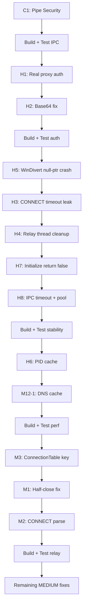

# План исправлений по аудиту REVIEW (1).md

**Ветка:** `audit-review-fixes`
**Порядок:** от наиболее критичных к наименее.
**Метод:** после каждого исправления → сборка → проверка.

---

## Этап 1: CRITICAL — Безопасность IPC

### [C1] Named pipe security descriptor
- **Файлы:** `infrastructure/ipc/PipeServer.h`
- **Задача:** Добавить `SECURITY_ATTRIBUTES` с DACL (только Admins/SYSTEM) + `FILE_FLAG_FIRST_PIPE_INSTANCE`
- **Проверка:** Сборка backend, IPC не падает, GUI коннектится

---

## Этап 2: HIGH — Аутентификация прокси

### [H1] Зардкоженный пароль вместо реального
- **Файлы:** `infrastructure/relay/TcpRelayServer.h:316-319`, `adapters/driven/ProxyEngine.h:144-148`
- **Задача:** Прокинуть логин/пароль из `ConfigManager::GetPlainPassword()` в `TcpRelayServer`, формировать Basic-заголовок из реальных данных
- **Проверка:** Basic-auth прокси отвечает 200 вместо 407

### [H2] Base64-декодер: `'='` padding как данные
- **Файлы:** `infrastructure/auth/auth_sspi.cpp:253-277`, `infrastructure/config/ConfigManager.cpp:471-495`
- **Задача:** `D['='] = 0xFF` чтобы padding пропускался; учесть что `'='` выравнивает декодированный размер
- **Проверка:** Base64-декодирование корректно, Kerberos-токены не ломаются

---

## Этап 3: HIGH — Стабильность и краши

### [H5] Краш по null-указателю при неудаче WinDivertOpen
- **Файл:** `infrastructure/capture/WinDivertCapture.cpp:111-136`, `:146-153`
- **Задача:** После провала Open() ставить `m_handle = nullptr`; в Close() проверять `m_handle && m_handle != INVALID_HANDLE_VALUE && m_api.Shutdown`
- **Проверка:** Запуск без админ-прав не крашит при Stop()

### [H3] Таймаут 30s утекает из CONNECT в фазу данных
- **Файл:** `infrastructure/relay/TcpRelayServer.h:259-264`
- **Задача:** После успешного CONNECT сбросить `SO_RCVTIMEO/SO_SNDTIMEO` в 0 на `proxy_sock`; добавить `SO_KEEPALIVE`
- **Проверка:** idle-соединения не рвутся через 30с

### [H4] Потоки relay не join'ятся + WSACleanup при живых потоках
- **Файл:** `infrastructure/relay/TcpRelayServer.h:132-152`, `:215-223`
- **Задача:** Вести список активных `RelayPair`, при Stop() сигналить shutdown, дожидаться завершения, затем WSACleanup()
- **Проверка:** Stop() не крашит, активные туннели закрываются graceful

### [H7] Initialize() всегда true — ложный статус RUNNING
- **Файл:** `adapters/driving/ServiceMain.h:156-158`
- **Задача:** Возвращать false при критичных отказах (relay/WinDivert не стартанули)
- **Проверка:** SCM видит STOPPED если подсистемы не стартанули

### [H8] Однопоточный блокирующий IPC без таймаутов
- **Файл:** `infrastructure/ipc/PipeServer.h:91-160`
- **Задача:** Таймаут на ReadFile; пул потоков/async I/O для нескольких инстанций
- **Проверка:** Занятие IPC не блокирует сервис

---

## Этап 4: HIGH/MEDIUM — Производительность горячего пути

### [H6] PID-lookup на каждый пакет
- **Файл:** `infrastructure/capture/WinDivertCapture.cpp:512-533`, `:421-453`
- **Задача:** Кэш src_port→PID с TTL; кэшировать решение DIRECT в битмапе раньше
- **Проверка:** CPU нагрузка снижена, захват работает

### [M12-1] DNS-кэш для getaddrinfo(proxyHost)
- **Файл:** `infrastructure/relay/TcpRelayServer.h:275`
- **Задача:** Кэшировать результат резолва proxy-host (время жизни ~60с)
- **Проверка:** DNS не резолвится на каждое соединение

---

## Этап 5: MEDIUM — Корректность relay

### [M3] Ключ connection table по src_port → коллизии
- **Файл:** `infrastructure/relay/ConnectionTable.h`, WinDivertCapture.cpp
- **Задача:** Ключ — 4-кортеж `(src_ip, src_port, dst_ip, dst_port)` или хотя бы `(src_port, orig_dst)`
- **Проверка:** Коллизии портов не смешивают потоки

### [M1] Потеря данных при half-close
- **Файл:** `infrastructure/relay/TcpRelayServer.h:483-486`
- **Задача:** `shutdown(to, SD_SEND)` вместо `SD_BOTH`, дать второму направлению до-слиться
- **Проверка:** Half-close не обрезает данные

### [M2] Успех CONNECT по подстроке "200"
- **Файл:** `infrastructure/relay/TcpRelayServer.h:354-405`
- **Задача:** Парсить статус-строку `HTTP/1.x 200`; читать до `\r\n\r\n`
- **Проверка:** CONNECT не даёт ложный успех

---

## Этап 6: MEDIUM — Остальные

### [M4] getenv("ProgramData") → nullptr
- **Файл:** `adapters/driving/ServiceMain.h:37`
- **Задача:** Проверка на null, фолбэк `C:\ProgramData`
- **Проверка:** При отсутствии переменной — не краш

### [M5] Нет try/catch вокруг Initialize()/Run()
- **Файл:** `main.cpp:27-49`
- **Задача:** Обернуть в try/catch, рапортовать SCM ошибку
- **Проверка:** Исключение не приводит к std::terminate

### [M6] wstring(s.begin(),s.end()) — порча не-ASCII
- **Файлы:** 28 мест в ConfigManager.cpp, IpcHandler.h, ServiceMain.h, TcpRelayServer.h
- **Задача:** Заменить на `MultiByteToWideChar`/`WideCharToMultiByte` с `CP_UTF8`
- **Проверка:** Кириллические пути не ломаются

### [M7] PipeServer: конкурентная запись
- **Файл:** `infrastructure/ipc/PipeServer.h:163-176`
- **Задача:** Мьютекс на доступ к пайпу; очередь исходящих сообщений
- **Проверка:** Параллельная запись не перемешивает сообщения

### [M8] ConnectionTracker: рекурсивный lock + мониторинг не подключён
- **Файл:** `domain/services/ConnectionTracker.h`
- **Задача:** Нотификацию вызывать после unlock; связать данные ConnectionTable с трекером
- **Проверка:** GUI-вкладка «соединения» показывает данные

### [M9] config.json: не атомарное сохранение
- **Файл:** `infrastructure/config/ConfigManager.cpp:270-297`
- **Задача:** Запись во временный файл + rename; валидация порта/хоста; `.value()` с дефолтами
- **Проверка:** Краш при сохранении не бить конфиг

### [M10] Неверная сигнатура SCM-обработчика
- **Файл:** `main.cpp:9-22`
- **Задача:** Правильная сигнатура `DWORD WINAPI(DWORD, DWORD, LPVOID, LPVOID)`, асинхронный Stop
- **Проверка:** SCM не ругается

### [M11] Неверный порядок остановки
- **Файл:** `adapters/driving/ServiceMain.h:177-212`
- **Задача:** Stop: сначала capture, затем relay, затем чистить таблицу
- **Проверка:** При остановке не приходят RST на новые SYN'ы

### [M12-2] Таймаут на connect() к прокси
- **Файл:** `infrastructure/relay/TcpRelayServer.h:290`
- **Задача:** `setsockopt(SO_SNDTIMEO)` на proxy_sock перед connect, или async connect с таймаутом
- **Проверка:** При недоступном прокси поток не виснет 21с

---

## Схема работы

---

## Как выполнять

1. Каждый fix = отдельный коммит в ветку `audit-review-fixes`
2. После каждого коммита — полная сборка C++ (backend) 
3. После каждого fix — краткая проверка (backend запуск, GUI коннект)
4. При ошибке — откат fix, перепланирование
