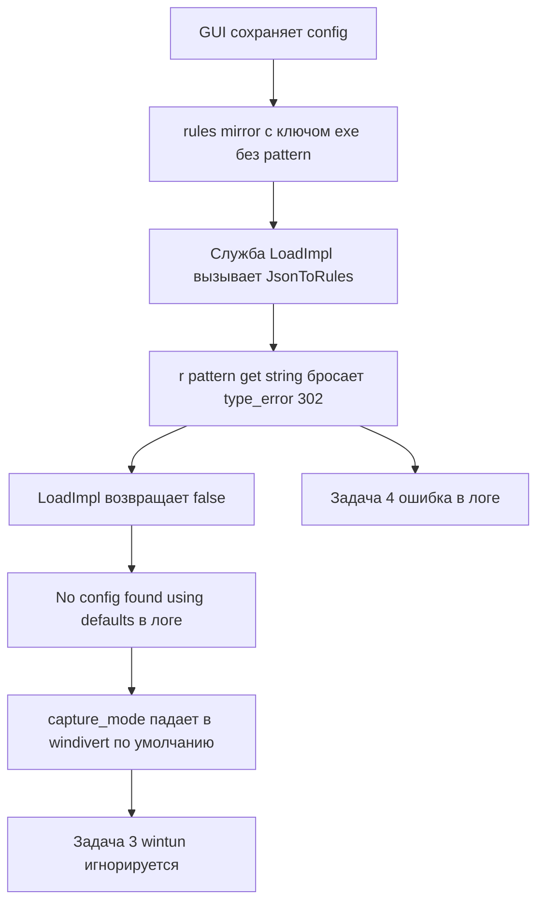

# План исправлений GUI/служба — 14.07.2026

Диагностика и план для четырёх связанных находок: показ/скрытие настроек в GUI
по режиму захвата (Задача 1), несохранение пароля прокси (Задача 2), фактический
запуск WinDivert при выборе Wintun (Задача 3) и две ошибки в логе службы
(`LoadImpl exception` / `No config found`).

---

## 1. Корневая причина (единая для Задач 3, 4 и частично 2)

Рассинхрон схемы legacy-`rules[]` между GUI и службой:

- GUI в [`BuildLegacyRulesMirror()`](../src/gui/TcpRedirectorGUI/Infrastructure/Config/JsonConfigRepository.cs:619)
  пишет каждое правило с ключом `"exe"` (и `"port"`, `"proxyId"`), **без** ключа
  `"pattern"`.
- Служба в [`JsonToRules()`](../src/service/TcpRedirectorService/infrastructure/config/ConfigManager.cpp:588)
  читает `r["pattern"].get<std::string>()` — жёсткий доступ **без** default.
  Когда ключа `pattern` нет, `nlohmann::json` бросает
  `[json.exception.type_error.302] type must be string, but is null`.

Исключение возникает в [`LoadImpl()`](../src/service/TcpRedirectorService/infrastructure/config/ConfigManager.cpp:364)
(`m_rules = JsonToRules(j)`), ловится в catch на
[`:408`](../src/service/TcpRedirectorService/infrastructure/config/ConfigManager.cpp:408),
и `LoadImpl` возвращает `false`. Далее служба логирует
`No config found, using defaults` и работает на дефолтах, где
`capture_mode = WinDivert`.

Таким образом, как только из GUI сохранено хотя бы одно правило приложения
(появляется `exe`-зеркало), служба вообще перестаёт читать `config.json`:
игнорирует выбор `wintun` (Задача 3) и пишет обе ошибки (Задача 4). Файл при
этом существует — но не парсится.

Вторичная (латентная) копия той же ошибки — в
[`IpcHandler::SetRules`](../src/service/TcpRedirectorService/adapters/driving/IpcHandler.h:166):
такой же незащищённый `r["pattern"].get<std::string>()`. По live-IPC GUI шлёт
`Pattern` корректно, поэтому проявляется реже, но починить нужно тоже.

---

## 2. Задача 4 / Задача 3 — исправление парсинга (служба, C++)

**Файл:** [`ConfigManager.cpp`](../src/service/TcpRedirectorService/infrastructure/config/ConfigManager.cpp:581)

В `JsonToRules`:
- Читать имя правила терпимо: сперва `pattern`, затем fallback на `exe`
  (ключ, который реально пишет GUI), через `.value(...)` с дефолтом `""`.
- Если после fallback имя пустое — **пропустить** запись (`continue`), не
  бросая исключение. Никаких `r["pattern"].get<...>()` без проверки типа.
- Аналогично защитить `description`, `type`, `action` (уже читаются через
  `.value(...)`, проверить, что нет других жёстких доступов).

**Файл:** [`IpcHandler.h`](../src/service/TcpRedirectorService/adapters/driving/IpcHandler.h:159)

В `SetRules` — та же терпимая логика (`pattern` → `exe` → пропуск), чтобы
некорректный элемент не срывал весь IPC-запрос.

**Результат:** после правки `LoadImpl` больше не падает, `Load()` возвращает
`true`, служба читает реальный `capture_mode` из файла → при выборе Wintun
запускается Wintun (закрывает Задачу 3), обе ошибки из лога исчезают
(закрывает Задачу 4).

> Примечание: желательно также согласовать «зеркало» — чтобы GUI писал ключ,
> совместимый с читателем. Но минимально-инвазивно и надёжнее сделать читатель
> терпимым к обоим ключам (обратная совместимость со старыми файлами, где мог
> быть `pattern`). Опционально GUI можно доп. писать и `pattern`, и `exe`.

---

## 3. Задача 2 — пароль прокси не попадает в config.json

**Текущее поведение:**
- GUI **никогда** не пишет `auth.encryptedPassword` сам —
  [`WriteFullV2`](../src/gui/TcpRedirectorGUI/Infrastructure/Config/JsonConfigRepository.cs:385)
  лишь сохраняет уже существующее значение с диска.
- Пароль отправляется только по live-IPC (`SetConfigAsync`) и лишь когда
  `_svc is { IsConnected: true }` —
  [`SettingsViewModel.cs:663`](../src/gui/TcpRedirectorGUI/Adapters/Driving/Wpf/ViewModels/SettingsViewModel.cs:663).
  Если служба не запущена/не подключена в момент Save — пароль теряется.
- Даже при подключённой службе `IpcHandler::SetConfig` вызывает
  `m_configManager->Load()` перед `SetPassword` —
  [`IpcHandler.h:134`](../src/service/TcpRedirectorService/adapters/driving/IpcHandler.h:134).
  Пока не исправлен парсинг (раздел 2), этот `Load()` падает, и сохранение
  пароля происходит поверх дефолтного состояния (затирая apps/wintun).

**Рекомендуемое исправление (надёжное, не зависит от запущенной службы):**

GUI сам шифрует пароль через **DPAPI в scope `LocalMachine`** и пишет
`auth.encryptedPassword` (Base64) прямо в `config.json` в `WriteFullV2`.

- Scope `LocalMachine` (а не `CurrentUser`) обязателен: GUI работает под
  учёткой администратора-пользователя, служба — под `LocalSystem`; только
  машинный scope расшифровывается обеими учётками (см. замечание B4 в
  [`docs/ИЗВЕСТНЫЕ_ПРОБЛЕМЫ.md`](../docs/ИЗВЕСТНЫЕ_ПРОБЛЕМЫ.md:72) — там описано,
  почему DPAPI user-scope не подходил).
- Служба должна расшифровывать тем же machine-scope. Проверить/согласовать
  флаги DPAPI в [`ConfigManager::DecryptPassword`](../src/service/TcpRedirectorService/infrastructure/config/ConfigManager.cpp:1041)
  и `EncryptPassword` (сейчас `CryptProtectData` без `CRYPTPROTECT_LOCAL_MACHINE`
  = user-scope). Чтобы blob от GUI (LocalMachine) читался службой, обе стороны
  должны использовать `CRYPTPROTECT_LOCAL_MACHINE`.
- Формат Base64 должен совпадать с тем, что ожидает служба
  (`ConfigManager::Base64Decode`). Проще всего в GUI использовать стандартный
  `Convert.ToBase64String` — он совместим с раскодировщиком службы.
- Очистить поле пароля в UI после сохранения (уже делается через `Saved`).
- Оставить также live-IPC push как «горячее» применение без рестарта, но он
  больше не единственный путь персистентности.

**Альтернатива (менее предпочтительна):** оставить только IPC-путь, но
принудительно (пере)подключаться к службе при Save и явно предупреждать
пользователя, если служба недоступна. Минус — пароль нельзя задать при
остановленной службе.

> Требуется уточнение у пользователя: менять ли DPAPI-scope службы на
> `LocalMachine` (влияет на совместимость уже сохранённых user-scope паролей —
> их придётся ввести заново один раз).

---

## 4. Задача 1 — показ/скрытие настроек по режиму (GUI, XAML)

**Файл:** [`MainWindow.xaml`](../src/gui/TcpRedirectorGUI/MainWindow.xaml:210)

Сейчас Wintun-подпанель только **отключается** (серый вид) через
`IsEnabled="{Binding Settings.IsWintunSelected}"` на `Border`
([`:213`](../src/gui/TcpRedirectorGUI/MainWindow.xaml:213)). Требование —
**скрывать**.

- Заменить/дополнить биндинг: панель Wintun должна иметь
  `Visibility="{Binding Settings.IsWintunSelected, Converter={StaticResource BoolToVis}}"`
  — при `windivert` она полностью скрыта.
- Так как выделенной панели настроек WinDivert нет, добавить компактный
  информационный блок «Настройки WinDivert» с
  `Visibility` по инверсии `IsWintunSelected` (виден только в режиме
  `windivert`). Для инверсии добавить либо новый конвертер
  (`InverseBoolToVis`), либо булево свойство во VM (`IsWinDivertSelected =>
  CaptureMode == CaptureMode.WinDivert`) — предпочтительно свойство во VM,
  оно проще и уже есть паттерн `IsWintunSelected`.
- VM: добавить `IsWinDivertSelected` и уведомлять о нём из
  [`OnCaptureModeChanged`](../src/gui/TcpRedirectorGUI/Adapters/Driving/Wpf/ViewModels/SettingsViewModel.cs:283)
  рядом с `IsWintunSelected`.
- Убедиться, что `IsWintunSelected`/`IsWinDivertSelected` внесены в
  `s_nonContentProps` (уже есть `IsWintunSelected`) — чтобы переключение режима
  не ломало dirty-tracking сверх ожидаемого. (Само переключение режима должно
  помечать dirty — это часть контента, менять `CaptureMode` уже это делает.)

Внешний under-engine блок (`IsExternalEngine`) остаётся как есть — он вложен в
Wintun-панель и скроется вместе с ней.

---

## 5. Порядок работ

1. **Служба (C++):** починить `JsonToRules` и `IpcHandler::SetRules`
   (раздел 2). Это разблокирует Задачи 3 и 4.
2. **Служба (C++):** согласовать DPAPI machine-scope для пароля (раздел 3),
   если выбран вариант «GUI шифрует сам».
3. **GUI (C#):** запись `auth.encryptedPassword` в `WriteFullV2` через DPAPI
   LocalMachine (раздел 3).
4. **GUI (XAML+VM):** показ/скрытие панелей по режиму (раздел 4).
5. **Сборка:** `msbuild` службы (Release/x64) + `dotnet build` GUI — 0 ошибок.
6. **Рантайм-проверка на стенде** (раздел 6).

---

## 6. Критерии приёмки (ручная проверка на стенде)

- [ ] Выбрать в GUI режим `wintun`, добавить приложение, Save → в логе службы
      **нет** `LoadImpl exception` и **нет** `No config found`.
- [ ] При выбранном `wintun` служба фактически поднимает Wintun-адаптер
      (а не WinDivert) — проверить по логу/наличию адаптера `TcpRedirector`.
- [ ] Переключение режима в GUI: при `windivert` блок настроек Wintun **скрыт**,
      при `wintun` — виден; (опц.) блок WinDivert виден только в `windivert`.
- [ ] Ввод пароля прокси в GUI + Save → в `config.json` появляется непустой
      `auth.encryptedPassword`, сохраняется **без** запущенной службы.
- [ ] Служба расшифровывает пароль (Basic-auth к прокси работает).
- [ ] Старые файлы `config.json` (где в `rules[]` мог быть `pattern`) по-прежнему
      читаются (обратная совместимость терпимого парсера).
