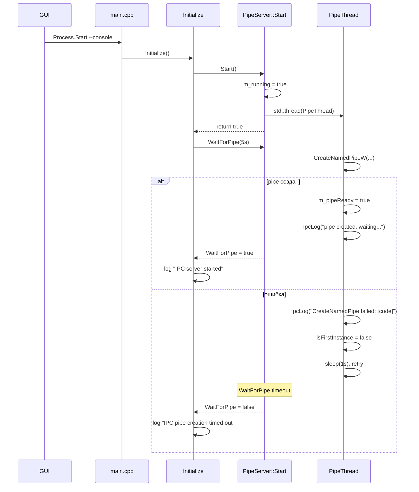

# План исправления: Named Pipe не создаётся при запуске из GUI

## Диагноз

Обнаружены два бага, которые вместе приводят к отказу IPC:

### Баг #1 (диагностический): `SetLogSink` не вызывается
- **Файл**: [`ServiceMain.h:164`](../TcpRedirector/src/service/TcpRedirectorService/adapters/driving/ServiceMain.h:164)
- **Суть**: `PipeServer` создаётся, но `SetLogSink(m_logger.get())` нигде не вызывается
- **Следствие**: `IpcLog()` в [`PipeServer.h:350`](../TcpRedirector/src/service/TcpRedirectorService/infrastructure/ipc/PipeServer.h:350) молча пропускает все сообщения, т.к. `m_logSink == nullptr`
- **Почему это критично**: мы не видим код ошибки `CreateNamedPipeW`, не можем диагностировать

### Баг #2 (функциональный): Неполная обработка ошибок `CreateNamedPipeW`
- **Файл**: [`PipeServer.h:182-192`](../TcpRedirector/src/service/TcpRedirectorService/infrastructure/ipc/PipeServer.h:182)
- **Суть**: Только `ERROR_ACCESS_DENIED` (5) и `ERROR_PIPE_BUSY` (231) сбрасывают `isFirstInstance`. Любая другая ошибка → бесконечный ретрай с `FILE_FLAG_FIRST_PIPE_INSTANCE`
- **Следствие**: Если `CreateNamedPipeW` падает с `ERROR_INVALID_PARAMETER` (87) или иной ошибкой, поток входит в бесконечный цикл

### Баг #3 (архитектурный): `Start()` не ждёт создания pipe
- **Файл**: [`PipeServer.h:50-53`](../TcpRedirector/src/service/TcpRedirectorService/infrastructure/ipc/PipeServer.h:50)
- **Суть**: `Start()` запускает поток и возвращает `true` немедленно, до фактического создания pipe
- **Следствие**: Лог "IPC server started" в [`ServiceMain.h:185`](../TcpRedirector/src/service/TcpRedirectorService/adapters/driving/ServiceMain.h:185) — ложное подтверждение

## План исправлений (в порядке приоритета)

### Шаг 1: Добавить `SetLogSink` в `ServiceMain.h`

**Файл**: `TcpRedirector/src/service/TcpRedirectorService/adapters/driving/ServiceMain.h`

После строки 164 (`m_pipeServer = std::make_unique<infrastructure::PipeServer>();`) добавить:

```cpp
m_pipeServer->SetLogSink(m_logger.get());
```

Это включит диагностику и позволит увидеть реальную ошибку `CreateNamedPipeW`.

### Шаг 2: Исправить обработку ошибок в `PipeThread`

**Файл**: `TcpRedirector/src/service/TcpRedirectorService/infrastructure/ipc/PipeServer.h`

Заменить блок обработки ошибок (строки 182-192):

```cpp
// БЫЛО:
if (newPipe == INVALID_HANDLE_VALUE) {
    DWORD err = GetLastError();
    IpcLog(domain::LogLevel::Warn,
        "CreateNamedPipe failed: " + std::to_string(err));
    if (err == ERROR_ACCESS_DENIED || err == ERROR_PIPE_BUSY) {
        isFirstInstance = false;
    }
    std::this_thread::sleep_for(std::chrono::seconds(1));
    continue;
}

// СТАЛО:
if (newPipe == INVALID_HANDLE_VALUE) {
    DWORD err = GetLastError();
    IpcLog(domain::LogLevel::Warn,
        "CreateNamedPipe failed: " + std::to_string(err));
    // Сбрасываем FIRST_PIPE_INSTANCE при ЛЮБОЙ ошибке,
    // чтобы следующий ретрай был без этого флага.
    isFirstInstance = false;
    std::this_thread::sleep_for(std::chrono::seconds(1));
    continue;
}
```

**Обоснование**: `FILE_FLAG_FIRST_PIPE_INSTANCE` — это оптимизация для проверки, что мы единственный владелец pipe. При любой ошибке создания безопаснее отказаться от этого флага и создать обычный экземпляр.

### Шаг 3: Добавить синхронизацию в `Start()`

**Файл**: `TcpRedirector/src/service/TcpRedirectorService/infrastructure/ipc/PipeServer.h`

Добавить `std::atomic<bool> m_pipeReady{false}` и изменить `Start()`:

```cpp
// В секцию Members (после строки 358):
std::atomic<bool> m_pipeReady{false};

// Изменить Start():
bool Start() override {
    m_running = true;
    m_pipeReady = false;
    m_thread = std::thread([this]() { PipeThread(); });
    return true;
}

// Добавить метод ожидания:
bool WaitForPipe(std::chrono::milliseconds timeout = std::chrono::seconds(10)) {
    auto deadline = std::chrono::steady_clock::now() + timeout;
    while (!m_pipeReady.load(std::memory_order_acquire)) {
        if (std::chrono::steady_clock::now() > deadline)
            return false;
        std::this_thread::sleep_for(std::chrono::milliseconds(100));
    }
    return true;
}
```

В `PipeThread()`, после успешного создания pipe (после строки 209), добавить:
```cpp
m_pipeReady.store(true, std::memory_order_release);
```

В `ServiceMain.h`, после `m_pipeServer->Start()`:
```cpp
if (m_pipeServer->Start()) {
    if (m_pipeServer->WaitForPipe(std::chrono::seconds(5))) {
        m_logger->Info("service", "IPC server started");
    } else {
        m_logger->Error("service", "IPC pipe creation timed out");
    }
}
```

### Шаг 4 (опционально): Дублировать ошибки pipe в stderr

Чтобы GUI мог захватывать ошибки через `RedirectStandardError`, добавить в `IpcLog`:
```cpp
void IpcLog(domain::LogLevel level, const std::string& msg) {
    if (m_logSink) {
        m_logSink->Log(level, "pipe", msg);
    }
    // Дублируем ошибки в stderr для захвата GUI
    if (level == domain::LogLevel::Error || level == domain::LogLevel::Warn) {
        fprintf(stderr, "[PIPE] %s\n", msg.c_str());
        fflush(stderr);
    }
}
```

## Диаграмма последовательности после исправления



## Ожидаемый результат

1. **Шаг 1** покажет реальный код ошибки `CreateNamedPipeW` в лог-файле
2. **Шаг 2** предотвратит бесконечный цикл ретраев — при любой ошибке флаг `FILE_FLAG_FIRST_PIPE_INSTANCE` сбрасывается
3. **Шаг 3** даст GUI честный ответ: pipe готов или нет, вместо ложного "IPC server started"
4. **Шаг 4** позволит GUI показывать ошибки pipe пользователю через `SvcMsg`