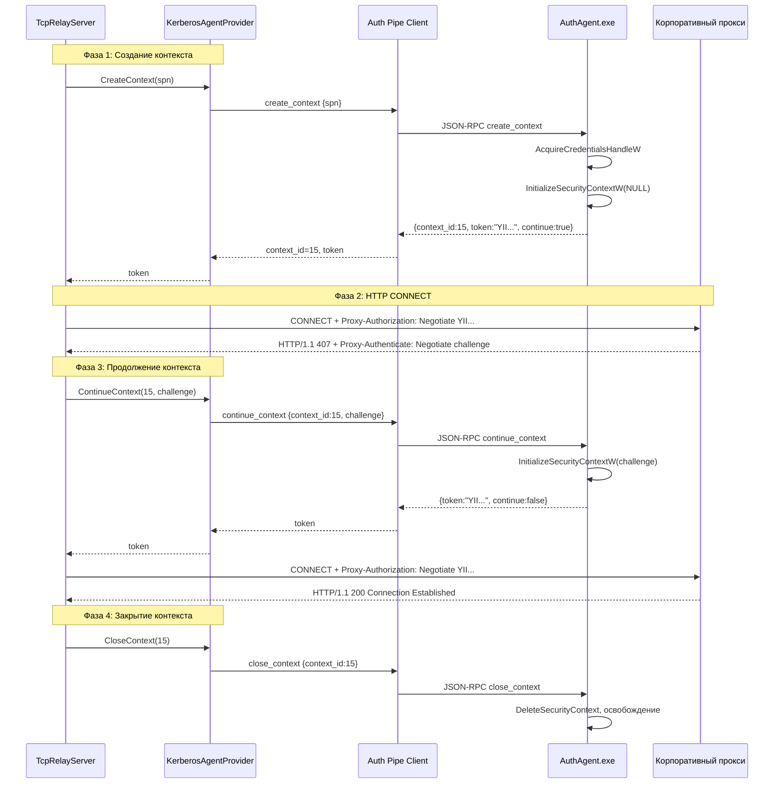

# Архитектура TcpRedirector v1.1.0 — Kerberos + Non-Admin GUI

## Версия: 1.1.0

---

## 0. Ключевые архитектурные решения

### 0.0. ContextId = один TCP CONNECT (одноразовый)

**Каждый ContextId живёт ровно в рамках одного HTTP CONNECT к прокси.**

- Для каждого нового TCP-соединения создаётся **новый** Security Context.
- После успешного CONNECT (`HTTP/1.1 200`) Context **обязательно уничтожается** через `CloseContext()`.
- После ошибки (407 без challenge, таймаут, разрыв соединения) Context **обязательно уничтожается**.
- **Повторное использование ContextId запрещено.** Попытка `ContinueContext` с уже закрытым ID — ошибка.
- Контекст не переживает CONNECT. Каждый новый CONNECT = новый `CreateContext`.


### 0.1. Impersonation исключён

`ImpersonateNamedPipeClient()`, `OpenThreadToken()`, `DuplicateTokenEx()`, `SetThreadToken()` — **не используются**. `AcquireCredentialsHandleW()` работает через SSPI/LSA и должен вызываться непосредственно в пользовательской Logon Session. Вся Kerberos-аутентификация выполняется отдельным пользовательским процессом `AuthAgent.exe`.

### 0.2. AuthAgent — единственный SSPI-компонент

`TcpRedirectorAuthAgent.exe` — единственный процесс, вызывающий:
- `AcquireCredentialsHandleW()`
- `InitializeSecurityContextW()`
- `DeleteSecurityContext()`
- `FreeCredentialsHandle()`

`TcpRedirectorService.exe` **никогда** не использует SSPI напрямую. Файлы `auth_sspi.*` становятся внутренней реализацией AuthAgent.

### 0.3. TcpRelayServer не знает про SSPI

`TcpRelayServer` не создаёт `CredHandle`, `CtxtHandle`, не вызывает `InitializeSecurityContext()`, не разбирает SSPI-состояния. Его задача: получить готовый токен → добавить `Proxy-Authorization: Negotiate <token>` → отправить CONNECT.

### 0.4. Security Context живёт в AuthAgent

`CredHandle` и `CtxtHandle` принадлежат процессу AuthAgent. Служба знает только `ContextId` (непрозрачный идентификатор).

---

## 1. Анализ текущей реализации Kerberos

### 1.1. Как работает сейчас

**Файл:** [`auth_sspi.cpp:71`](TcpRedirector/src/service/TcpRedirectorService/infrastructure/auth/auth_sspi.cpp)

```cpp
AcquireCredentialsHandleW(NULL, L"Negotiate", SECPKG_CRED_OUTBOUND, NULL, NULL, NULL, NULL, &ctx.credentials, &expiry);
```

- `NULL` в качестве `pszPrincipal` → учётные данные **процесса** (LocalSystem)
- Под LocalSystem это машинный аккаунт `COMPUTER$`
- `COMPUTER$` не имеет TGT для SPN `HTTP/proxy.corp.local`
- Результат: `SEC_E_NO_CREDENTIALS` → Kerberos не работает

**Файл:** [`TcpRelayServer.h:324-449`](TcpRedirector/src/service/TcpRedirectorService/infrastructure/relay/TcpRelayServer.h)

SSPI встроен прямо в `HandleClient()` — нарушение Single Responsibility.

---

## 2. Новая архитектура

### 2.1. Обзор компонентов

```
┌──────────────────────────────────────────────────────────────────┐
│                    Windows (после перезагрузки)                    │
├──────────────────────────────────────────────────────────────────┤
│                                                                   │
│  ┌───────────────────────────┐   ┌────────────────────────────┐  │
│  │ TcpRedirectorService.exe  │   │ TcpRedirectorAuthAgent.exe │  │
│  │ (LocalSystem, AutoStart)  │   │ (User Session, At Logon)   │  │
│  │                           │   │                            │  │
│  │ WinDivert ──► Relay ─────│   │ SSPI Engine:               │  │
│  │                │          │   │  CredHandle                │  │
│  │                ▼          │   │  CtxtHandle (кэш)          │  │
│  │     IAuthenticationProvider   │  ContextId → CtxtHandle    │  │
│  │         │        │        │   │  TTL 30 min                │  │
│  │         ▼        ▼        │   │             │              │  │
│  │  KerberosAgent  Basic     │   │             ▼              │  │
│  │  Provider       Provider  │   │  Named Pipe Server         │  │
│  │         │                 │   │  (ACL: Everyone)           │  │
│  │         ▼                 │   │             ▲              │  │
│  │  Named Pipe Client ───────┼───│─────────────┘              │  │
│  │  (keepalive + reconnect)  │   │                            │  │
│  │                           │   └────────────────────────────┘  │
│  │  PipeServer (GUI IPC)     │                                    │
│  │         ▲                 │                                    │
│  └─────────┼─────────────────┘                                    │
│            │                                                      │
│  ┌─────────┼─────────────────┐                                    │
│  │ TcpRedirectorGUI.exe      │                                    │
│  │ (User, без UAC)           │                                    │
│  │ Named Pipe Client ────────┘                                    │
│  └───────────────────────────┘                                    │
│                                                                   │
└──────────────────────────────────────────────────────────────────┘
```

### 2.2. Поток аутентификации (Sequence Diagram)



### 2.3. Интерфейс IAuthenticationProvider

**Новый файл:** `src/service/TcpRedirectorService/domain/ports/IAuthenticationProvider.h`

```cpp
#pragma once
#include <string>
#include <string_view>
#include <cstdint>

namespace tcp_redirector {
namespace domain {
namespace ports {

enum class AuthProviderType {
    KerberosAgent,  // через AuthAgent.exe
    Basic           // Basic Authentication
};

/// Результат создания контекста
struct CreateContextResult {
    bool success;
    uint64_t context_id;        // непрозрачный ID, живёт в AuthAgent
    std::string token;          // начальный SSPI-токен (Base64)
    bool needs_continue;        // true если нужен ContinueContext (407 expected)
    std::string error_message;  // при success=false
};

/// Результат продолжения контекста
struct ContinueContextResult {
    bool success;
    std::string token;          // следующий SSPI-токен (Base64)
    bool needs_continue;        // true если нужен ещё один раунд
    std::string error_message;
};

/// Абстракция аутентификации для HTTP CONNECT к прокси.
/// Скрывает от TcpRelayServer детали получения токенов.
///
/// Жизненный цикл контекста (ОДНОРАЗОВЫЙ):
///   CreateContext(spn) → [ContinueContext(id, challenge)]* → CloseContext(id)
///   Каждый ContextId живёт ровно один HTTP CONNECT.
///   После успеха или ошибки — обязательно CloseContext().
///   Повторное использование ContextId запрещено.
class IAuthenticationProvider {
public:
    virtual ~IAuthenticationProvider() = default;

    /// Создать новый SSPI-контекст для заданного SPN.
    virtual CreateContextResult CreateContext(std::string_view spn) = 0;

    /// Продолжить SSPI-контекст с challenge от прокси (407 ответ).
    virtual ContinueContextResult ContinueContext(
        uint64_t context_id,
        std::string_view challenge) = 0;

    /// Закрыть SSPI-контекст.
    virtual void CloseContext(uint64_t context_id) = 0;

    /// Сбросить все активные контексты (при остановке/перезапуске).
    virtual void Reset() = 0;

    /// Тип провайдера.
    virtual AuthProviderType GetType() const = 0;
};

} // namespace ports
} // namespace domain
} // namespace tcp_redirector
```

### 2.4. Протокол Service ↔ AuthAgent (JSON-RPC)

**Named Pipe:** `\\.\pipe\TcpRedirectorAuth`
**ACL:** Everyone (Read/Write)

#### hello (version negotiation)
```json
// Service → Agent
{"jsonrpc":"2.0","method":"hello","params":{"version":1},"id":1}
// Agent → Service
{"jsonrpc":"2.0","result":{"version":1,"agent":"TcpRedirectorAuthAgent/1.1.0"},"id":1}
```

#### create_context
```json
// Service → Agent
{"jsonrpc":"2.0","method":"create_context","params":{"spn":"HTTP/proxy.corp.local"},"id":2}
// Agent → Service (успех)
{"jsonrpc":"2.0","result":{"context_id":15,"token":"YII...","continue":true},"id":2}
// Agent → Service (ошибка)
{"jsonrpc":"2.0","error":{"code":-1,"message":"SEC_E_NO_CREDENTIALS"},"id":2}
```

#### continue_context
```json
// Service → Agent
{"jsonrpc":"2.0","method":"continue_context","params":{"context_id":15,"challenge":"YH..."},"id":3}
// Agent → Service
{"jsonrpc":"2.0","result":{"token":"YII...","continue":false},"id":3}
```

#### close_context
```json
// Service → Agent
{"jsonrpc":"2.0","method":"close_context","params":{"context_id":15},"id":4}
// Agent → Service
{"jsonrpc":"2.0","result":{"closed":true},"id":4}
```

#### ping (keepalive)
```json
// Service → Agent
{"jsonrpc":"2.0","method":"ping","id":5}
// Agent → Service
{"jsonrpc":"2.0","result":{"pong":true},"id":5}
```

### 2.5. KerberosAgentProvider

**Новый файл:** `src/service/TcpRedirectorService/infrastructure/auth/KerberosAgentProvider.h`

- Реализует `IAuthenticationProvider`
- Подключается к `AuthAgent.exe` через Named Pipe `\\.\pipe\TcpRedirectorAuth`
- Выполняет `hello` + version negotiation при подключении
- Кэширует `context_id → token` (только ID, не CtxtHandle)
- **Keepalive:** периодический `ping` (каждые 15 секунд)
- **Reconnect:** при обрыве Pipe переподключается без перезапуска службы
- При недоступности AuthAgent возвращает `success = false`

### 2.6. BasicAuthenticationProvider

**Новый файл:** `src/service/TcpRedirectorService/infrastructure/auth/BasicAuthenticationProvider.h`

- Реализует `IAuthenticationProvider`
- `CreateContext()` возвращает `token = Base64(user:password)`, `needs_continue = false`
- `ContinueContext()` всегда возвращает ошибку (Basic не многошаговый)
- `CloseContext()` — no-op

### 2.7. Режимы аутентификации (AuthenticationMode)

**Добавить в `Config.h`:**
```cpp
enum class AuthenticationMode {
    KerberosOnly,       // только Kerberos, ошибка = разрыв соединения
    KerberosPreferred,  // Kerberos, fallback на Basic
    BasicOnly           // только Basic
};
```

**Логика в ServiceMain:**
- `KerberosOnly` → только `KerberosAgentProvider`, ошибка фатальна
- `KerberosPreferred` → `KerberosAgentProvider` с fallback на `BasicAuthenticationProvider`
- `BasicOnly` → только `BasicAuthenticationProvider`

### 2.8. AuthAgent.exe

**Новый проект:** `src/auth-agent/TcpRedirectorAuthAgent/`

**Файлы:**
- `main.cpp` — точка входа, Named Pipe сервер (`\\.\pipe\TcpRedirectorAuth`, ACL Everyone)
- `SspiEngine.h/cpp` — SSPI логика (перенесена из `auth_sspi.*`)
- `ContextStore.h/cpp` — кэш `ContextId → {CredHandle, CtxtHandle, Expiry, SPN}`
- `CMakeLists.txt` — сборка

**SspiEngine:**
- `AcquireCredentialsHandleW(NULL, L"Negotiate", ...)` — в контексте пользователя
- `InitializeSecurityContextW()` — многошаговый
- `DeleteSecurityContext()` + `FreeCredentialsHandle()` — освобождение

**ContextStore:**
- `std::unordered_map<uint64_t, ContextEntry>`
- `ContextEntry = {CredHandle, CtxtHandle, TimePoint expiry, std::string spn}`
- TTL: 30 минут (настраиваемый)
- Автоматическая очистка просроченных контекстов
- Очистка всех контекстов при завершении процесса

**Жизненный цикл:**
- Запускается Task Scheduler "At Logon"
- Работает пока пользователь в системе
- Завершается при Logoff (все контексты освобождаются)
- Перезапускается при следующем Logon

### 2.9. Изменения в TcpRelayServer

**Файл:** [`TcpRelayServer.h`](TcpRedirector/src/service/TcpRedirectorService/infrastructure/relay/TcpRelayServer.h)

**Текущее состояние (строки 324-449):**
- SSPI-логика встроена в `HandleClient()`
- `SspiContext sspiCtx`, `sspiToken`, `sspiInitDone`, `sspiAvailable` — локальные переменные
- `retry_connect:` — goto для повторного CONNECT

**Новое состояние:**
- `IAuthenticationProvider* m_authProvider` — внедряется через `SetAuthenticationProvider()`
- `HandleClient()` вызывает `m_authProvider->CreateContext(spn)` → получает токен
- При 407: `m_authProvider->ContinueContext(contextId, challenge)` → новый токен
- После CONNECT: `m_authProvider->CloseContext(contextId)`
- **Не знает** про SSPI, CredHandle, CtxtHandle

**Псевдокод нового HandleClient (фаза CONNECT):**
```cpp
// Контекст живёт только в рамках этого CONNECT.
// Создание контекста
auto ctxResult = m_authProvider->CreateContext(spn);
if (!ctxResult.success) {
    // fallback или ошибка в зависимости от AuthenticationMode
    // Контекст НЕ создан — CloseContext НЕ нужен.
    return;
}
uint64_t contextId = ctxResult.context_id;
// Гарантированно закроем контекст при любом исходе.
bool contextClosed = false;

// Первый CONNECT
connect_req += "Proxy-Authorization: Negotiate " + ctxResult.token + "\r\n";
// ... отправка ...

// Если 407 и ctxResult.needs_continue:
auto challenge = Parse407Challenge(resp_buf);
auto contResult = m_authProvider->ContinueContext(contextId, challenge);
if (!contResult.success) {
    m_authProvider->CloseContext(contextId);  // ошибка → уничтожить
    contextClosed = true;
    return;
}
connect_req = "CONNECT ...";
connect_req += "Proxy-Authorization: Negotiate " + contResult.token + "\r\n";
// ... повторная отправка ...

// После успешного CONNECT (200) или финальной ошибки:
if (!contextClosed) {
    m_authProvider->CloseContext(contextId);  // контекст больше не нужен
}
// ContextId уничтожен. Для следующего CONNECT — новый CreateContext().
```

### 2.10. Keepalive и Reconnect

**KerberosAgentProvider:**
- Каждые 15 секунд отправляет `ping` в AuthAgent
- При ошибке (pipe broken) — переподключение:
  1. Закрыть старый pipe
  2. Открыть новый `NamedPipeClientStream`
  3. Выполнить `hello` + version negotiation
  4. Все активные `context_id` становятся невалидными (AuthAgent перезапущен)
  5. Новые `CreateContext` будут использовать новый pipe

---

## 3. Non-Admin GUI

### 3.1. PipeServer.h — ACL Everyone

**Файл:** [`PipeServer.h`](TcpRedirector/src/service/TcpRedirectorService/infrastructure/ipc/PipeServer.h)

- Строка 158: SDDL `L"D:(A;;GA;;;BA)(A;;GA;;;SY)"` → `L"D:(A;;GRGW;;;WD)"`
- Функция `MakeAdminOnlySA()` → `MakeEveryoneSA()`

### 3.2. ShellViewModel.cs — авто-подключение

**Файл:** [`ShellViewModel.cs`](TcpRedirector/src/gui/TcpRedirectorGUI/Adapters/Driving/Wpf/ViewModels/ShellViewModel.cs)

- Удалить: `_scm`, `StartService()`, `StopService()`, `KillServiceProcess()`
- Добавить: `ConnectToServiceAsync()`, `IsServiceAvailable`, `ServiceStatusText`
- Индикатор: 🟢 "Service running" / 🔴 "Service unavailable"
- Блокировка контролов при отсутствии службы

### 3.3. ServiceController.cs — удалить

**Файл:** [`ServiceController.cs`](TcpRedirector/src/gui/TcpRedirectorGUI/Infrastructure/Scm/ServiceController.cs) — удалить полностью.

### 3.4. ITcpRedirectorService.cs — обновить

- Удалить `IServiceController`
- Добавить: `PingAsync()`, `GetStatusAsync()`, `GetVersionAsync()`

### 3.5. IpcClient.cs — новые методы

- `PingAsync()`, `GetStatusAsync()`, `GetVersionAsync()`

### 3.6. IpcHandler.h — новые команды

- `ping` → `{"pong": true}`
- `get_status` → `{service_state, driver_loaded, capture_enabled, active_connections, relay_connections, version}`
- `get_version` → `{"version": "1.1.0"}`

### 3.7. JsonConfigRepository.cs — убрать прямую запись

- Удалить `WriteFull`, `WriteInt`

---

## 4. Запуск после перезагрузки

| Компонент | Механизм | Учётная запись | Когда |
|---|---|---|---|
| TcpRedirectorService | Windows SCM, StartupType=Automatic | LocalSystem | При загрузке Windows |
| TcpRedirectorAuthAgent | Task Scheduler, At Logon | Пользователь | При входе пользователя |
| TcpRedirectorGUI | Вручную | Пользователь | По требованию |

---

## 5. Инсталлятор (Inno Setup)

- Install/Upgrade/Repair/Uninstall
- Установка службы: `TcpRedirectorService.exe --install`
- Регистрация AuthAgent: `schtasks /create /tn "TcpRedirectorAuthAgent" /xml "..." /f`
- Установка WinDivert: `WinDivertInstall.exe install`
- Backup config.json при обновлении

---

## 6. Релизная структура

```
release/1.1.0/
├── installer/
│   ├── TcpRedirectorSetup.iss
│   ├── TcpRedirectorAuthAgent.xml
│   └── TcpRedirectorSetup-1.1.0.exe
├── bin/
│   ├── TcpRedirectorService.exe
│   ├── TcpRedirectorAuthAgent.exe    # NEW
│   ├── TcpRedirectorGUI.exe
│   ├── WinDivert.dll, WinDivert64.sys, WinDivertInstall.exe
│   └── install_windivert.bat
├── docs/
│   ├── BUILD.md, INSTALL.md, UPGRADE.md, UNINSTALL.md
│   ├── SMOKE_TEST.md, ADMIN_GUIDE.md
└── CHANGELOG.md
```

---

## 7. Полный список файлов

### Новые файлы (12):

| # | Файл |
|---|---|
| 1 | `domain/ports/IAuthenticationProvider.h` |
| 2 | `infrastructure/auth/KerberosAgentProvider.h` |
| 3 | `infrastructure/auth/KerberosAgentProvider.cpp` |
| 4 | `infrastructure/auth/BasicAuthenticationProvider.h` |
| 5 | `infrastructure/auth/BasicAuthenticationProvider.cpp` |
| 6 | `src/auth-agent/TcpRedirectorAuthAgent/main.cpp` |
| 7 | `src/auth-agent/TcpRedirectorAuthAgent/SspiEngine.h` |
| 8 | `src/auth-agent/TcpRedirectorAuthAgent/SspiEngine.cpp` |
| 9 | `src/auth-agent/TcpRedirectorAuthAgent/ContextStore.h` |
| 10 | `src/auth-agent/TcpRedirectorAuthAgent/ContextStore.cpp` |
| 11 | `src/auth-agent/TcpRedirectorAuthAgent/CMakeLists.txt` |
| 12 | `installer/TcpRedirectorAuthAgent.xml` |

### Изменяемые файлы (12):

| # | Файл | Изменение |
|---|---|---|
| 13 | `PipeServer.h` | ACL Everyone |
| 14 | `IpcHandler.h` | +ping, +get_status, +get_version |
| 15 | `TcpRelayServer.h` | Замена SSPI на IAuthenticationProvider |
| 16 | `ServiceMain.h` | Внедрение IAuthenticationProvider, AuthenticationMode |
| 17 | `Config.h` | +AuthenticationMode |
| 18 | `ShellViewModel.cs` | Удаление ServiceController, авто-подключение |
| 19 | `ServiceController.cs` | **УДАЛИТЬ** |
| 20 | `ITcpRedirectorService.cs` | -IServiceController, +Ping/GetStatus/GetVersion |
| 21 | `IpcClient.cs` | +PingAsync/GetStatusAsync/GetVersionAsync |
| 22 | `App.xaml.cs` | Обновление DI |
| 23 | `MainWindow.xaml` | Индикатор, блокировка |
| 24 | `JsonConfigRepository.cs` | -WriteFull, -WriteInt |

### Документация (7):

| # | Файл |
|---|---|
| 25 | `docs/BUILD.md` |
| 26 | `docs/INSTALL.md` |
| 27 | `docs/UPGRADE.md` |
| 28 | `docs/UNINSTALL.md` |
| 29 | `docs/SMOKE_TEST.md` |
| 30 | `docs/ADMIN_GUIDE.md` |
| 31 | `CHANGELOG.md` |

### Инсталлятор + скрипты (2):

| # | Файл |
|---|---|
| 32 | `installer/TcpRedirectorSetup.iss` |
| 33 | `install_windivert.bat` |

**Всего: ~33 файла.**

---

## 8. Критерии приёмки

- [ ] Установка выполняется один раз администратором
- [ ] Служба запускается автоматически после загрузки Windows
- [ ] AuthAgent запускается автоматически после входа пользователя
- [ ] GUI запускается обычным пользователем без UAC
- [ ] GUI подключается к Named Pipe (ACL Everyone)
- [ ] Kerberos работает через AuthAgent (пользовательский контекст)
- [ ] Basic Auth работает как fallback (KerberosPreferred) или изолированно (BasicOnly)
- [ ] KerberosOnly блокирует соединения при недоступности Kerberos
- [ ] WinDivert, Redirect, HTTP CONNECT работают
- [ ] TcpRelayServer не содержит SSPI-логики
- [ ] Security Context живёт только в AuthAgent
- [ ] Keepalive + reconnect работают при обрыве Pipe
- [ ] Version negotiation при подключении Service ↔ AuthAgent
- [ ] Context TTL 30 минут, автоочистка
- [ ] GUI получает статистику и логи через IPC
- [ ] GUI изменяет настройки через IPC
- [ ] Инсталлятор поддерживает Install/Upgrade/Repair/Uninstall
- [ ] Релизные артефакты собраны в `release/1.1.0/`
- [ ] Документация полная и актуальная
- [ ] Сборка 0 ошибок, тесты проходят

---

## 9. План реализации (15 шагов)

| # | Шаг | Файлы |
|---|---|---|
| 1 | PipeServer.h — ACL Everyone | 1 файл |
| 2 | IAuthenticationProvider — интерфейс | 1 новый файл |
| 3 | KerberosAgentProvider | 2 новых файла |
| 4 | BasicAuthenticationProvider | 2 новых файла |
| 5 | AuthAgent.exe (main + SspiEngine + ContextStore + CMake) | 5 новых файлов |
| 6 | TcpRelayServer.h — переход на IAuthenticationProvider | 1 файл |
| 7 | ServiceMain.h + Config.h — внедрение, AuthenticationMode | 2 файла |
| 8 | IpcHandler.h — ping, get_status, get_version | 1 файл |
| 9 | ShellViewModel.cs — авто-подключение, индикатор | 1 файл |
| 10 | ServiceController.cs (удалить) + ITcpRedirectorService.cs + IpcClient.cs | 3 файла |
| 11 | App.xaml.cs + MainWindow.xaml + MainWindow.xaml.cs | 3 файла |
| 12 | JsonConfigRepository.cs + install_windivert.bat | 2 файла |
| 13 | Inno Setup + Task Scheduler XML | 2 файла |
| 14 | Документация (7 файлов) | 7 файлов |
| 15 | Релизная структура + сборка + тесты | release/1.1.0/ |