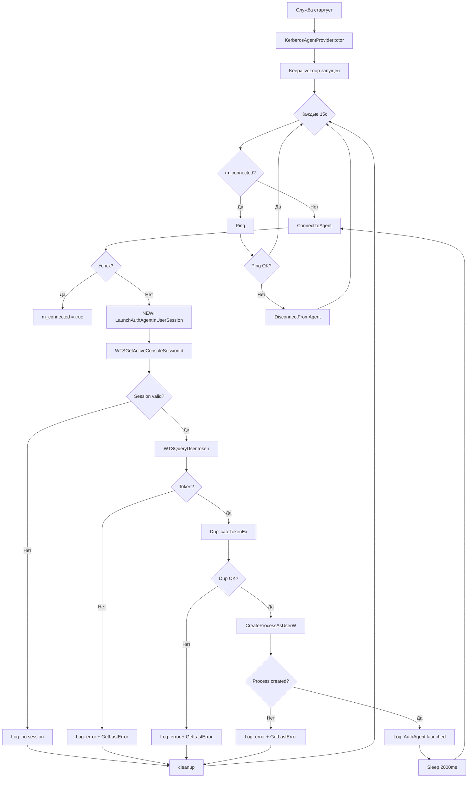

# План исправлений v1.1.1 — Стабильность AuthAgent и прокси

## Диагностика

### Проблема 1: AuthAgent не запускается автоматически

**Симптомы:**
```
[WARN] Auth provider failed: AuthAgent not available
```
Агент поднялся только после ручного рестарта службы.

**Корневые причины:**

1. **Ноль логирования в `LaunchAuthAgentInUserSession()`** — все 5 точек отказа (WTSGetActiveConsoleSessionId, WTSQueryUserToken, DuplicateTokenEx, CreateEnvironmentBlock, CreateProcessAsUserW) молча проваливаются через `goto cleanup`. Невозможно диагностировать, на каком этапе ошибка.

2. **`KeepaliveLoop` не пытается запустить агент** — только `EnsureConnected()` (вызывается из CreateContext/ContinueContext) пробует `LaunchAuthAgentInUserSession()`. KeepaliveLoop каждые 15с вызывает `ConnectToAgent()`, но если агент не запущен — он никогда не запустится автоматически при реконнекте.

3. **`DuplicateTokenEx` с `TOKEN_ALL_ACCESS`** — избыточные права. Достаточно `TOKEN_QUERY | TOKEN_DUPLICATE | TOKEN_ASSIGN_PRIMARY`. С `TOKEN_ALL_ACCESS` вызов может отказать на некоторых конфигурациях.

4. **Хардкод пути** `C:\Program Files\TcpRedirector\TcpRedirectorAuthAgent.exe` — если служба установлена в другой каталог, запуск невозможен.

### Проблема 2: 504 Gateway Timeout

**Симптомы:**
```
[WARN] CONNECT failed: HTTP/1.1 504 Gateway Timeout\n\nTimeout: timed out
```

**Анализ:** Это НЕ баг редиректора. Прокси (test_proxy.py) возвращает 504, когда не может соединиться с целевым хостом. Редиректор корректно детектирует и логирует ошибку.

**Усугубляющий фактор:** Редиректор не различает классы ошибок:
- 504/502 = прокси жив, но цель недоступна (можно retry на уровне редиректора)
- Ошибка соединения с прокси = прокси мёртв (retry бесполезен)

## План исправлений

### Исправление 1: Логирование в LaunchAuthAgentInUserSession

**Файл:** `TcpRedirector/src/service/TcpRedirectorService/infrastructure/auth/KerberosAgentProvider.cpp`

Добавить `Log()` на каждом этапе:

```cpp
bool KerberosAgentProvider::LaunchAuthAgentInUserSession() {
    bool expected = false;
    if (!s_launchInProgress.compare_exchange_strong(expected, true,
                                                     std::memory_order_acquire)) {
        return false;
    }

    bool result = false;
    HANDLE userToken = nullptr;
    HANDLE dupToken = nullptr;
    LPVOID envBlock = nullptr;

    DWORD sessionId = WTSGetActiveConsoleSessionId();
    if (sessionId == 0xFFFFFFFF) {
        Log(domain::LogLevel::Warn, "AuthAgent launch: no active console session");
        goto cleanup;
    }
    Log(domain::LogLevel::Debug, "AuthAgent launch: session " + std::to_string(sessionId));

    if (!WTSQueryUserToken(sessionId, &userToken)) {
        Log(domain::LogLevel::Warn, "AuthAgent launch: WTSQueryUserToken failed: " +
            std::to_string(GetLastError()));
        goto cleanup;
    }

    if (!DuplicateTokenEx(userToken, TOKEN_QUERY | TOKEN_DUPLICATE | TOKEN_ASSIGN_PRIMARY,
                          nullptr, SecurityImpersonation, TokenPrimary, &dupToken)) {
        Log(domain::LogLevel::Warn, "AuthAgent launch: DuplicateTokenEx failed: " +
            std::to_string(GetLastError()));
        goto cleanup;
    }

    if (!CreateEnvironmentBlock(&envBlock, dupToken, FALSE)) {
        Log(domain::LogLevel::Debug, "AuthAgent launch: CreateEnvironmentBlock failed (non-fatal): " +
            std::to_string(GetLastError()));
        envBlock = nullptr;
    }

    {
        // Динамический путь относительно службы
        wchar_t exePath[MAX_PATH];
        GetModuleFileNameW(nullptr, exePath, MAX_PATH);
        std::wstring dir(exePath);
        dir = dir.substr(0, dir.find_last_of(L"\\/") + 1);
        std::wstring agentPath = dir + L"TcpRedirectorAuthAgent.exe";

        STARTUPINFOW si = {};
        si.cb = sizeof(si);
        si.lpDesktop = const_cast<wchar_t*>(L"winsta0\\default");

        PROCESS_INFORMATION pi = {};

        if (CreateProcessAsUserW(dupToken, nullptr, agentPath.data(),
                                 nullptr, nullptr, FALSE,
                                 CREATE_UNICODE_ENVIRONMENT | DETACHED_PROCESS,
                                 envBlock, dir.c_str(), &si, &pi)) {
            Log(domain::LogLevel::Info, "AuthAgent launched in session " +
                std::to_string(sessionId));
            CloseHandle(pi.hThread);
            CloseHandle(pi.hProcess);
            result = true;
        } else {
            Log(domain::LogLevel::Warn, "AuthAgent launch: CreateProcessAsUserW failed: " +
                std::to_string(GetLastError()));
        }
    }

cleanup:
    if (envBlock) DestroyEnvironmentBlock(envBlock);
    if (dupToken) CloseHandle(dupToken);
    if (userToken) CloseHandle(userToken);
    s_launchInProgress.store(false, std::memory_order_release);
    return result;
}
```

**Изменения:**
- Добавлен `Log()` на каждом этапе с кодом ошибки `GetLastError()`
- `TOKEN_ALL_ACCESS` → `TOKEN_QUERY | TOKEN_DUPLICATE | TOKEN_ASSIGN_PRIMARY`
- Хардкод пути → `GetModuleFileNameW` для динамического определения
- `CreateEnvironmentBlock` failure больше не фатальный (продолжаем без custom environment)

### Исправление 2: KeepaliveLoop запускает агент

**Файл:** `TcpRedirector/src/service/TcpRedirectorService/infrastructure/auth/KerberosAgentProvider.cpp`

```cpp
void KerberosAgentProvider::KeepaliveLoop() {
    while (m_running.load(std::memory_order_relaxed)) {
        std::this_thread::sleep_for(kKeepaliveInterval);

        if (!m_connected.load(std::memory_order_acquire)) {
            if (!ConnectToAgent()) {
                // v1.1.1: try to launch AuthAgent from keepalive too
                LaunchAuthAgentInUserSession();
                // Wait a bit for agent to initialize, then retry
                Sleep(2000);
                ConnectToAgent();
            }
            continue;
        }

        // Ping
        try {
            auto resp = Call("ping");
            if (resp.contains("error")) {
                DisconnectFromAgent();
            }
        } catch (...) {
            DisconnectFromAgent();
        }
    }
}
```

### Исправление 3: Retry при 504/502 от прокси

**Файл:** `TcpRedirector/src/service/TcpRedirectorService/infrastructure/relay/TcpRelayServer.h`

В `ConnectionHandler`, после получения ответа от прокси, добавить различение классов ошибок:

```cpp
// После строки 474 (else ветка)
else {
    std::string respStr(resp_buf, bytes);
    bool isGatewayError = (respStr.find("504") != std::string::npos ||
                           respStr.find("502") != std::string::npos);
    
    if (isGatewayError && m_proxyRetries < 3) {
        m_proxyRetries++;
        Log(domain::LogLevel::Debug, "Proxy gateway error, retry " +
            std::to_string(m_proxyRetries) + "/3");
        // Close and reconnect to proxy
        closesocket(proxy_sock);
        Sleep(500);
        // Re-create socket and reconnect
        goto retry_proxy_connect;  // новый label для retry
        return;
    }
    
    Log(domain::LogLevel::Warn, "CONNECT failed: " + respStr.substr(0, 100));
    // ... existing error handling
}
```

Но это требует рефакторинга `ConnectionHandler` для поддержки retry на уровне proxy-соединения (пересоздание сокета). Это более инвазивное изменение.

**Альтернатива (менее инвазивная):** Добавить счётчик retry в `RelayContext` и использовать существующий `goto retry_connect` с флагом `is_retry`.

### Исправление 4: Динамический путь в ServiceMain

**Файл:** `TcpRedirector/src/service/TcpRedirectorService/infrastructure/auth/KerberosAgentProvider.h`

Добавить статический метод для получения пути к агенту:

```cpp
static std::wstring GetAgentPath();
```

Реализация:
```cpp
std::wstring KerberosAgentProvider::GetAgentPath() {
    wchar_t path[MAX_PATH];
    GetModuleFileNameW(nullptr, path, MAX_PATH);
    std::wstring fullPath(path);
    size_t pos = fullPath.find_last_of(L"\\/");
    if (pos != std::wstring::npos) {
        return fullPath.substr(0, pos + 1) + L"TcpRedirectorAuthAgent.exe";
    }
    return L"TcpRedirectorAuthAgent.exe";
}
```

## Диаграмма потока запуска AuthAgent



## Порядок реализации

1. **Добавить логирование в `LaunchAuthAgentInUserSession`** — критично для диагностики
2. **Исправить `DuplicateTokenEx`** — минимальные права
3. **Динамический путь** — `GetModuleFileNameW`
4. **`KeepaliveLoop` запускает агент** — ключевое исправление
5. **Retry при 504/502** — опционально, улучшает стабильность
6. **Полная сборка и обновление release/1.1.1**